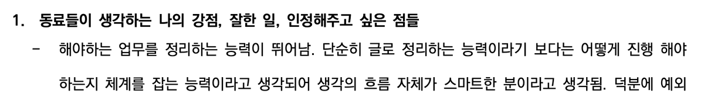
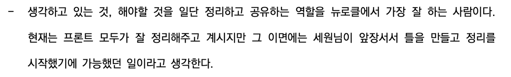
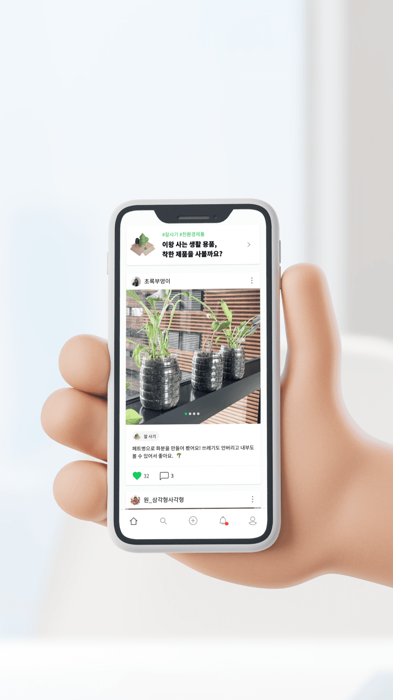
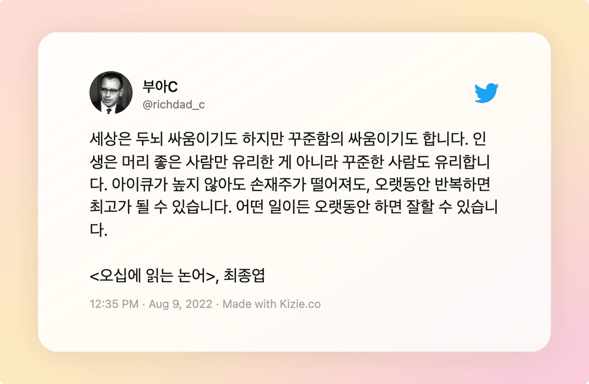

저는 12월부터 시작해서 늦게는 1월까지 지난 한 해를 돌아보는 시간을 참 좋아합니다. 2022년은 처음으로 1년을 꽉 채워 개발자로서 일했던 한 해였기 때문에 돌아볼만한 의미가 있는 것 같습니다. 회사 안에서 그리고 회사 밖에서의 개발을 정리해보고, 2023년에는 어떤 방향으로 나아가면 좋을지 생각해 보았습니다.

 

<!--truncate-->

## 회사 안에서의 개발

### 1. Major update; 개발자 수와 개발 속도는 비례하지 않는다

입사 후 처음으로 **메이저 업데이트 개발에 참여**했습니다. 년초부터 프론트 팀원 한 분이 백엔드로 직무변경을 하시면서 주니어 개발자 2명이서 맞이하는 메이저 업데이트는 챌린징했습니다만, 덕분에 공수산정과 일정관리하는 스킬이 늘어난 것 같습니다. 팀에 개발자가 많을수록 더 빨리, 많이 일할 수 있다고 생각했는데 팀마다, 또 프로젝트마다 적당한 개발자의 수가 있는 것 같아요. 그러나 여전히 3명일 때의 팀에서 제일 안정감을 많이 느끼는 것 같습니다. 

### 2. 채용 참여

아직 회사 적응에 정신 못차릴 때지만 스타트업 개발자는 어쩔 수 없겠지요. **채용 참여에 많은 시간을 할애**했습니다. 연말에는 **[채용 페이지](https://www.neurocle-career.com/)도 릴리즈** 했어요 :)

채용에 참여하면서 '어떤 사람과 일하고 싶은지', '나는 떳떳한 개발자인지'와 같은 것들을 꾸준히 생각해 볼 수 있었고, 그때 했던 생각들을 바탕으로 채용 페이지TF에도 자진 참여하게 되었던 것 같습니다. 처음 면접에 참여했을 땐, 제가 면접자보다 더 긴장했었는데 이젠 대화로 느껴질 정도로 익숙해지기도 했어요! 채용 페이지TF에 참가하면서 다른 직무(마케팅, 기획운영)분들과 처음으로 협업해봤고, 제가 업무 주관이 상당히 뚜렷한 사람이라는 것도 알게되었습니다. 업무 성향이 잘 맞는 것이 참으로 중요하다는 것을 알게되었느데 지금 프론트 팀원들의 소중함을 배로 느끼게되었습니다.

### 3. 자아성찰

올해에만 3.0.0 ~ 3.1.2까지 크게 3개의 버전 개발에 참여하면서 팀원들과 3번의 회고를 했고, 제가 어떤 개발자인지 좀 더 잘 알게되었습니다. 

- 마크업이나 레이아웃 설계가 버그 픽스보다 재미있습니다.
- 작업의 효율성을 높이거나 자동화하는 것에 흥미가 있습니다.
- 알고리즘 구현이나 성능 향상을 위한 로직적인 작업을 할 때 생각할 시간이 많이 필요합니다.
- 마감 시간 급박한 작업을 할 때 부담을 느낍니다.
- 조직문화, 개발문화에 관심이 많습니다.

스스로 생각했던 제 모습인데요. 현재 팀원들과는 밸런스가 좋은 편이라 다행입니다. 동료평가를 통해서도 자아성찰을 할 수 있었는데요.

1년동안 분기별로 받았던 동료평가에서는 `정리`, `문서화`, `기록`에 대한 언급이 많았습니다. 저에게도 재능이 있었던 걸까요...? 아무튼 같이 일해서 든든하고, 앞으로도 같이 일하고 싶다는 평가는 참 좋았습니다💗 

 

## 회사 밖에서의 개발

### 1. 넥스터즈 20기 수료

넥스터즈 20기를 성황리에 수료했습니다!

생각해본 적도 없는 NFT라는 주제로 도전적인 사이드 프로젝트를 했어요. 유능한 팀원들을 만나서 많이 배웠습니다. 신기했던 건 발제자 빼고는 NFT라는 도메인에 크게 관심이 없었는데 다들 퇴근후에 새벽 2~3시까지 진짜 정말 열심히 했다는거에요. ('데일리 해커톤'이라는 무시무시한 워딩을 붙여봅니다...) 이미 회사일로 너무 지쳐있었던 저는 상대적으로 많이 참여하지 못한 것 같아 부끄러웠습니다. 그래도 8주간 몰입하며 개발했고, 유저 인터뷰를 위한 프로토타이핑과 1차 프로토타입 개발 이후의 QA와 디벨롭까지 진행했던 의미있는 사이드 프로젝트였습니다. 개발에 있어서 도메인 지식도 굉장히 중요한 부분을 차지한다는 것을 알게 되었어요.

### 2. 플러터

만들고 싶은 것들이 많아서 **앱개발에도 도전**해봤습니다. 결과는 졌잘싸...

제가 관심있었던 도메인 중 하나인 친환경 커뮤니티 개발을 해봤는데요. 무지에서 비롯된 앱개발의 어려움과 개발보다 더 여러운 앱스토어 심사에 대해 배웠습니다. 다트 언어 자체를 배우는 것은 어렵지 않았는데 폴더구조 설계나 위젯을 나누는 것, 데이터를 fetching 해 오는 것, API 연결, 상태관리, 파일 업로드 등 쉬운 것이 없었습니다. 웹은 브라우저를 닫으면 끝인데 앱은 그게 아니니까 데이터를 초기화 하는 시점도 감이 안왔고, 디버깅도 웹에 비하면 좋은 환경은 아니어서 사이드로 진행하기에는 너무나도 스트레스가 컸어요. 한번에 3개 이상의 일을 동시에 진행할 수 없다는 교훈도 얻었고요. 그래도 앱개발은 제대로 공부해서 다시 도전해보고 싶긴 합니다. 만들고 싶은 게 너무 많아요. 

### 3. 블로그

작년 말, **개발 블로그 개편**을 마음 먹고나서 거의 반년이 지나서야 개편을 마무리하고 첫 글을 썼습니다. 첫글을 쓴 게 3월이었는데 1년이 지났습니다. ~~마피아는 고개를 들어...~~ 메모 같은 게 아니라 정말 영양가 있는 글을 쓰고 싶어서 오히려 한 글자도 쓰기 어려웠던 것 같습니다. 

### 4. 독서

2022년의 목표 중 하나는 ‘편향된 독서 하지 않기’였는데 경제, 인문, 자기계발, 소설책들을 골고루 읽고 나니 **개발 서적을 너무 적게 읽었다**는 사실을 깨달았습니다. [개발 독서 목록](https://sewonkimm-github-io.vercel.app/docs/wiki/books/intro)에 업데이트를 하며 시각화하는게 효과가 좋은 것 같습니다. 

올해의 개발서적을 꼽자면 <죽을 때까지 코딩하며 사는 법>이라고 말할 수 있습니다. 기술적인 내용보다는 개발을 즐겁게 하기위해서는 어떻게 해야할지에 관한 general한 내용이었는데요. 책 안에서 인용하는 프로그래밍 관련 서적도 굉장히 많아서 저같은 주니어 뽀시래기가 보기에 딱 좋은 책이 아닌가 싶습니다. 

 

## 2023년에 바라는 것

**지덕체(智德體)를 고루 갖춘 훌륭한 인재**가 되었으면 합니다.

### 1. 지; 똑똑해지기

- 책을 더 많이 읽고, 작년에 사둔 개발 강의들도 다 들으려고 합니다. 작년에 부족했던 것들을 챙겨야겠습니다.
- 뉴스레터나 트위터를 읽고, 컨퍼런스에 참석하는 일을 꾸준히 하려고 합니다. 우물 밖으로 자주 나오는 개구리가 되려구요 🐸 
- 배운 것들을 잘 공유하는 사람이 되고 싶습니다. ~~이젠 정말 블로그에 글을 써야겠지요~~
- 스스로 CS가 약하다고 생각해서인지 조금이라도 복잡한 로직을 짜야할 때면 덜컥 두려운 마음이 들었습니다. 그래서 Binary를 활용해서 코드를 짰을 땐, 코드의 우아함에 스스로 감동을 받기도 했어요. 코드 한 줄 쓰지 않고 문제를 해결하는 방법도 굉장히 고급지다고 생각합니다. 코드를 잘 짜는 개발자이기보다는 일을 잘 하는 개발자가 되고 싶습니다.

### 2. 덕; 다정한 사람이 되기

'일은 잘하는 데 싸가지' vs '완전 착한데 일 못함' 이런 밸런스 게임 질문을 많이 본 적 있습니다. 근데 일을 잘한다는 것에 싸가지를 챙기는것도 포함된다고 생각해요. 커뮤니케이션을 잘하는 것도 일에 포함된다고 생각합니다. 

  
### 3. 체; 강한 개발자 되기

- 다정함은 체력에서 나오는 것 같아요. 상반기에 유독 사건사고가 많아 4월쯤엔 몸과 마음이 너덜너덜해졌습니다. 체력이 떨어질수록 주변 사람들에게 까칠해지기 시작했고, 집중력을 잃고, 표정관리가 안되고, 대화가 힘들어지고... 문제가 많았습니다. 하반기에는 휴식도 늘리고, 운동을 시작하면서 상태가 많이 좋아졌는데 체력의 소중함을 많이 느꼈습니다.
- 힘세고 오래가는 개발자가 되어서 그동안 미뤄두었던 공부도 슈슈슉 해내는 사람이 되었으면 좋겠습니다.

 
 

22년에는 새로운 시도를 많이 했던 것 같은데요. 23년에는 **꾸준함**을 미덕으로 삼아볼까합니다. 즐거운 마음으로 오래오래 개발하는 사람이 되길...! 
