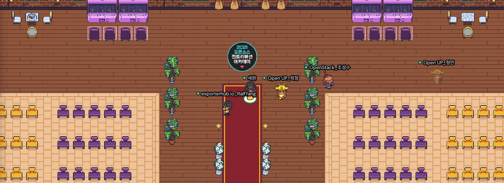
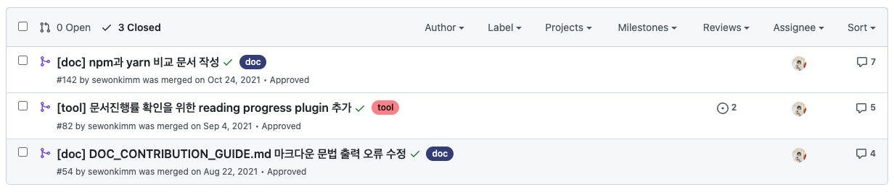
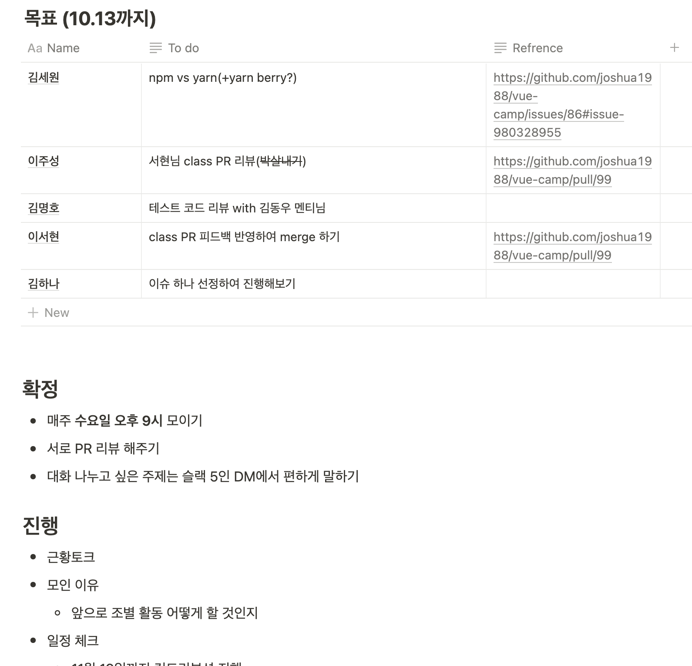
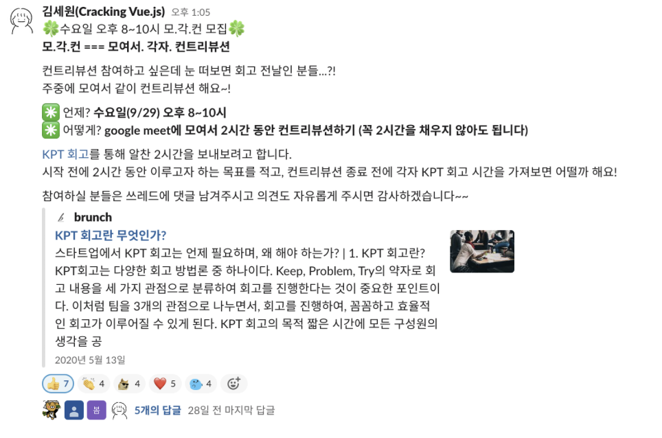

2021년 7월, 오픈소스 컨트리뷰션 멘티로 선정되어 활동했던 내용을 기록합니다.

## 멘티 참가신청

SSAFY에서 2개의 프로젝트를 vue로 진행해본 경험이 있는데요. 참가 당시만해도 React보다는 vue에 더 자신이 있는 상태였습니다. 프로젝트 진행하면서 구글에서 제일 자주 봤었던 캡틴판교 기효님이 멘토로 계신 [Cracking vue.js](https://www.oss.kr/contribution_academy_project/show/1efa75c8-4b54-4624-8652-81b16968add3) 프로젝트에 참가신청을 했고, 멘티로 선정이 되었습니다.

오픈소스 컨트리뷰션 프로젝트에는 직접 개발을 하는 종류의 프로젝트도 있지만 제가 참여했던 Cracking vue.js 처럼 문서화를 하거나, 번역을 하는 프로젝트도 있습니다. 저는 문서화하는 것에 관심이 많았고, 기효님의 블로그만 봐도 알겠지만 워낙 글을 잘 쓰시는 분이라서 문서화에 대해 많이 배우고 싶어서 프로젝트에 지원했습니다. 덤으로 프론트엔드 관련 공부와 커리어에 대해서도 이야기를 많이 나눠보고 싶었어요.

### 목표

오픈소스 컨트리뷰션이 퇴근 후 시간을 내어 참여하는 것이기 때문에 생각보다 열심히 참여하기 힘들 수 있는데요. 참가 전에 스스로의 작은 목표를 세워놓으면 도움이 됩니다. 

당시의 목표는 문서화 능력 향상, 커뮤니케이션 능력 배우기(PR 리뷰 같은 것에서도), vue press로 사이트 제작하는 법 배우기, SSR 공부, 라이브러리 버전업에 대처하는 방법 배우기 등을 목표로 세웠었는데요. 이루지 못한 것들이 더 많아서 아쉽긴 합니다😅 하지만 퇴근 후에 뭔가를 한다는 것은 정말 쉽지가 않더군요...

## 전설의 시작

멘티 선정이 되고나면 2일에 걸쳐 Git 기본/고급 교육을 받습니다. 그리고 발대식 때 처음으로 멘토분들과 멘티분들을 만납니다. 

코로나로 대면 모임이 불가능했기 때문에 게더타운으로 비대면 발대식을 진행했습니다. 당시에 400명이 동시 접속했었는데요. 주최측에서 어떻게 핸들링하는지 운영측면에 있어서도 많이 배울 수 있었습니다. (모임을 운영할 생각은 없지만... 혹시나...)

## 발대식까지는 좋은데... 이제 어디로 가야하죠 아저씨~...

학부생 때, 오픈소스라는 것을 처음 접했을 때에도 그래서 내가 기여할 수 있는 부분이 도대체 무엇인지에 대한 어려움이 있었습니다. 멘티로 하나의 프로젝트에 참여하더라도 그 어려움은 없어지지 않더라고요. 다행히도 같은 멘티 분들이 잘 이끌어 주셔서 금방 할 일을 찾을 수 있었습니다. 

자잘한 버그나 vue press plugin, 제목만 있고 내용이 없는 페이지 등을 추가하는 활동을 했고, 그 외엔 PR리뷰에도 참여했습니다. 생각보다 문서 작성을 많이 하지 못해서 아쉬웠는데요. vue 관련 문서는 아니지만 [npm과 yarn을 비교하는 문서](https://joshua1988.github.io/vue-camp/package-manager/npm-vs-yarn.html#npm)를 작성했습니다. 블로그에 기록용으로 글을 쓰는 게 아니고, 사람들에게 리뷰 받는 글이다보니 글 하나를 작성하더라도 꼼꼼히 조사하게 되더라구요. 그래서 많은 문서를 작성하는 것이 생각보다 어려웠던 것 같습니다. 

그리고 컨트리뷰톤 참여 덕분에 vue press를 알게되면서 정적 문서 생성 프레임워크를 이것저것 찾아보게 되었고, 개인 블로그 3.0을 위한 프레임워크로 Docusaurus를 선택하게 되기도 했습니다.

그래도 차근차근 기여한 결과 4개월동안 괄목할 만한 성과를 내었습니다. 

- 57개의 이슈 생성 및 38개 해결
- 467개의 커밋
- 76개의 PR
- 10회의 정기회고
- 9회의 모각컨(모여서 각자 컨트리뷰트)
- 13회의 팀별활동

개인적으로는 

- 2건의 문서 작성
- 1개의 기능 추가
- 3건의 코드 리뷰
  
를 진행했습니다. ~~많지는 않습니다ㅠㅠ~~

## 우물 밖 개구리

SSAFY라는 우물에 갇혀서 맘 편히 살고 있었는데 우물 밖에는 멋진 개구리가 너무나 많았습니다. 같은 멘티이고, 직장인임에도 저랑은 시간을 다르게 쓰는 멘티분들이 많았고, 멘토분들의 기여도 인상적이었습니다. 이왕 우물 밖으로 나온 거 뭐라도 하자 싶어서 Zoom 미팅에 적극적으로 참여했고, 그래서 그런지 최종 발표를 제가 하게 되었어요. 저는 평소에 그렇게 외향적인 성격이 아닌데 참여하는 멘티분들 수가 20명이 넘어가고, 온라인 미팅이다보니 참여도가 낮아서 눈에 띄었던 것 같습니다. 

퇴근 후 참여하는 것이 힘들어 고민이었는데 팀별로 모각컨(모여서 각자 컨트리뷰트) 활동 해보자는 아이디어를 제시해서 한 달가량 소모임을 이끌어보기도 했습니다. 코딩을 한다기보다는 한두시간 정도 수다를 열심히 떨었었는데 다른 회사에 다니는 프론트엔드 개발자와 이야기하는 시간도 참 좋았어요! 처음으로 오프라인 회식해서 강남역에서 멘토분들도 직접 뵙고, 이런저런 개발이야기 하는 것도 굉장한 자극이 되었습니다. (만나서 개발 이야기하는 회식... 짜릿해...)

### 코드말고도 얻어갈 수 있는 것

컨트리뷰톤에 처음 참가할 때에는 개발적으로의 성장만을 기대했던 것 같은데 4개월 간 활동해보니 개발자들 간의 네트워킹, 협업 스킬, 프로젝트 참여 동기를 부여하는 여러가지 방법 배우기, 시니어 개발자와의 대화 등 좀 더 다양한 부분에서 성장할 수 있었던 기회였습니다.
