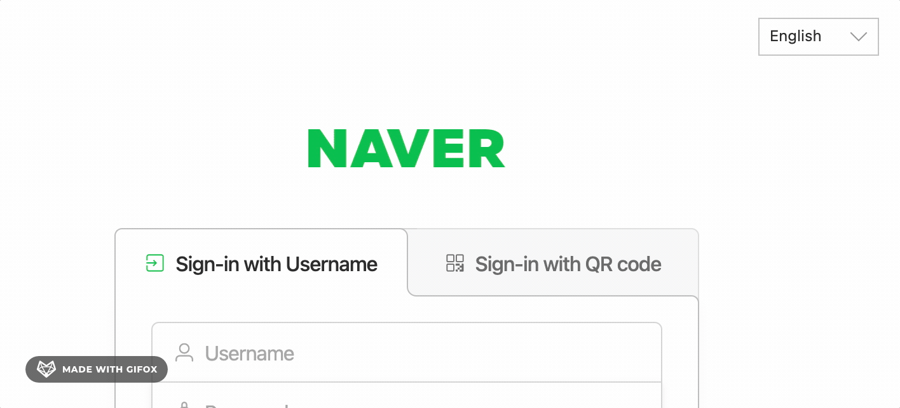
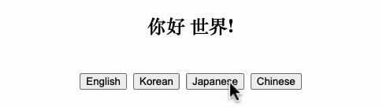

제가 회사에서 만들고 있는 제품은 한국뿐 아니라 일본, 싱가폴, 대만, 유럽 등 다양한 국가에 고객사가 있습니다. 지금은 영어, 일본어, 한국어를 지원하고 있는데요. 취준생 시절 포트폴리오를 만들기 위한 웹서비스 개발을 할 때에는 다국어 지원 경험이 많지 않아서 처음엔 조금 생소한 주제였습니다. 그래서 이번 기회에 다국어 지원을 위한 구현 방법을 정리해보려고 합니다.


## 먼저, 생각해 볼까요?



위와 같이 다양한 언어를 지원하는 서비스를 만들려면 어떻게 해야할까요? 간단히 구현방법을 생각해보면 다음과 같습니다.

1. 컴포넌트 내 모든 문구를 하드코딩하지 않고, 언어에 맞는 문구를 반환하는 메서드를 사용한다.
2. 언어별로 문구를 관리하는 파일을 마련한다.
3. 언어 선택 버튼을 만들어서, 언어를 선택하면 해당 언어로 문구를 반환한다.

생각보다 복잡하지는 않은 것 같습니다. 직접 구현해 보는 것도 좋은 경험이지만 위에 나열한 것들을 쉽게 구현할 수 있도록 도와주는 라이브러리가 이미 존재합니다! 

<!--truncate-->

## i18n
 
:::info 깨알 상식 

i18n은 internationalization(국제화)의 약자로, i와 n 사이에 있는 글자 수가 18개라서 i18n이라고 한다고 해요. 

:::


i18n 라이브러리를 사용하는 이유가 단순히 'key - value' 형태로 문구를 쉽게 관리할 수 있기 때문만은 아니고, interpolation(보간)이나 pluralization(복수형) 등 다양한 기능을 제공하기 때문입니다. 그 외에도 플러그인이 많아서 필요한 기능을 직접 구현하는 시간과 비용을 아낄 수 있습니다. 

그리고 i18n라이브러리를 사용하면 locize라는 유로 서비스를 활용하는 것도 쉬워지는데요. 제품의 크기가 커지면 번역 작업이 생각보다 가성비 떨어지는 일이기 때문에 기획자, 디자이너, 번역자와 더 효율적으로 협업할 수 있도록 도와주는 이런 서비스가 있다는 것이 굉장히 좋습니다. 저는 2022년 locize를 사용해 언어 관리를 효율적으로 할 수 있는 시스템을 구축하는 작업을 진행했고, 덕분에 한국어 지원을 부담없이 진행할 수 있었는데요. **다국어 서비스를 효율적으로 관리하는 방법**에 대해서는 또 다른 글에서 다루도록 하겠습니다. 

:::tip 

더 많은 정보는 [i18n 공식문서](https://www.i18next.com/)를 참고하세요.
javascript말고도 제공하는 언어가 많아서 한 번 익혀놓으면 다른 언어에서도 쉽게 사용할 수 있습니다.

:::


우선 프로젝트에 i18n 라이브러리를 사용해 다국어 서비스를 세팅하는 방법에 대해서 알아보겠습니다.


## 실전! 다국어 서비스 개발하기

:::note



선택한 언어에 따라서 문구가 바뀌는 예제입니다.
프로젝트 소스코드는 [여기](https://github.com/sewonkimm/react-i18n-practice)에서 확인할 수 있습니다.
:::

구현 순서는 다음과 같습니다.

### 1. 프로젝트 준비하기

먼저 리액트 프로젝트 생성하고 문구와 언어를 선택할 수 있는 UI를 구현합니다.


### 2. react-i18next 라이브러리 설치하기

```bash
npm install react-i18next i18next --save
```

### 3. i18n config 설정하기

1. i18n config 설정
2. 언어별 키-값 쌍으로 문구 관리하는 JSON 파일 생성
3. 언어 선택 버튼을 누르면 언어가 변경되는 기능 구현


간단하죠? 이제 다국어 서비스를 구현할 수 있습니다! 
이 글이 다국어 서비스를 구현하는 데에 도움이 되었으면 좋겠습니다. 감사합니다. 🙏


