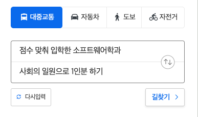
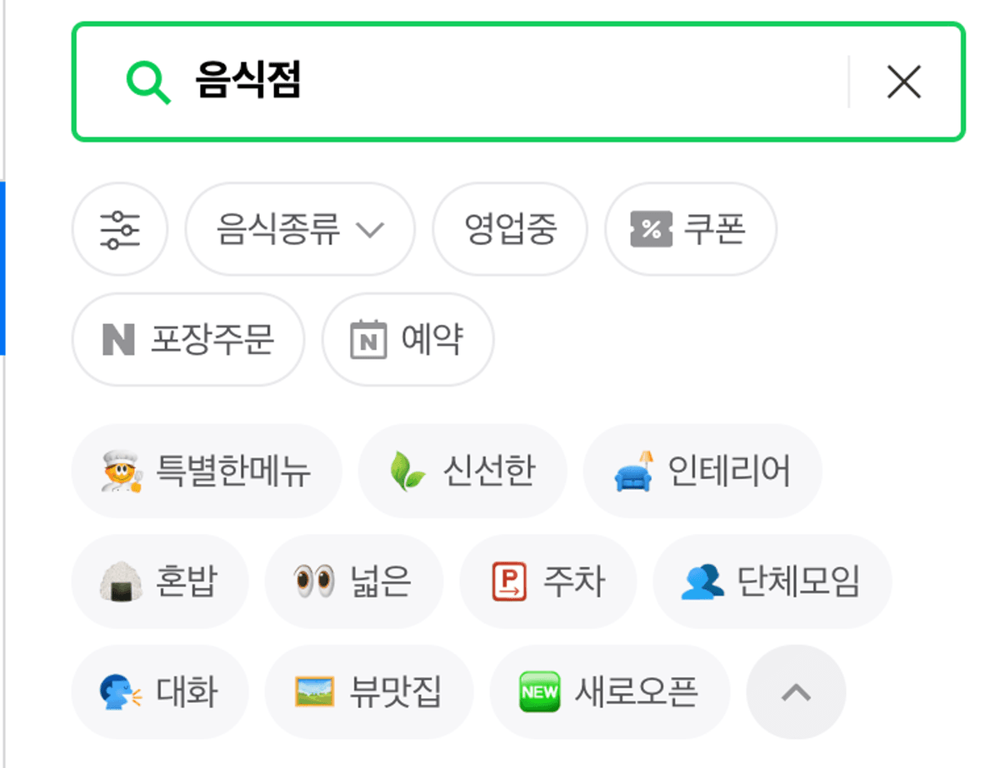
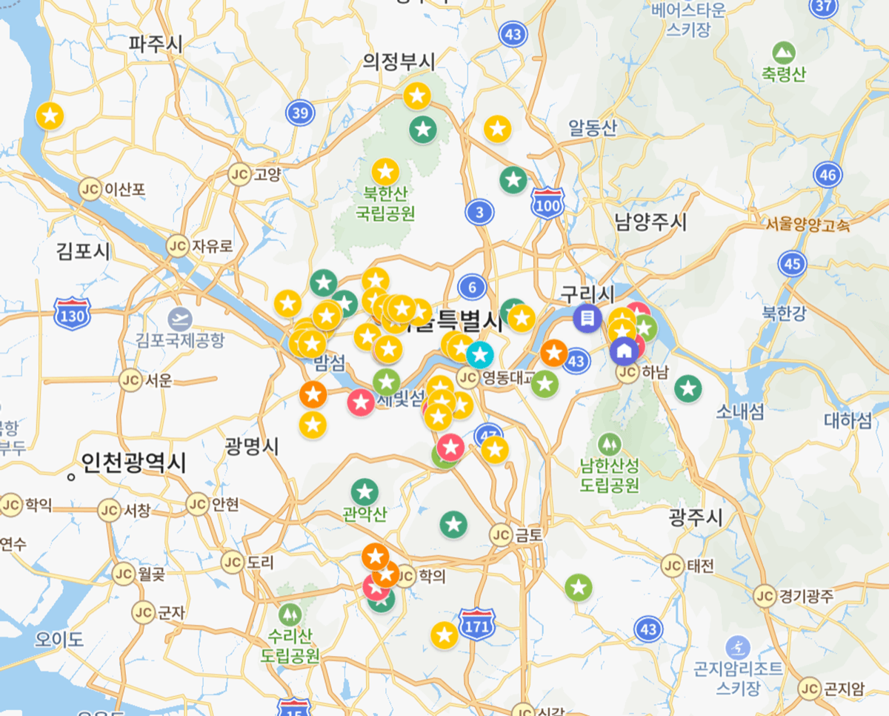

import Table from './Table';

> 글또 9기를 지원하며 작성한 글입니다.

내가 거의 매일 사용하는 어플 중 하나는 지도 어플이다. 기술이 발전하면서 지도의 기능이 다양해져 단순히 길을 찾는 데에만 쓰지는 않는다. 이동시간을 최적화 할 때, 맛집을 찾아볼 때, 또가고 싶은 곳을 기록할 때에도 쓴다. 새로운 길을 갈 때에도 도움이 되지만, 익숙한 길을 갈 때에도 도움이 되기도 한다.

만약 삶에도 지도가 있다면, 앞으로 가야할 길에 큰 도움이 되지 않을까? 실제 지도를 볼 때처럼 **내가 지금 어디에 있고, 어디로 가야하고, 어떻게 가야할지** 지도에 비유해 생각해 보려고 한다.

<!--truncate-->

## 1. 목적지 설정 - 개발자로서의 길 찾기

지도를 가장 많이 사용하는 목적은 아마 `길 찾기` 일 것이다.

내가 첫번째로 찾아야 할 길은 바로 **사회의 일원으로 1인분 하기**까지 가는 길이었다. 점수 맞춰 들어간 대학의 전공이 소프트웨어학이었던 것이 출발지였는데 자동차가 없어서 도착지까지 최단 루트로는 못 오고, 대신 버스도 타고, 환승도 하고, 도보로 걸어가며 거의 6~7년 만에 목적지에 도착할 수 있었다.

사실 처음엔 내 목적지를 몰랐기 때문에 전공 수업도 제대로 듣지 않았다. 교내 방송국 활동을 하며 방송 업계는 어떤가 살펴보기도 하고, 대만으로 교환학생을 다녀오며 해외 생활을 꿈꾸기도 했다. 휴학하면서 스타트업의 창업 멤버로 VR업계와 개발을 살짝 맛보긴 했으나 그 때도 아직 목적지가 어딘지는 깨닫지 못했었다.
대학 졸업반 즈음 삼성 청년 소프트웨어 아카데미(이하 싸피)와 넥스터즈라는 IT동아리 활동을 하면서부터 목적지를 향해 달리기 시작했는데, 여행 초반에 목적지랑은 상관 없이 그저 길이 예쁜 국도로 가다가 나중에야 고속도로를 탄 느낌이다.

인생의 ‘업(業)’을 찾는 첫 번째 여정이었던 만큼 길 찾는데 노하우가 없었는데 그 과정이 없었다면 지금의 나도 없었을 것이다. 내가 어떤 것을 좋아하고 싫어하는지, 어떤 곳으로 가고 싶은지 혹은 가고 싶지 않은지에 대해서도 생각해보게 되었고, 그래서 주도적이고 효율적으로 일할 수 있을 것 같은 스타트업에 도착하게 되었다.

## 2. 맛집 찾기 - 다음 방문지를 정하는 기준

지도에서 유용하게 쓰는 기능 중 하나는 `주변 살펴보기`인데 잘 모르는 지역에서 방문지를 정할 때 유용하게 쓰인다.

첫번째 목적지에 도착한 지 3년이 다 되어가는 요즘. 다시 길을 잃은 기분이다. 두번째 목적지를 정해야할 때인 것 같다. 다음에 어떤 길로 가야하는지 골라서 갈 수 있는 살펴보기 기능이 있다면 얼마나 좋을까? 내가 맛집을 찾을 때의 기준과 비교해서 생각해보면 인생에서의 다음 목적지를 정하는데 도움이 될 수 있을 것 같다.

<Table />

## 3. 즐겨찾기 - 안가본 곳만 갈 필요는 없잖아?

지도에는 `즐겨찾기` 기능이 있다. 자주 가는 곳을 즐겨찾기에 추가해두거나, 가보고 싶은 곳을 즐겨찾기에 추가해두면 선택지가 많을 때 빠르게 선택할 수 있다.

나는 외출을 많이 하는 편은 아니라 많은 곳을 알지는 못하지만 대신 좋고 싫음이 확실한 편이라 좋았던 곳은 몇 번이고 다시 간다. (예를 들어 매헌 시민의 숲...) 그래서일까? 개발 분야 중에 FE가 가장 재미있었고, FE를 ‘즐겨찾기’한 후에는 거의 2~3년은 프론트엔드만 팠다. 일을 좀 하다보니 백엔드도 알아두면 참 유용하겠다 싶어 '즐겨찾기'에 추가했고, 프론트엔드/백엔드 보다 즐겨찾기를 좀 더 구체화 해나가면 더 좋을 것 같다는 생각이 든다.

‘읽기와 쓰기’도 또 다른 즐겨찾기 중의 하나다. 성장하는 수 많은 방법 중에서도 ‘기술 서적 읽기’와 ‘개발 블로그에 글쓰기’의 방법으로 가장 많이 성장을 시도하고 있다. 처음엔 TIL(Today I Learned)형식으로 블로그에 매일 기록을 남겨오다가 취업 이후에는 단순한 메모가 아닌 좀 더 의미있는, 내 생각을 글로 남기는 연습을 해보고 있다. 주제가 개발이 아니더라도 읽고 쓰는 것을 좋아해서 다양한 분야의 책을 읽고, 종종 글을 쓰고 있고, 앞으로도 더 많이 읽고, 더 자주 글을 쓰고 싶다.

---

무언가를 돌아 볼 때, 보통 시간 순으로 많이 돌아보곤 하는데 공간을 표현하는 ‘지도’에 빗대어서 생각해보니 새로운 관점으로 나에 대해 생각해 볼 수 있었던 것 같다. 오늘도 출근길에 지도 덕분에 버스를 하염없이 기다리지 않았고, 환승 할 때 뛰어서 늦지 않게 탈 수 있었다. 앞으로 살아가는 데에 있어서도 삶의 지도를 항상 생각하면서 적절히 도움을 받을 수 있도록 종종 업데이트 해봐야겠다🙂🗺️💙
