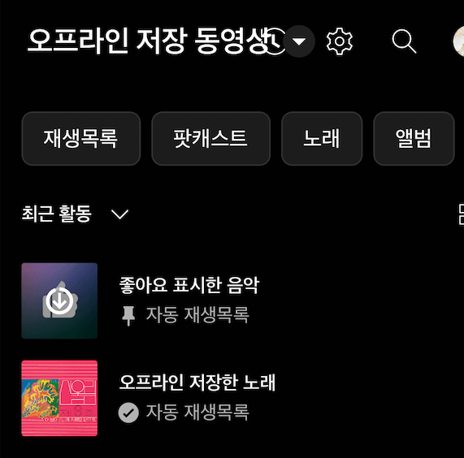

[이전 포스트](/blog/dev/i18n/tutorial)에서 소개했듯이 저는 현재 회사에서 다국어 서비스를 만들고, 운영하고 있습니다. 이 글에서는 3개 국어를 지원하는 서비스를 개발해 오면서 겪었던 어려움과, 이를 해결하기 위해 시도했던 방법들을 공유하고자 합니다. 글로벌 서비스를 운영하시는 분들께 도움이 되었으면 좋겠습니다.

<!--truncate-->

# 다국어 서비스 개발의 어려움

여러 언어를 동시에 지원하다 보면 생각지 못했던 어려움을 자주 마주치게 됩니다. 영어를 모국어로 사용하는 사람이 한국어를 배울 때, 가장 많은 학습 시간을 요구한다고 하는데요. 그만큼 두 언어가 차이점이 많아서 그렇다고 합니다. 다국어 시스템을 운영하다 보면, 이런 차이를 놓치기가 쉽습니다.

## 1. 복수형과 단수형 표기

영어는 복수형과 단수형을 구분하여 표기합니다. 예를 들어, `1 file`과 `2 files`처럼 말이죠. 그런데 한국어는 복수형과 단수형을 구분하지 않습니다. `파일 1개`과 `파일 2개`로 표현합니다. 이런 차이점을 놓치면 영어 표기에서 문법적 오류를 낼 가능성이 높아집니다.

### Plurals

문자열안에 수량이 들어가면 [plurals](https://www.i18next.com/translation-function/plurals) 기능을 사용하는 것이 좋습니다.

```ts
// 언어키
{
  "en" : {
    "file" : "{{ count }} file",
    "file_plural" : "{{ count }} files"
  },
  "ko" : {
    "file" : "파일 {{ count }}개",
    "file_plural" : "파일 {{ count }}개"
  }
}
```

다음과 같이 언어키를 작성하면 i18n 라이브러리에서 자동으로 복수형과 단수형을 구분하여 표기해줍니다.

```ts
const file = t("file", { count: 1 }); // "1 file"
const file2 = t("file", { count: 2 }); // "2 files"
```

## 2. 수량사 표기


얼마 전, 링크드인에서 매우 어색한 제목의 메일을 받았습니다. 아마도 숫자는 동적으로 받아오고, 문장은 언어키로 표현하는 방식으로 구현했을 것으로 추측됩니다.

```ts
const emailTitle = `${count} ${t('email.title_notice')}`;

// 언어키
{
  "en" : {
    "email" : {
      "title_notice" : "People have noticed you."
    }
  },
  "ko" : {
    "email" : {
      "title_notice" : "사람들이 당신을 알아차렸다."
    }
  }
}
```

코드로 봤을 땐 크게 문제가 없지만, 언어의 어순이 다르고, 한국어에서는 '명'이라는 수량사가 빠졌기 때문에 매우 어색하게 느껴질 수밖에 없는데요.(휴먼 번역체의 느낌이 납니다🤖)

수량사(數量詞)는 '개', '장'과 같은 수량의 표현입니다. 예를 들어, 영어에서는 `import 10 files`라는 표현을 한국어로는 `10개의 파일 가져오기`라고 표현할 수 있습니다.

이때 if-else 문으로 언어마다 어순을 다르게 처리해줄 수 있는데 그렇게 되면 언어 JSON파일만 보고 문장을 파악하기 어려워지고, 새로운 언어가 추가될 때마다 if-else문을 추가해줘야 합니다. 조건이 추가될 때마다 코드가 복잡해지고, 가독성은 떨어지며, 확장성도 떨어지기 때문에 i18n의 [interpolation](https://www.i18next.com/translation-function/interpolation)을 사용하는 것이 좋습니다.

### Interpolation

Interpolation은 중괄호 `{`를 사용하여 문자열에 변수를 삽입하는 방식입니다. interpolation을 사용하면 위의 예시를 다음과 같이 표기할 수 있습니다. (plurals로 복수형도 표기해주었습니다)

```ts
const emailTitle = t('email.title_notice', { COUNT: count });

// 언어키
{
  "en" : {
    "email" : {
      "title_notice" : "{{ COUNT }} person have noticed you."
      "title_notice_plural" : "{{ COUNT }} people have noticed you."
    }
  },
  "ko" : {
    "email" : {
      "title_notice" : "{{ COUNT }}명의 사람들이 당신을 알아차렸습니다."
      "title_notice_plural" : "{{ COUNT }}명의 사람들이 당신을 알아차렸습니다."
    }
  }
}
```

Interpolation을 사용하면 수량사 표기 뿐만 아니라 언어별로 어순이 달라지는 문제도 쉽게 해결할 수 있습니다.

## 3. 어순

영어를 그대로 번역기에 돌려서 나온 한국어는 어순 때문에 어색하게 느껴질 때가 많습니다. 한국어는 어순을 어떻게 해도 알아들을 순 있지만, 일상생활에서나 자연스럽고 제품에 도치법이 적용된 문구가 들어가는 경우는 거의 없습니다.


(도치... 고슴)

예를들어 "Please, enter your name"이라는 문구를 input placeholder에 넣어야 하는 상황이라고 합시다. 이때, name의 위치에 password나 email과 같이 다른 단어가 들어가는 기획이라면 보통은 비슷한 단어를 중복으로 치지 않기 위해서 다음과 같이 표현할 것입니다.

```ts
const placeholderObjects = [t('name'), t('password'), t('email')];

const placeholders = placeholderObjects.map(
  (placeholderObject) => `${t(placeholder)} ${placeholderObject}`;
);

// 언어키
{
  "en" : {
    "placeholder" : "Please, enter your"
  }
}
```

하지만 이렇게 표현하게 되면 영어와 어순이 다른 언어에서는 굉장히 부자연스러운 표현이 될 수 있습니다. `placeholderObjects`가 들어가는 위치가 한국어에서는 다른 위치에 들어가기 때문입니다. 한국어로는 "이름을 입력해주세요"가 훨씬 자연스러운 표현이고, interpolation을 사용하면 if-else 문을 사용하지 않고도 손쉽게 구현할 수 있습니다.

```ts
const placeholders = placeholderObjects.map(
  (placeholderObject) => t(placeholder, { OBJECT: placeholderObject });
);

// 언어키
{
  "en" : {
    "placeholder" : "Please, enter your {{ OBJECT }}",
  },
  "kr": {
    "placeholder" : "{{ OBJECT }}을(를) 입력해주세요",
  }
}
```

## 4. 한국어의 조사 표기

바로 위의 예시에서도 보셨듯이 interpolation을 사용하는 것은 어순 문제를 쉽게 해결해주지만, 한국어의 조사 표기 문제는 해결이 어렵습니다. "이메일**를** 입력해주세요" 라는 표현이 보인다면 유저가 굉장히 어색하게 느낄 수 있습니다.


이 문제를 해결하기 위한 방법으로는 괄호로 `이메일를(을) 입력해주세요`와 같이 표기하는 방법이 있습니다. 하지만 이 방법은 가독성을 떨어뜨리고, 한국 제품이 아닌 것 같은 느낌을 유저에게 줄 수 있습니다.

### Plugins

저는 이 문제를 해결하기 위해서 [i18next-korean-postposition-processor](https://github.com/Perlmint/i18next-korean-postposition-processor#i18next-korean-postposition-processor)라는 플러그인을 사용했습니다. 이 플러그인은 한국어의 조사 표기를 자동으로 처리해주는 플러그인입니다.

`i18next-korean-postposition-processor`패키지를 설치한 후, 다음과 같이 i18n 파일에 추가하고

```ts
import processor, {
  KoreanPostpositionProcessor,
} from "i18next-korean-postposition-processor";

i18next
  .use(processor)
  .use(new KoreanPostpositionProcessor())
  .init({
    postProcess: ["korean-postposition"],
  });
```

언어키에 대괄호 `[`로 조사를 표기하면 됩니다.

```ts
{
  "kr": {
    "placeholder" : "{{ OBJECT }}[[을]] 입력해주세요",
}
```

이외에도 유용한 [플러그인](https://www.i18next.com/principles/plugins)이 있으니 필요한 플러그인을 찾아보시는 것을 추천드립니다.

## 5. 문장의 길이가 달라져 UI가 깨지는 경우

한국어, 일본어는 중국어와는 달리 외래어 표기가 많은 편입니다. 예를 들어, 영어로 "Classification"이라는 단어가 다른 언어에서는 아래와 같이 번역될 수 있는데요.

- 클래시피케이션
- クラシフィケイション

한국어, 중국어는 단어의 길이가 짧아지는 경우가 많고, 외래어를 가타카나로 표기하는 일본어는 길어지는 경향이 있습니다. 제품 디자이너가 n개국어를 전부 고려해 화면마다 x3의 작업을 한다면 다행이지만 현실적으로 리소스 관리가 어렵고, 한가지 언어를 기준으로 디자인되는 경우가 대부분이기에 번역이 적용된 문구에 UI가 깨지는 경우가 많습니다.



(번역이 적용되며 문장이 길어지면 이렇게 깨져 보일 수 있습니다)

사실 이런 경우를 쉽게 해결해주는 기능을 발견하지 못했고, 아직은 **모든 화면을 일일이 검수**하며 잡아내고 있습니다🥺 그래도 이런 경우를 최소화하기 위해서 고정된 width를 가지는 컴포넌트에 적용되는 번역을 주의해서 살펴보고, 번역되는 문구를 짧게 줄일 수 없는 경우에는 **tooltip + ellipsis**를 활용해서 UI가 깨지는 것을 방지하면서 문구는 다 읽을 수 있도록 처리하고 있습니다.


웹 서비스에서만 사용할 수 있겠지만 **hover하면 toopltip이 나오는 형태**로 UI가 깨지지 않고 문구를 읽을 수 있도록 하는 것도 괜찮은 방법이라고 생각합니다.

## 6. 동적인 스타일 처리

특정 문구를 **bold 처리**하거나 **다른 스타일**을 일부에만 적용해야하는 경우가 있습니다. 이럴 때에는 대부분 문구를 분리해서 처리하면 되지만 부득이한 이유로 분리하기 어렵다면 Trans 컴포넌트를 사용하면 됩니다.

### Trans 컴포넌트

```ts
function MyComponent({ person, messages }) {
  const { name } = person;
  const count = messages.length;

  return (
    <>
      Hello <strong title="This is your name">{name}</strong>, you have {count} unread message(s). <Link to="/msgs">Go to messages</Link>.
    </>
  );
}
```

위 문구를 Trans 컴포넌트를 사용하면 다음과 같이 처리할 수 있습니다.

```ts
import { Trans } from 'react-i18next';

function MyComponent({ person, messages }) {
  const { name } = person;
  const count = messages.length;

  return (
    <Trans i18nKey="userMessagesUnread" count={count}>
      Hello <strong title={t('nameTitle')}>{{name}}</strong>, you have {{count}} unread message. <Link to="/msgs">Go to messages</Link>.
    </Trans>
  );
}


// 언어키
{
  "en": {
    "nameTitle": "This is your name",
    "userMessagesUnread_one": "Hello <1>{{name}}</1>, you have {{count}} unread message. <5>Go to message</5>.",
    "userMessagesUnread_other": "Hello <1>{{name}}</1>, you have {{count}} unread messages.  <5>Go to messages</5>.",
  }
}
```

그 결과, 다음과 같은 컴포넌트를 생성합니다.


여기서 언어키에 `<1></1>`, `<5></5>` 등으로 표현된 것은 문자열을 분리해서 처리하기 위한 표기입니다. 이렇게 표기된 문자열은 번역이 적용되지 않습니다.


위와 같은 방식으로 나눠서 생각해볼 수 있습니다.

이렇게 Trans 컴포넌트를 사용하면 name과 count를 interpolation으로 처리하여서 한 문장 안에 다른 스타일이 적용되는 것을 어순까지 고려해 해결할 수 있습니다.

## 7. 이미지의 번역


일본 애니메이션이 한국 방송에 방영될 때에는 위의 사진처럼 현지화 작업이 진행되는 경우가 많습니다.

제품 현지화에 있어서는 문자열 번역과 더불어 이미지 번역도 이슈가 되는데요. 이미지 번역은 개발자가 독자적으로 진행할 수 없고, 이미지를 만들어 넘겨주는 디자인팀과 협업해서 진행해야 합니다. 그 경우 두 팀의 리소스가 많이 소모되기 때문에 이미지에 문구가 포함되지 않는 것이 리소스 관리 측면에서는 제일 좋고, 이미지 추가를 신중히 진행하는 것이 좋습니다.

글로벌 서비스를 처음 개발해보면서 겪었던 어려움은 위에서 언급한 7가지보다 많지만 가장 흔하게 볼 수 있었던 사례들만 모아보았습니다. 저는 새로운 언어 배우는 것을 좋아해서 다국어 지원 관련 업무를 몰입하여 수행할 수 있었는데요. 단순 번역이 아니라 '현지화' 관점에서 생각해 보는 것도 업무 수행에 도움이 될 것 같습니다.

다국어 서비스 관련해서 궁금한 점은 언제든 댓글 남겨주시고, 틀린 부분이나 본인만의 노하우가 있다면 같이 공유해주시면 감사하겠습니다😊 긴 글 읽어주셔서 감사합니다.
