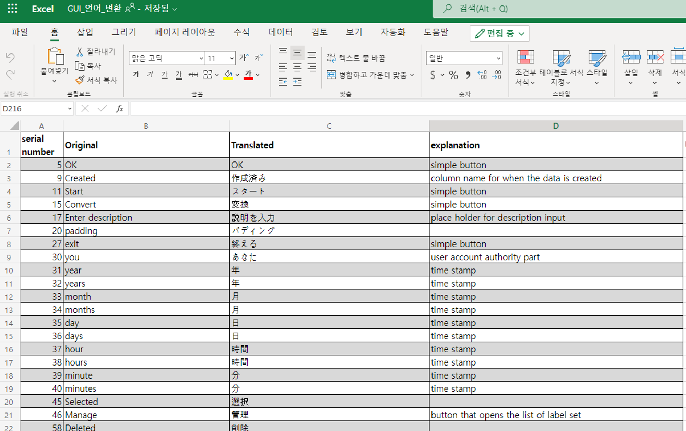

여러 가지 언어를 지원하는 서비스를 만들 때, [개발적인 어려움](../2023-12-05-post/index.md) 외에도 디자이너, 번역가와 협업하면서 마주치는 어려움도 있습니다. 이 글은 제가 다국어 언어 key 관리 업무를 맡으며 겪었던 비효율과 이를 Locize라는 플랫폼으로 해결한 내용을 다룹니다. 언어 key 관리에 고통받는 분들의 생산성을 높이는 데 도움이 되길 바랍니다.

<!--truncate-->

# 중요하지 않지만 시간을 많이 잡아 먹는 언어 관리

저는 회사에서 패키지 형식으로 제공되는 제품을 개발하고 있습니다. 그래서 한 번 릴리즈 되면 수정이 어렵기 때문에 릴리즈 이전에 오류가 없도록 철저히 검사해야 합니다. 하지만 제품의 번역 작업은 항상 모든 개발 작업이 끝난 이후, 일괄적으로 이루어졌기 때문에 오타와 UI 오류를 검수할 시간이 부족했습니다. 번역 작업은 로직적인 최적화에 비해서 단순노동에 가까워 비효율을 줄이고, 팀의 생산성을 높일 수 있는 방법을 고민하게 되었습니다.

## 대표적인 비효율

### 문서 관리

제품의 언어 문서는 번역가에게도 공유되어야 하므로 주로 엑셀로 관리해 왔습니다.



1. `디자인` 영문을 기본 언어로 새로운 컴포넌트 디자인
2. `개발` Figma를 보고 개발하면서 언어 key 생성
3. 새로 추가된 언어 key와 번역이 필요한 언어 key를 수기로 엑셀에 작성
4. `번역` 국문, 일문에 대한 번역 의뢰
5. `수정` 번역본을 프로젝트 코드에 반영
6. 반영한 문구는 엑셀에 따로 표시
7. 반복

기본적으로 위와 같은 프로세스로 작업해 왔는데 문제는 번역에 자잘한 수정이 있을 때입니다. 국문과 영문은 따로 번역 의뢰를 맡길 필요가 없기에 구두로 논의 후 수정하는 경우가 왕왕 있는데 그때마다 엑셀 문서를 업데이트해 주지 않으니 실제 제품 코드와 엑셀 문서가 동기화되지 않는 경우가 발생했습니다. 제품 코드의 문구가 살짝 수정될 때마다 엑셀 문서도 업데이트해 주지 않으면(혹은 그 반대로 엑셀의 문구가 업데이트되었는데 코드에 반영되지 않으면) 나중에 해당 문자열을 찾기 어렵고, 변경 사항이 누락되기 쉽습니다.

### 수정의 어려움

기획/디자인 측의 요청으로 언어 표현이 바뀌는 경우가 잦은데 변경 권한을 개발자만 가지고 있는 것이 번거로웠습니다. 사소한 작업임에도 매번 Jira 티켓 생성하고, 작업하고, 코드 리뷰 받고, 머지하는 과정을 거쳤는데 이 부분이 비효율적이고 피로하다고 느껴졌습니다.


미안할 일이 아닌데도 요청할 때마다 눈물로 읍소🥺하는 게 요청하는 사람도 요청받는 사람도 불편하고, 제품에도 좋지 않은 영향을 미친다고 생각했습니다.

# Locize로 행복 코딩하세요

[Locize](https://docs.locize.com/)란 i18next의 개발자들이 만든 번역 관리 시스템입니다.

여러 명의 관리자가 협업할 수 있고, 개발자는 CLI로 코드와 문서의 동기화를 손쉽게 진행할 수 있으며, 디자이너는 Figma 플러그인으로 디자인 단계에서 UI 번역을 해 볼 수 있습니다. 그 밖에도 언어 key의 히스토리 관리도 가능하고, 무엇보다 i18n의 기능을 모두 지원합니다.

## 장점 - 문서 관리 생산성 향상

Locize 적용 후, 다음과 같은 워크플로우로 컴포넌트 개발을 진행하였습니다.

1. `디자인` 새로운 컴포넌트 생성 시, locize에 key 업로드
2. `개발` 새로운 컴포넌트 개발 전, locize에 업로드 된 언어 key를 다운로드
3. `번역` export 기능을 사용해 엑셀 생성하여 번역을 맡기거나, 번역가가 직접 locize에 입력
4. `수정` 변경사항은 locize에서 바로 수정, 수정 후 한꺼번에 다운로드하여 코드에 적용
5. 최종 빌드 전 다시 한 번 다운로드하여 Locize와 프로젝트 코드 동기화

엑셀을 손수 작업하는 부분이 자동화 되어서 휴먼에러를 많이 줄일 수 있었고, 덕분에 복잡한 로직 작업에 시간을 더 많이 할애할 수 있었습니다.

## 장점 - 손쉬운 동기화

코드와 문서를 함께 관리할 때에는 휴먼에러가 자주 발생할 수 있기 때문에 자동화를 1순위로 고려해야 한다고 생각합니다. 그런 점에 있어서, [Locize에서 제공하는 CLI](https://docs.locize.com/integration/cli)는 매력적인 장점입니다.

온라인에서 로컬로 싱크를 맞추는 ‘download’ 도 있고, 로컬에서 온라인을 변경하는 ‘sync’도 있어서 비개발자와 개발자 사이의 협업에 큰 도움을 줍니다.

### Online → Local

```jsx
locize download --path ./src/data/language --project-id 아이디 --ver 버전명
```

`download` 명령어를 사용하면 `-—path`에 설정한 경로에 온라인에 업로드 된 언어 key JSON 파일이 생성됩니다.

### Local → Online

```jsx
locize sync --path ./src/data/language --project-id 아이디 --api-key 키 --reference-language-only false --update-reason true
```

`sync` 명령어를 사용하면 로컬 파일이 온라인에 덮어쓰기 됩니다. 만약 로컬 파일의 언어 key 중에서 온라인에 등록되지 않은 key가 있다면 새로 추가되고, `--update-reason` 옵션을 true로 설정 하면 온라인에 등록된 언어 key의 value 값도 변경됩니다.

## 단점 - 비용

가장 큰 단점은 아무래도 비용입니다. `기본 사용료 + 단어당 과금` 되는 방식으로 [과금 정책](https://docs.locize.com/more/general-questions/why-is-the-pricing-so-complicated)이 꽤 복잡합니다. (문서 제목이 "왜 이렇게 과금 정책이 복잡한가요?" 일 정도...)


현재 제가 진행 중인 프로젝트는 3개국어를 지원하고, 약 7000 단어 정도를 사용하고 있는데 적지 않은 돈이 과금되는 것으로 알고 있습니다. (한창 개발 중일 땐 10만원이 넘게 과금되기도 합니다.) 달러로 결제되기 때문에 환율을 생각해보면 더 부담이 돼서 중복된 key를 최대한 줄이려고 노력하고 있습니다. 하지만 그 비용을 상쇄할 만큼 개발자의 언어 key 관리 부담을 덜어주었고, 덕분에 새로운 언어를 추가하는 데 비용과 시간도 많이 줄었습니다. 언어 key를 추가하지 않는 기간이 있다면 계정을 일시정지하여 비용 부담을 아끼는 방법도 있으니 다국어 프로젝트를 진행 중이고, 비슷한 어려움을 겪고 계시다면 Locize 도입을 한 번 고려해보세요!
