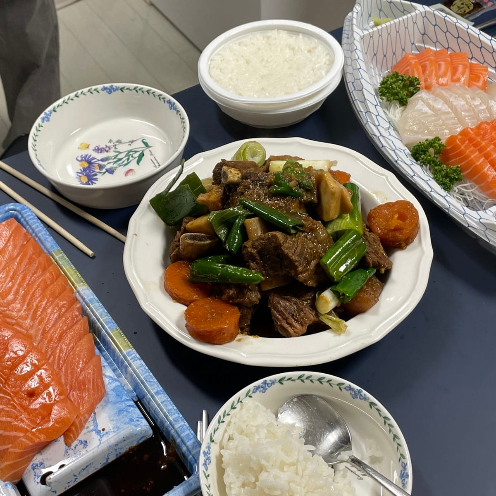
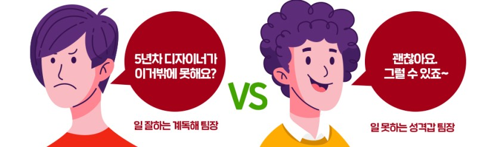
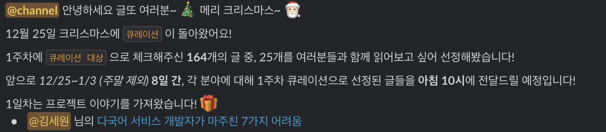
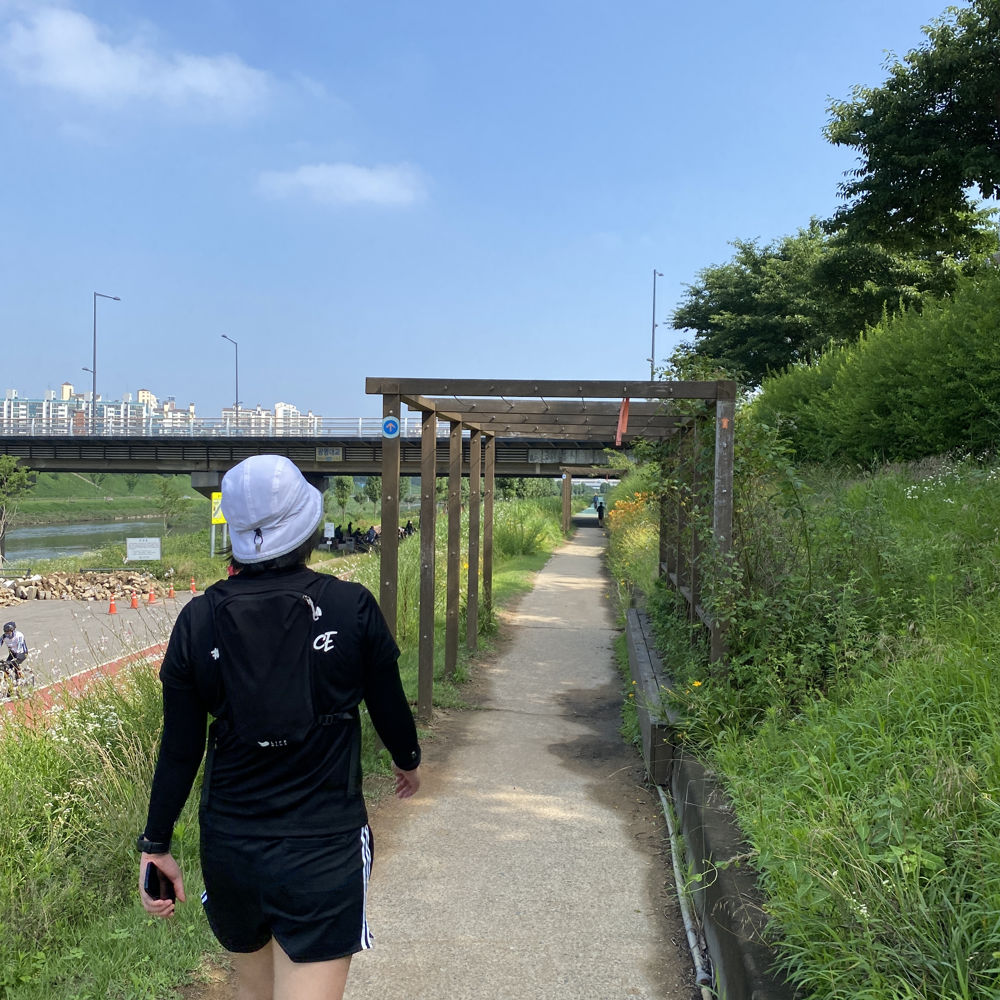
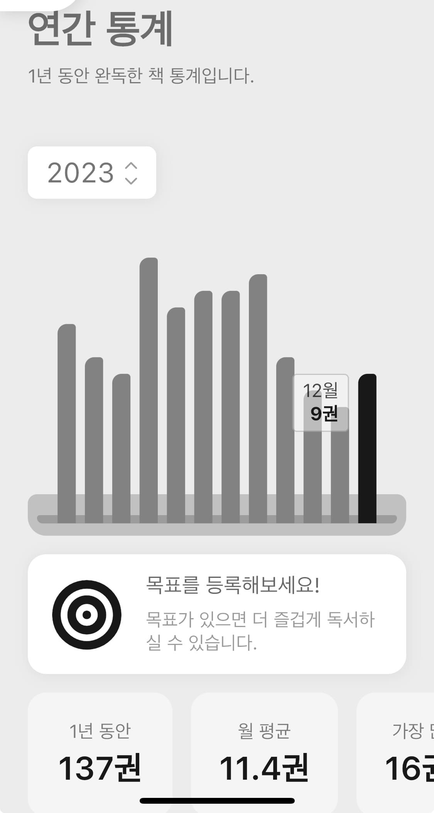

[지덕체를 고루 갖춘 훌륭한 사람이 되고자 했던 2023년](../2023-01-03-post/index.md)이 지나갔습니다. 회고를 쓰고 있는 지금은 감기에 걸려서 조금 골골대고 있지만 종합적으로 보면 지덕체 스탯을 골고루 찍었지 않았나... 하는 생각이 드네요. 구체적으로 1년동안 어떻게 살았는지, 그리고 2024년에는 또 방향으로 나아가야 하는지 생각하는 시간을 가져보려고 합니다.

<!--truncate-->

 
 

## 회사 안에서

### 1. 팀 빌딩

드디어 뉴로클 FE팀이 4명이 되었습니다. 2021년에는 2명, 2022년에는 3명, 2023년에는 4명으로 팀도 점점 성장하고 있고 그 안에서 스스로도 많이 성장함을 느꼈습니다. 성향과 관심사가 각기 다른 4명이 모여 처음에는 조금 적응의 시간이 필요했지만 지금은 서로 비슷하지 않아서 다행이라는 생각이 듭니다. 서로 다르기 때문에 부족한 부분들을 메꿀 수 있고, 서로를 존중하는 방법도 배우게 되었습니다.

22년 회고를 하면서 업무 주관이 뚜렷하고, 직설적으로 말하는 제 성향이 팀에 누가 되지 않을까 고민이 많았는데 걱정대로 상반기에는 갈등과 스트레스가 있었습니다. 그 시간들을 지나오는 게 힘들지 않았다면 거짓말이겠지요. 그렇지만 그 시간을 지나오면서 커뮤니케이션에 대한 책도 많이 읽을 수 있었고, 팀원 분들과 대화도 더 많이 할 수 있었습니다. 그래서 지금은 팀원들과의 관계도 더 좋아졌고, 회사생활이 행복합니다.

(회사 동료와 홈파티를 할 수 있다는 것도 믿기지 않았는데 갈비찜이 먹고 싶다고 하니 손수 갈비찜을 해주셔서 너무 감동이었습니다 🥺🍖)

한 가지 걱정이 있다면 팀에 인원 변동이 생기는 것입니다. 영원한 건 절대 없고, 현재 모두가 최상의 상태라고 할 수는 없지만, 행복한 회사생활을 하고 있기 때문에 그 미래가 빨리 오지 않기를 바라게 되네요.

### 2. 일잘러 되기

23년 한 해는 조직에 대한 관심을 많이 가지고, 액션도 취해본 한 해였습니다. 정말 일이 잘 되게 만드려면 코딩도 잘 해야하지만 조직원 모두가 일을 잘하는 환경이 중요하다는 생각이 들었거든요.

진짜 일을 잘하는 사람은 배려와 공감을 잘 하는 사람이라는 생각에는 변함이 없습니다. 그래서 개발뿐만 아니라 관계를 더 잘 만들어 나갈 수 있는 방법들도 공부했습니다. 종종 티타임을 가지며 도움을 받기도, 도움을 드리기도 했고, 워크샵 TF에 참여해 다른 직무 분들과도 협업할 기회를 가졌습니다. 취준생 시절처럼 기술적인 부분에서 많이 성장했다는 느낌은 못 받았지만, 인간적인 부분에서는 뿌듯함이 남는 한 해였습니다.

### 3. 에러 핸들링과 객체지향

23년 한 해동안 에러 핸들링과 객체지향, 2가지 부분을 가장 신경쓰며 개발했습니다.

제가 담당했던 파트가 에러 핸들링에 관련한 것이었던 것도 있지만 이건 도메인과 무관하게 FE 개발자로써 잘 알아두면 제품의 디테일이 올라가는 부분이라고 생각했습니다. 2022년에는 다국어 지원에 집중했기 때문에 관련 포스팅을 많이 했는데, 2023년에는 에러 핸들링에 대해 배운 것들을 정리해서 포스팅 해보고 싶습니다.

또 다른 부분은 객체지향입니다. FE에서의 객체지향을 어떻게 적용할 수 있을까 고민하면서 <디자인 패턴의 아름다움>이라는 책도 읽고, 몇 몇 아티클들도 읽어보았습니다. 그저 하나의 개발 패러다임일 뿐, JS에서는 적용 불가능 한 것도 아니었고 실제로 컴포넌트 개발에 적용해보았습니다. 저도 잘 모르는 부분이었지만 적용하면서 공부해보고, 팀원 분들께도 새로운 지식을 전파하는 역할을 할 수 있어서 좋았습니다.

### 4. 애자일

2번의 메인 릴리즈를 거치면서 제품팀 전체가 애자일하게 일하는 것의 필요성을 느꼈습니다. 관성대로 일하는 것이 아니라 생산성을 올려서 일을 더 똑똑하게 해보려는 시도를 하고 있습니다. <클린 애자일>이라는 도서가 정말 많은 도움이 되었고, 단순히 업무 프로세스를 개선하는 것 뿐만 아니라 개발자로서 가져야 할 장인 정신이나 일에 대한 태도를 많이 배울 수 있었습니다. 당장 다음 버전 개발에 얼마나 적용할 수 있을지는 미지수지만, 근 2달간의 노력이 헛되지 않도록 노력해보려고 합니다.

### 5. 사내 사이드 프로젝트

한 해를 시작하면서 '사이드 프로젝트 무작정 하지 않기'라는 목표를 가지고 있었습니다. 이렇게 마음먹은 덕분인지 평일 저녁, 주말을 모두 사이드 프로젝트에 쏟는 일은 없었습니다. 대신 사내에서 모집하는 사이드 프로젝트 TF에 참여해 개발적인 갈증을 채웠습니다. vite나 tailwind CSS처럼 사용해 보고 싶던 기술들을 적용해봤고, 유저를 좀 더 고려한 기획/제품에 대한 고민을 해볼 수 있었습니다.

업무와 병행하면서 하다보니 생각보다 개발 속도가 더뎌서 아쉬운 부분도 있는데, 2024년에는 메인 업무와 사이드 프로젝트 둘 다 집중해서 작업할 수 있는 방법, 환경에 대해 고민해보고 싶습니다.

 
 

## 회사 밖에서

### 1. 봉사활동

지난 여름, 지인분의 제안으로 웹 사이트를 제작해드리는 봉사활동을 했습니다. 제가 가진 기술로 뭔가 의미있는 프로그램을 만들어드린다는 것이 정말 뿌듯했으나 동시에 도메인에 대한 이해가 부족하고, 기획자가 없는 상태에서 진행하는 프로젝트는 정말 어려웠습니다. 유지보수하는 것도 문제가 있었고, 뭔가 미완성으로 마무리 된 것 같아서 아쉽지만 다음에도 이런 기회가 있다면 또 참여해보고 싶습니다.

### 2. 글또 9기

2023년 11월, 글또 9기를 시작했습니다. 덕분에 미루고 미뤄오던 다국어 지원에 관한 포스팅을 정리할 수 있었습니다.

선물처럼 1주차 큐레이션에 제 글이 뽑히기도 했습니다. 글또 시작하자마자 '진즉 글을 쓸 걸...' 하는 생각이 들었네요. 회사 사람들과 일하는 것도 재미있지만 회사에서 충족하지 못하는 읽기와 쓰기에 대한 욕구를 글또에서 해소할 수 있어서 퇴근후에도 행복한 나날을 보내고 있습니다️~😊☘️ 9기 마무리까지 꾸준히 포스팅하고, 소모임 활동도 열심히 해보려고요!

 
 

## 2024년에 바라는 것

### 1. 나만의 성장

커리어를 시작할 때부터 '성장'에 대한 고민이 참 많았습니다. 다들 성장하고 싶어하는데 도대체 그 성장이라는 게 무엇인지, 어디까지 성장해야 하는 건지, 어떻게 성장해야 하는 건지 뚜렷하게 알 수 없었습니다. 누구나 알만한 회사에서 연봉을 얼만큼 받으면 충분히 성장했다고 볼 수 있는 걸까요? 유명한 개발자로 이름을 날리면 충분히 성장한 걸까요? 그 다음에 또 어디로 성장해야하는 걸까요?

산책하다 발견한 푯말에서 대왕참나무는 30m까지 매우 빠른 성장을 한다고 합니다. 대왕참나무가 성장하는 것처럼, 남들이 성장하는만큼 나도 따라서 성장해야하는 것은 아니라는 생각이 들었어요. 그리고 내가 남들만큼 빠르게 성장하지 못한다고해서 불안해 할 필요도 없다는 생각을 했습니다. 저는 대왕참나무가 아닐지도 모르니까요! 다양한 풀과 나무가 모여서 예쁜 공원을 만들고, 멋진 숲과 산을 만드는 것처럼 내가 이 세상에서 어떤 역할을 하고 있는지를 먼저 알아야 할 것 같더라고요.

내가 어떤 나무인지, 어디에 심어진 묘목인지 알아보자는 생각을 하기 전에는 그냥 덮어놓고 갓생을 살아야하는 인생이 너무 지치고 피로하게 느껴졌습니다. '난 더 이상 성장하고 싶지 않다'는 오만한 생각도 하게되었어요. 2024년에는 좀 더 넓은 시야로 제 자신과 저를 둘러싼 환경을 파악하고, 나만의 성장을 이뤄나가고 싶습니다.

### 2. 나만의 시간

2023년에는 회사에서의 시간, 개발자로서의 시간 외에도 스스로의 시간을 챙기기 위해 노력했던 한 해였습니다.

6번의 등산을 했고, 30회의 PT를 받았습니다. 157km의 서울 둘레길 8코스를 완주했고, 누적 284.3km의 달리기를 했으며(마라톤에 3회 참가했습니다), 클라이밍과 필라테스 수업도 들었습니다. 개발 외에는 건강을 챙기는 것을 최우선으로 생각했는데 덕분에 정신적으로 많이 깨어날 수 있었습니다. 운동을 할 수록 몸 상태에 예민해지게 되니 '몸과 마음이 연결되어있다'는 말이 무엇인지 체감할 수 있었습니다. 올해에는 운동 뿐만아니라 먹는 것에도 좀 더 신경을 써서 더 건강한 몸과 마음으로 살아보고 싶습니다.

그리고 총 137권의 책을 읽었습니다. 나의 관심분야, 배우고 싶은 것, 사람들의 추천 도서 등 다양한 책들로 한 해를 가득 채웠어요! 일 외에 제 삶을 풍부하게 해주는 가장 큰 요소가 아닌가 싶습니다. 137권의 책 중 10% 정도는 개발 관련 서적들을 읽었습니다. 실무에 적용해보기도 했고, 사내에 5권정도는 전파해보는 시도를 했어요. 제가 책을 읽음으로 인해서 주변 사람들에게도 좋은 영향을 끼치고 싶었습니다. 올해는 책을 더 많이 읽는 것보다는 한 권을 읽더라도 제대로 읽고, 잘 소화해서 변화를 만들어내고 싶습니다. 책만 많이 읽는 헛똑똑이가 되지 않도록...!
