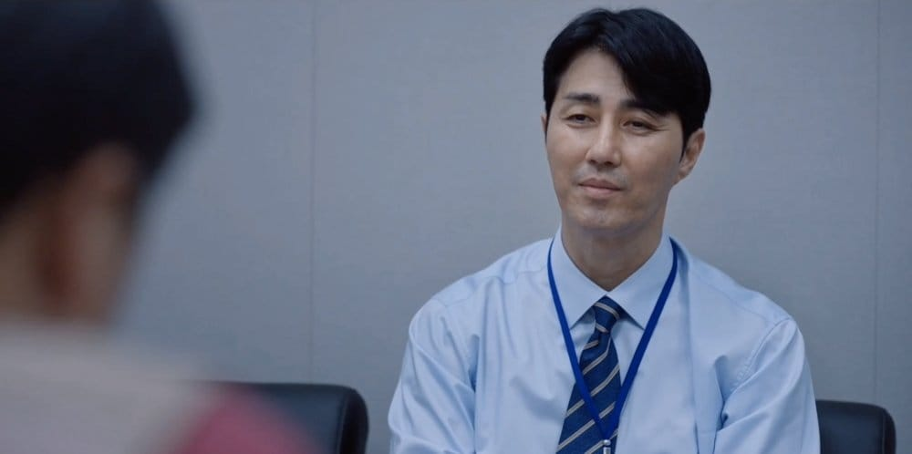
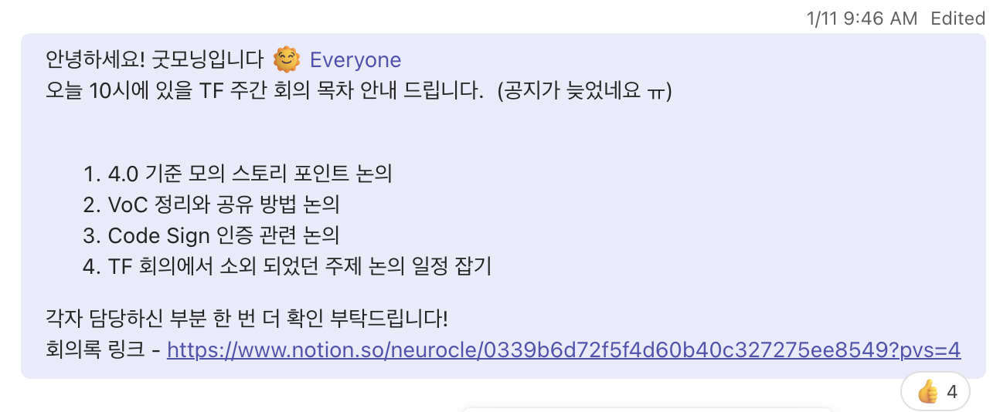

어그로성이 짙은 제목입니다. 이 글은 회사에서 2개월 간 서비스 개발을 멈추고, 개발 프로세스를 점검하고 개선하는 TF에 참여하면서 느낀 점을 정리한 글입니다. 저도 프론트엔드 개발 말고 이런 업무는 처음이라 2개월간 많은 삽질을 했는데 이 과정을 글로 정리하면서 배운 점, 개선할 점들을 돌아보고 싶었습니다.

 

## TF의 발단

TF란 'Task Force'의 약자로, 특정 목적을 달성하기 위해 일시적으로 구성된 팀을 말합니다. 저희 회사에서는 '지속가능한 개발팀'을 위해 2달간 제품 개발을 멈추고, 회사의 개발 프로세스를 점검하고 개선하는 TF를 구성했는데요. 이 TF는 **서비스의 메이저 업데이트 회고 이후 제기된 문제점**을 해결하기 위해 시작되었습니다.

### 새벽 5시 퇴근... 그만 하려면 어떻게 해야할까요?

저희 회사의 제품은 예전 포토샵과 같은 패키지 형태이고, 5~8개월 주기로 서비스를 배포 합니다. 유저에게 배포 메일이 릴리즈 된 이후에는 제품에 버그가 있어도 변경할 수 없기 때문에 마지막의 마지막까지 공들여 QA하고 버그픽스를 진행하는데요. 핫픽스 버전을 내는 것이 비즈니스적으로 비용이 매우 많이 드는 작업이고, 고객과의 신뢰와도 연관되어있기 때문에 모든 개발자가 부담을 가지고 진행합니다. **스프린트 후반에는 종종 주말 출근을 하기도 하고, 최종 빌드 날까지 버그 픽스와 QA를 진행하느라 새벽 퇴근이 당연해지는 문제**가 있었어요.

<!--truncate-->

4월부터 11월까지 진행된 4.0버전 개발은 메이저 업데이트였던 만큼 부담이 컸고, 12월에 진행된 회고에서 어김없이 문제가 언급되었다. 4번(3.0~2, 4.0)의 배포를 경험한 저도 매번 반복되는 야근과 일정 관리가 스트레스였고, 특히나 이번 버전 개발은 PM도, 기획자도, 개발자도, QA도 누구하나 만족하지 못했다고 느껴졌습니다.

문제점을 인지했지만 해결을 위한 액션 플랜은 '다음엔 이렇게 하지 말자!'처럼 추상적인 다짐에 가까웠고, 이대로 다음 버전 개발을 진행했다가는 많은 사람들이 머지않아 회사를 떠날 것 같다는 걱정이 들었습니다. 회사에서도 지속적으로 불만이 나오는 상황을 해결하고자 하는 의지가 있어서 `업무 프로세스 개선 TF`라는 거창한 이름을 달고, 2달동안 서비스 개발을 멈추고 업무 프로세스를 점검하고 개선하는 TF를 구성하게 되었습니다.

 

## TF에서의 나

:::warning 주의
이 글에서는 구체적인 TF의 내용보다는 이 TF를 진행하면서 제가 느낀 점과 배운 점들을 정리하려고 합니다. 그래서 앞서 소개한 문제들을 어떻게 해결했는지에 대한 내용은 포함하지 않았습니다.
:::

 

### '퍼실리테이터'로서의 나

처음 TF를 모집하고 시작할 때, 회사에서 `어떤 문제를, 언제까지, 어떤 형태로 해결하라`는 구체적인 지시가 없었습니다. 회고에서 가장 문제가 되었던 부분이 업무 프로세스인 것 같으니 이걸 해결하는 것이 미션이었고, 달성하려는 임무가 충분히 구체적이지 않았기 때문에 TF 참여인원 모두가 처음에는 어떻게 해야할지 막막했습니다.

(일단 회의 시간을 잡고 모이긴 했는데 무슨 말을 해야할지 모를 때...)

6개월 전 쯤, <클린 애자일>이라는 책을 감명 깊게 봤었고, 어쩌면 _진짜_ 애자일 프로세스를 적용하면 이 문제가 해결될 것 같다는 생각이 들어서 초반에는 제가 주도적으로 회의 퍼실리테이팅을 맡았습니다.

일단 노션 페이지의 틀을 만들고, 회의 진행을 위한 준비를 철저히 했습니다. 가장 신경썼던 부분은 '불필요한 회의 줄이기'였고, 회의가 진행되기 전에 먼저 논의할 주제를 정해놓고 미리 회의록 목차를 작성해 팀에 공유했습니다.

이렇게 하니 초반에 버리는 시간 없이 바로 논의를 시작할 수 있어서 좋았고, 중요한 주제를 먼저 논의할 수 있었습니다. 쉽게 발산형 회의가 되어버릴 수 밖에 없는 TF라서 이런 장치들을 통해 제한된 시간을 최대한 효율적으로 사용하려고 노력했습니다.

그리고 회의가 끝난 후에는 회의에 참여하지 못한 분들을 위해 회의록을 정리해서 팀에 공유했습니다.

처음에는 단순히 내용 전달을 위해 정리한 것이었지만 서로 논의한 내용이 맞는지 한 번 더 확인 할 수 있게 되어 좋았습니다.

다만 회의를 준비하고, 회의 내용을 정리하는 것에 리소스를 적지 않게 들였기 때문에 회의가 마냥 좋지만은 않았습니다. 2개월동안 코딩보다 회의 정리를 더 열심히하는 제 모습을 발견할 때마다 현타가...😅

그리고 다른 사람들의 반응에 굉장히 신경을 많이 쓴다는 것을 스스로 느꼈습니다. 무언가 공유드렸을 때 칭찬 받고 싶고, 개선해야할 점을 듣고 싶은 마음이 컸는데 대부분 그냥 '좋아요👍'로 끝나는 경우가 많아서 아쉬웠습니다. 뭔가 할 때마다 피드백이 돌아오지 않으니 다른 사람들의 눈치를 계속 살피게 되고, 그게 스트레스로 다가오더라구요. 저는 이렇게 인정 받고 싶어하면서 막상 **다른 사람에게는 칭찬하고, 피드백** 주지 않았던 것 같아서 반성하게 되었습니다.

 

### '리더(?!)'로서의 나

초반에 적극적으로 퍼실리테이터 역할을 맡아서 그런지, 어느새 사내에 제가 TF의 _리더_처럼 생각되고 있었습니다. TF의 목적이나 방향성을 결정하는 권한이 없었기 때문에 리더도 아니었고, 진짜로 문제를 해결하고 싶어서 다른 사람들보다 조금 더 나댔을 뿐인데... 조금 부담이 되었습니다.

하지만 이 과정에서 회의가 너무 길어지지 않도록 적당한 선에서 의견을 모으는 것, 각자의 의견을 존중하면서도 하나의 결정을 내리는 것, 참여자의 참여도를 올리는 것 등 조직 내의 일이 잘 돌아가게 하기 위해서 신경써야 할 것들을 배운 것 같습니다. 그리고 **매 선택의 순간에 양보를 해야한다**는 것도요.

 

### '발표자'로서의 나

TF를 대표로 말하는 역할을 맡다보니 자연스럽게 발표도 하게 되었습니다. 대학 시절 조별과제 이후로 정말 오랜만에 PT를 준비한 거라 아직 발표 스킬이 많이 부족하다는 것을 느꼈습니다.

(젋은 패기로 신속 정확하게 프로세스를 전달한다...! 라는 생각으로 준비한 PT... 호덜덜)

PT를 하면서 가장 어려웠던 점은 '내가 말하고 싶은 내용을 효과적으로 전달하기'였습니다. 진행하려고 하는 일을 다른 사람들도 원하도록 설득하기 위해 발표하는 것이라 일종의 비즈니스 협상과도 같이 느껴졌습니다. 학생때에는 '제가 이렇게 잘 했으니까 A학점 주세요!'라고 말하면 되었는데, 이번엔 앞으로의 제 회사 생활이 달린 일이다보니 무게감이 아예 다르더라구요. 결과적으로는 제대로 전달하지 못한 것 같아서 아쉬운 부분입니다.

예전에는 발표 후 질문이 나오는 게 발표자 입장에서 좋지 않았는데, 이번에는 질문이 나오지 않는게 더 좋지 않았습니다. 질문이 없다는 의미가 이 세가지 중 하나이니까요.

:::note 질문이 없다는 건?
1. 명확히 이해했다.
2. 전혀 이해하지 못했다.
3. 관심이 없다.
:::

내용 전달 후 다들 같은 내용으로 받아들였는지 확인하는 과정이 없었고, 이를 역질문해서라도 확인했어야했는데 그러지 못해서 이후 서로의 오해만 커졌습니다. 발표 준비한 사람들도 치열하게 고민하고, 시간과 노력을 투자해서 준비한 것이니 커뮤니케이션 미스가 생겼을 때 기분도 많이 상하고, 사기도 많이 떨어지더군요. 이런 오해와 갈등을 줄이기 위해서는 **어떤 내용을 전달 할 때, 집요하게 물어봐서라도 align을 맞추는 과정이 필요하다**는 것을 배웠습니다.

 

### '동료'로서의 나

애자일 프로세스를 적용하는 과정에서 정말 많은 논의를 거쳤습니다. 그리고 매 논의마다 진심으로, 치열하게 토론했습니다. 그 과정에서 타인의 말을 끝까지 듣는 것, 그리고 화내지 않는 것이 참으로 어렵다는 것을 느꼈습니다. '내가 더 잘 알아, 내 말이 맞아'라는 생각을 은연중에 가지고 있었던 것 같아요. 그것을 내려놓아야 대화가 시작된다는 것을 깨달았고 반성도 많이 했습니다.

논의 중에 너무 흥분해서 조금 공격적인 어투로 이야기 한 적이 있었는데 감사하게도 다른 분께서 제 어투에 대한 피드백을 주셨습니다. 정말 감사했지만 동시에 너무 부끄러웠고, 부족한 제 모습이 화가나기도 했어요. 눈물이 날 정도로 부끄러운 순간이었습니다. 하지만 피드백을 받아들이고, 개선하는 모습을 보이는 것도 중요하다고 생각했고, 그 후로는 말할 때 더 주의를 기울이고, 좋은 분위기로 표현하려고 노력하고 있습니다. **같이 논의 했을 때 기분 좋게 최상의 결과를 끌어낼 수 있는 동료, 뭐든 같이 논의하고 싶은 동료**가 되고 싶어요.

 

## 아직 TF는 끝나지 않았다

아직 TF가 공식적으로 끝나지 않았지만, 1차 결과물을 가지고 다음 버전 개발에 슬슬 들어갈 준비를 하고 있습니다. 스프린트가 시작되면 또 정신없이 지나갈 것 같아서 조금 미리 TF에서의 스스로의 모습을 돌아봅니다. TF를 잘 마무리해서 `애자일 프로세스 적용`에 대한 내용도 글로 정리하게 되길...
