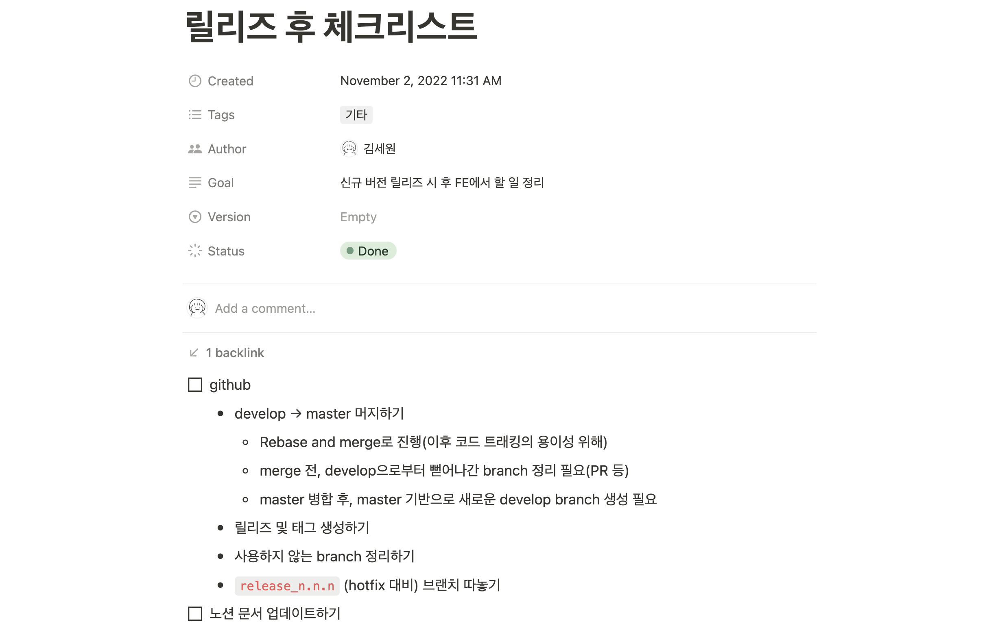
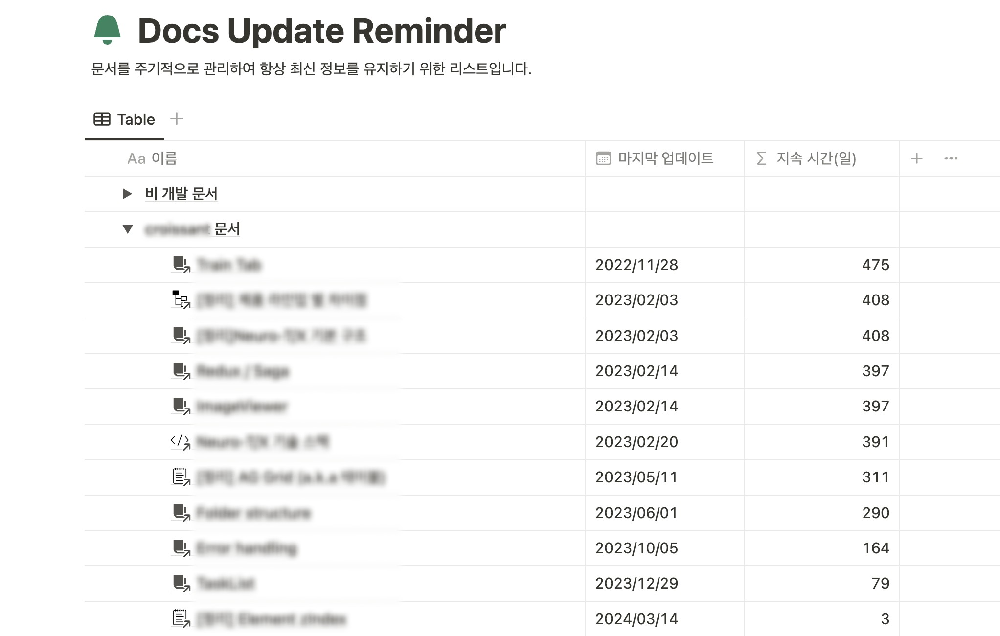

릴리즈를 하면 개발자의 일이 끝난 걸까요? 지난 3년 간 10여 번의 크고 작은 릴리즈를 경험하면서 느낀 점은 '끝날 때까지 끝난 게 아니다'였습니다.


어찌 보면 당연한(?) 말인데요. 처음에는 `릴리즈 === 끝`이라고 생각했습니다. 개발 기간 동안 야근한 나를 위로하기 위해 긴 휴가를 보내거나 하릴없이 월급 루팡을 하기도 했고요. 하지만 정말 프로젝트를 매조지기 위해서 해야 할 일들이 있고, 코드 개발에 비해 개발자들이 놓치기 쉽고 귀찮은 작업들이 많습니다.

우연히 읽게 된 `<Stopping at 90%>`라는 글에 굉장히 공감하며 읽었고, 이것이 비단 개발자들만의 문제는 아니라는 점도 알게 되어 흥미롭게 읽었습니다. 글을 소개하며 저도 지금까지 프로젝트들을 잘 마무리해왔는지 되돌아보려고 해요. 이 글을 읽는 분들도 하고 계신 일을 완전히 매듭짓는 데 이 글이 도움이 되었으면 좋겠습니다.


<!--truncate-->

## Stopping at 90%

> 이 글은 Austin Z. Henley의 포스트 [Stopping at 90%](https://austinhenley.com/blog/90percent.html)을 번역한 글입니다.

프로젝트를 막 마무리 했습니다.

4개월 동안 소프트웨어 시스템을 구축하고, 실험을 진행하고, 논문을 작성해 저널에 출판을 위해 제출하였습니다. 이제 할 일이 끝났습니다. 끝. 그렇죠?

아니요! 저는 이것을 **90%에서 멈추기**라고 합니다.

핵심 프로젝트는 완료되었지만 아직 할 일이 많이 남아 있습니다. 아무도 남은 할 일에 대해 모르거나 하려고 하지 않는다면 절대 일어나지 않을 일들입니다. 이렇게 마무리된다면 그것은 잘못된 마무리입니다.

이것은 비단 연구 논문 작성에만 발생하는 문제가 아닙니다. 당신이 출시한 iOS 앱, GitHub에 올린 개인 레포지토리, 회사에 제출할 보고서, 귀여운 강아지 그림을 그리는 사이드 프로젝트 등 모든 프로젝트에서 발생할 수 있습니다.

저는 이 현상을 어디에서나 발견했고, 어느 누구도 문제 발생에서 자유로울 수 없습니다.

핵심 프로젝트는 쉽게 측정할 수 있는 구체적인 결과물이 있는 반면, 나머지 10%의 할 일은 추적이 어렵고 명확한 중단 지점이 없는 경우가 많기 때문에 90%에서 멈추는 경우가 많습니다. (쉽게 측정할 수 있는 구체적인 결과물에는 예를 들어, 시스템 성능을 개선, 논문 제출 등이 있습니다.)

90%에서 100%로 가려면 무엇을 해야 할까요?

- 다른 팀에게 한 일을 발표합니다.
- 조직 내의 다른 사람들이 알 수 있도록 요점을 정리한 이메일을 발송합니다.
- 동료들이 나중에 활용할 수 있도록 코드를 저장합니다.
- 블로그 게시물을 작성합니다. 트위터, HN, Reddit에 글을 올립니다.
- 계속 진행할 계획이 없더라도 다음에 무엇을 할 것인지, 그 이유는 무엇인지 설명하는 문서를 작성합니다.
- 도움이 될 수 있는 비슷한 프로젝트를 찾아봅니다.
- 본인의 작업물에 허점을 찾아낼 수 있는 사람을 찾습니다. 그리고 그 문제를 해결하세요.

전파, 문서화, 고도화는 핵심 프로젝트만큼이나 중요합니다.


## 나는 95%쯤...?

저는 문서화와 전파를 중요하게 생각합니다. 일하는 인원에 교체가 있더라도 문제없이 잘 돌아갈 수 있는 시스템을 만들어 놓아야 한다고 생각합니다. 그러기 위해서는 이런 문서화 작업들이 필수적이라고 생각해서 몇 가지 작업들을 해놓았습니다.



먼저 릴리즈가 끝나면 체크리스트를 보며 빠뜨린 것이 없는지 확인합니다.


그리고 작성중인 글들을 확인하고, 문서화를 마무리합니다. 노션에 작성하는 문서는 하나의 데이터베이스에만 작성해서 관리하기 때문에 '상태' 값을 통해 작성중인 문서를 쉽게 확인할 수 있습니다.



작성 중인 글들을 완성하고 나면, 이전에 작성 완료된 문서들을 쭉 돌아보며 갱신이 필요한 부분이 있는지 확인합니다. 노션 데이터베이스의 '수식' 기능을 사용해 얼마나 방치된 문서인지 확인합니다.

:::tip 사용한 노션 수식

```
dateBetween(now(), prop("마지막 업데이트"), "days")
```
:::


위와 같은 나머지 10%에 해당하는 작업은 개발에 비해 우선순위가 떨어집니다. 그리고 당장하지 않아도 크게 문제되지 않아요. 굉장히 귀찮습니다. 하지만 이런 작업들을 릴리즈가 끝난 시점에 하지 않으면 다음 기회는 없습니다.

그래도 릴리즈 이후 이런 작업들을 하는 버릇이 들어 완성도가 95%정도는 되지 않나...라고 생각해봅니다. 앞으로는 문서화 외에도 다른 팀과 작업 내용에 대한 기술적 교류, 비슷한 프로젝트를 탐구해보고 비교하기, 작업물 개선 등을 시도해서 나머지 5%를 채워보아야겠습니다.
