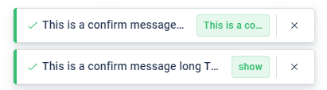

최근 Snackbar 컴포넌트를 만들면서 `callback ref`를 사용하게 되었습니다. `callback ref`는 함수를 ref로 전달하는 방식입니다. 이 글에서는 `callback ref`를 사용하게 된 이유와 사용 사례를 컴포넌트 개발 사례를 통해 소개하고자 합니다.

:::note 참고하세요

- [ref callback function 에 대한 React 공식문서](https://react.dev/reference/react-dom/components/common#ref-callback)

:::

<br />

## Quest! Snackbar 컴포넌트 제작하기

Snackbar 컴포넌트는 사용자에게 메시지를 보여주는 컴포넌트입니다. 사용자가 어떤 작업을 했을 때, 성공했는지 실패했는지 등을 알려주는 데 사용합니다.



### 말줄임표 처리 문제

제가 맞닥뜨린 문제는 Snackbar 컴포넌트의 내부 텍스트의 말줄임표 처리였습니다. 단순히 Snackbar 컴포넌트의 내부 메세지 텍스트에 max width값을 설정해 주어 ellipsis로 말 줄임 처리하면 해결되는 문제가 아니었기 때문입니다. Snackbar 컴포넌트 내부에 액션버튼이 있을 때, **액션 버튼의 길이에 따라 내부 메세지 텍스트의 max width값이 동적으로 변경되어야 했습니다.**

```jsx
const Snackbar = ({ message, action }) => {
  const classes = useStyles({
    root: {
      width: "fit-content",
      maxWidth: "300px",
    },
    message: {
      width: "fit-content",
      // maxWidth: 'calc(100% - action 버튼의 크기에 따라 동적으로 변경)',
      overflow: "hidden",
      textOverflow: "ellipsis",
      whiteSpace: "nowrap",
    },
    action: {
      maxWidth: "100px",
      overflow: "hidden",
      textOverflow: "ellipsis",
      whiteSpace: "nowrap",
    },
  });

  return (
    <div className={classes.root}>
      <div className={classes.message}>{message}</div>
      <button className={classes.action}>{action}</button>
    </div>
  );
};
```

<!--truncate-->

<br />

## 시도 1) useEffect 의존성에 ref 객체를 주입하기

처음 생각했던 방법은 button 노드를 ref에 등록한 후, useEffect에 의존성을 주어서 액션 버튼의 크기가 변경될 때마다 버튼의 width값을 전달 받는 방법이었습니다.

```jsx
const Snackbar = ({ message, action }) => {
  const buttonRef = useRef(null);
  const [buttonWidth, setButtonWidth] = useState(0);

  useEffect(() => {
    if (buttonRef.current) {
      const width = buttonRef.current.getBoundingClientRect().width;
      setButtonWidth(width);
    }
  }, [buttonRef]);

  return (
    <div className={classes.root}>
      <div
        className={classes.message}
        style={
          {
            maxWidth: `calc(100% - ${buttonWidth}px)`,
            // action 버튼의 크기에 따라 동적으로 변경
          } 
        }
      >
        {message}
      </div>
      <button ref={buttonRef} className={classes.action}>
        {action}
      </button>
    </div>
  );
};
```

### 리렌더링 문제

이때의 렌더링 순서는 다음과 같습니다.

1. buttonWidth state가 0인 상태로 컴포넌트 렌더링
2. buttonRef가 등록되면서 useEffect가 실행되어 buttonWidth를 계산
3. buttonWidth state가 변경되면서 컴포넌트 리렌더링

이런 동작 방식 때문에 컴포넌트가 두 번 렌더링 되는 문제가 발생했습니다. 그래서 useEffect의 의존성에 ref 객체를 주입하는 것은 올바른 해결책이 아니라는 생각이 들었고, 이 문제를 해결하기 위해 `callback ref`를 사용하게 되었습니다.

<br />

## 시도 2) callback ref 사용한 useDimension hook

### callback ref

`callback ref`는 함수를 ref로 전달하는 방식입니다. ref 객체를 생성하고, 해당 ref 객체를 컴포넌트의 ref 속성에 전달하는 대신, 함수를 ref 속성에 전달합니다. DOM 노드가 화면에 추가되면 ref 속성은 전달된 callback 함수를 호출하고, DOM 노드를 인수로 전달합니다.

### useDimension hook

DOM 노드가 화면에 추가될 때, width 값을 업데이트해주면 컴포넌트가 리렌더링 되는 문제를 해결할 수 있을 것이라고 생각했습니다. 그래서 인수로 전달받은 DOM 노드의 width와 height를 반환하는 `useDimension` hook을 만들었습니다.

```tsx
type useDimensionReturn = {
  width: nullableNumber;
  height: nullableNumber;
  ref: (node: HTMLElement | null) => void;
};

const useDimension = (): useDimensionReturn => {
  const [width, setWidth] = useState<number | null>(null);
  const [height, setHeight] = useState<number | null>(null);

  // useCallback을 사용한 ref 함수
  const ref = useCallback((node: HTMLElement | null) => {
    if (node !== null) {
      setWidth(node.getBoundingClientRect().width);
      setHeight(node.getBoundingClientRect().height);
    }
  }, []);
  return { width, height, ref };
};

export default useDimension;
```

<br />

Snackbar 컴포넌트에는 다음과 같이 사용할 수 있습니다.

```jsx
const Snackbar = ({ message, action }) => {
  const { width: buttonWidth, ref: buttonRef } = useDimension();

  return (
    <div className={classes.root}>
      <div
        className={classes.message}
        style={ 
          {
            maxWidth: `calc(100% - ${buttonWidth}px)`,
          } 
        }
      >
        {message}
      </div>
      <button ref={buttonRef} className={classes.action}>
        {action}
      </button>
    </div>
  );
};
```

이렇게 하면 ref가 변경되어도 컴포넌트가 리렌더링 되지 않아서 불필요한 리렌더링을 방지할 수 있습니다.

---

ref를 단순히 DOM 노드에 접근하는 변수, 컴포넌트 렌더링에 영향을 미치지 않는 변수로만 생각했었는데, Snackbar 컴포넌트를 구현하며 ref를 활용하는 방법에 대해 배울 수 있었습니다. 이 글이 ref의 활용을 배우는 데에 많은 도움이 되었으면 좋겠습니다. 감사합니다.
