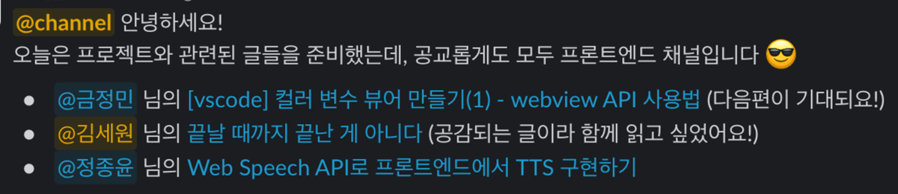
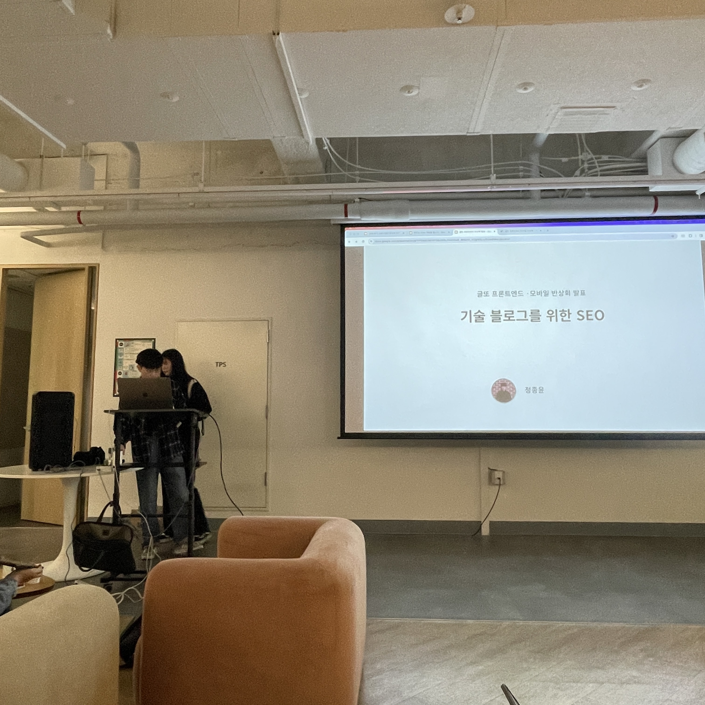

2023년 12월부터 2024년 4월까지 총 5개월간의 글또 활동이 끝났습니다. 글또 9기를 마치며 5개월동안 이룬 것과 느낀 점을 정리해보고자 합니다.

:::note 글또란 무엇인가요?

글또는 '글 쓰는 또라이가 세상을 바꾼다'라는 이름의 개발자 글쓰기 모임입니다. 블로그에 2주 간격으로 글을 작성합니다. 자세한 정보는 [글또 홈페이지](https://geultto.github.io/blog/geultto-summary/)에서 확인할 수 있습니다.

:::

 

## 글또에서 생긴 일

옛날부터 글또의 존재를 알고 있었지만 지원서를 작성할 용기가 생기기까지는 2~3년이 걸렸습니다. 제 삶에 꾸준히 긍정적 영향을 주는 친구가 있는데 그 친구가 꽤 오래전부터 글또 활동을 하고 있었더라구요.(심지어 운영진😮!!!) 덕분에 용기내어 글또 9기 활동을 시작 할 수 있었고, 글또를 통해 많은 것을 얻었습니다. 커뮤니티의 규칙은 단순히 '_2주에 한 번 글을 제출_'하는 것이지만 그것보다 더 많은 것을 해낸 5개월 이라고 생각합니다.

<!--truncate-->

### 1. 8편의 글 작성

2022년 회고 글에, '개발 블로그를 개편했지만 글 작성을 하지 않은' 반성 항목이 있었습니다. 글또에 지원한 목적도 더 많은 글을 써보기 위해서 였는데 5개월 동안 총 8편의 글을 작성해냈습니다! 작년에 총 6편의 글을 작성한 것에 비하면 괄목할만한 성과라고 생각합니다!

매번 회고글만 쓰는 것 같아서 기술적인 글을 쓰고 싶었는데 총 3편의 기술적인 글을 작성했습니다. 입사 후 가장 열심히 했던 다국어 관리 시스템에 대해 언젠가 한 번은 정리해보고 싶었는데 2주라는 마감시간을 갖게 되어 더이상 미루지 않고 글을 작성할 수 있었어요.

 
 

### 2. 큐레이션 2픽!!

글또에서 첫 활동이기도하고, 막상 들어와보니 활동 인원이 많아서(452명) 기대도 안했는데 [첫 회차에 제출한 글](/blog/dev/i18n/tips)이 큐레이션에 뽑혀서 정말 기분이 좋았습니다~

크리스마스날 큐레이션에 뽑혀서 선물같고, 더 좋았어요. '내 글을 다른 사람들이 재미있게 읽어주었구나'하는 보람이 있었습니다.

그리고 [8회차에 제출한 번역글](/blog/article/90percent)이 큐레이션에 뽑혀서 놀랐습니다. 단순 번역만 하지 않고, 제가 느꼈던 점을 덧붙였는데 큐레이션 이유에도 짤막하게 쓰여있듯 공감할 수 있는 부분이 많았던 것 같아요.

활동 전에는 큐레이션의 존재를 몰랐기 때문에 별 생각이 없었는데 제가 쓴 글이 큐레이션에 뽑히면서 글쓰는 재미를 좀 더 느끼게 되었습니다. (인정하긴 싫지만 인정받는 건 너무 달콤하네요...🍬)

 
 

### 3. 글쓰기 세미나

성윤님께서 몇 년간 쌓아온 노하우를 2회에 걸쳐 세미나로 공유해주신 글쓰기 세미나에 참석했습니다. 세미나를 듣고 [과제](/blog/writing)를 수행하면서 제 글쓰기 프로세스를 되돌아보고, 글 작성을 위한 환경을 조성할 수 있었어요. 안타깝게도 글쓰기 습관을 들이는 것에는 실패했지만 그래도 무기한으로 미루는 나쁜 습관은 조금씩 개선되는 것 같습니다.

 
 

### 4. 커뮤니티 활동

글또 슬랙에는 생각보다 많은 채널이 있습니다. 달리기 모임이나 독서모임 같은 제너럴한 모임부터 강아지 모임 같은 귀여운 모임도 있어요. 여러 채널에서 적극적으로 활동하지는 못했지만 몇 몇 커뮤니티 활동이 기억에 남습니다.

**리액트 훅을 활용한 마이크로 상태관리 스터디**

`리액트 훅을 활용한 마이크로 상태관리` 라는 책을 번역해주신 분께서 글또에 홍보 글을 작성해주신 덕분에, 그리고 그 글을 보고 스터디를 모집해주신 분 덕분에 글또 활동기간 중 개발 서적 한 권을 찐하게 읽을 수 있었습니다. 책을 읽다가 궁금한 부분에 대해서 사소한 거라도 깊게 파보고, 라이브러리 코드를 파헤쳐보면서 이해하려고 노력하시는 스터디원분들을 보면서 개발 서적을 대하는 자세에 대해 배울 수 있었어요.

 

**4번의 커피챗 ☕️☕️☕️☕️**

'커피챗'이라는 용어는 많이 들어봤지만 실제로 진행해 본 것은 글또를 통해서가 처음이었습니다. 제가 먼저 신청한 적도 있고, 다른 분이 먼저 제안해주신 적도 있고, 글또에서 엮어준 기회도 있었는데 4번 모두 기억에 남는 시간이었습니다. 같은 프론트엔드 직군의 개발자들을 만나서 다양한 이야기를 나눈 것도 좋았고, 다른 직군 개발자분들은 어떤 고민을 하는지 들어보는 것도 좋았습니다. 한두시간의 대화에서도 인사이트를 얻을 수 있고, 또 제가 다른 분에게 인사이트를 줄 수 있다는 것도 즐거운 경험이었어요.

 

**독서모임**

다양한 커뮤니티 활동 중에 독서모임에도 참여했습니다. 책을 좋아하시고, 같은 개발직군이라 그런지 다른 독서모임보다 훨씬 공감가는 이야기를 나눌 수 있었어요. 서로 다른 책을 읽고 이야기를 나눴지만 전체적으로 같은 결의 이야기를 하게 되는 것이 신기했습니다. 확실히 비슷한 결의 사람들이 모여있는 커뮤니티라는 생각이 들었어요.

 

**반상회**

글또 활동 막바지에 진행된 반상회도 재미있었습니다. 뭔가 연예인처럼 느껴지는 분들도 실제로 볼 수 있었어요.(쑥쓰러워 대화는 못해보았습니다만...) 블로그 SEO 향상에 관한 발표를 들으며 제 블로그에 google search console을 연결해놓아야겠다는 다짐을 했습니다. 그리고 1시간 정도 4명정도의 인원으로 네트워킹을 할 수 있는 시간도 정말 재미있었습니다. 같은 업계 사람들을 만나 네트워킹 할 수 있다는 것도 글또 활동의 큰 장점이라고 생각합니다.

 

## Before & After

지원서에 적었던 목표를 돌아보았습니다.

| 목표                                             | Before                                                                               | After                                                                                                                                                                                                                                    |
| ------------------------------------------------ | ------------------------------------------------------------------------------------ | ---------------------------------------------------------------------------------------------------------------------------------------------------------------------------------------------------------------------------------------- |
| 주기적으로 글 쓰기                               | 글을 쓰고 싶은 마음은 있으나, 미루는 습관이 있었습니다.(저항이 큰 사람ㅠㅠ)          | 글또 9기가 마무리 된 지금, 글 쓰기에 대한 저항은 여전히 있지만 그래도 그동안 미뤄왔던 글을 작성했습니다! 날씨가 좋아지면서 글 쓰기보다는 나가서 놀고 싶은 마음이 생겨서... 저항을 이겨내느라 힘들었지만 그래도 전반적으로 만족스럽습니다 |
| 글쓰는 노하우 배우기                             | 그냥 썼습니다.                                                                       | 성윤님의 글쓰기 세미나를 통해 글쓰기에 대한 노하우를 배웠습니다. (역시 일단 쓰는 게 답이긴 합니다만) 좋은 글을 쓰려면 좋은 글을 많이 보아야겠다는 생각을 했는데 다른 분들의 글도 많이 볼 수 있는 환경이라 좋았습니다.                    |
| 글쓰기를 좋아하는 친구를 만들어 더 즐겁게 글쓰기 | 몰래 글을 씁니다. 글쓰기를 주제로 이야기하고, 제 글을 피드백 받아본 경험이 없습니다. | 글또 내에서 '친구'라고 부를 만한 관계를 형성하지는 못했지만 글쓰기에 대한 열정을 가진 분들을 만날 수는 있었습니다. 글쓰기 자체에 대해서 이야기해본 적은 없는 것 같아서 아쉽네요.                                                         |

목표하지 않은 항목에서도 큰 성과가 있었습니다. 주기적으로 블로그를 관리하게 되면서 GA를 연결하고, docusaurus 버전 업데이트와 플러그인을 추가했습니다. 블로그 버그들을 글또를 통해 발견하고 수정할 수 있었어요. 뜻밖의 순기능입니다!

 

## 방학이다! 놀자(?)

글또 9기가 끝나고 방학이 시작되었습니다. 요즘은 퇴근 후 자기계발은 싹 잊고 각종 콘텐츠에 빠져 즐겁게 살고 있는데요. 일단 짧고 소중한 봄은 신나게 즐기고, 다시 글쓰기에 도전해보려고 합니다. 제 삶에 변화를 이끌어 준 글또에 감사하고, 덕분에 만난 모든 인연에게도 감사드립니다. 글또 10기에서 또 만나요!👐
