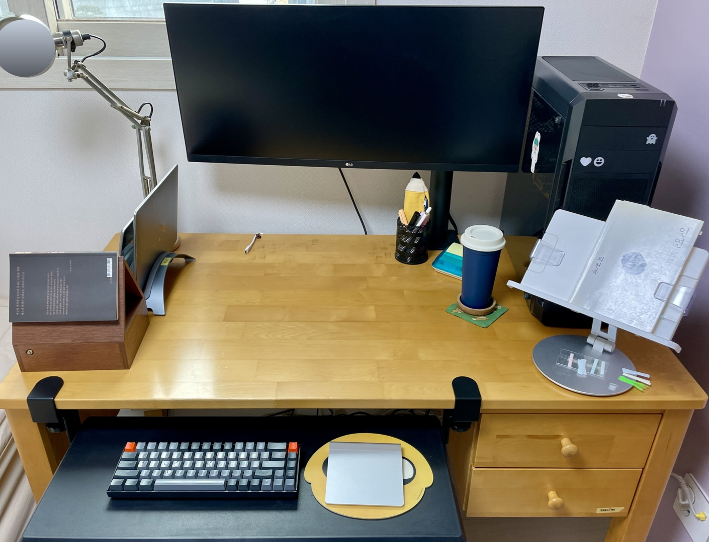
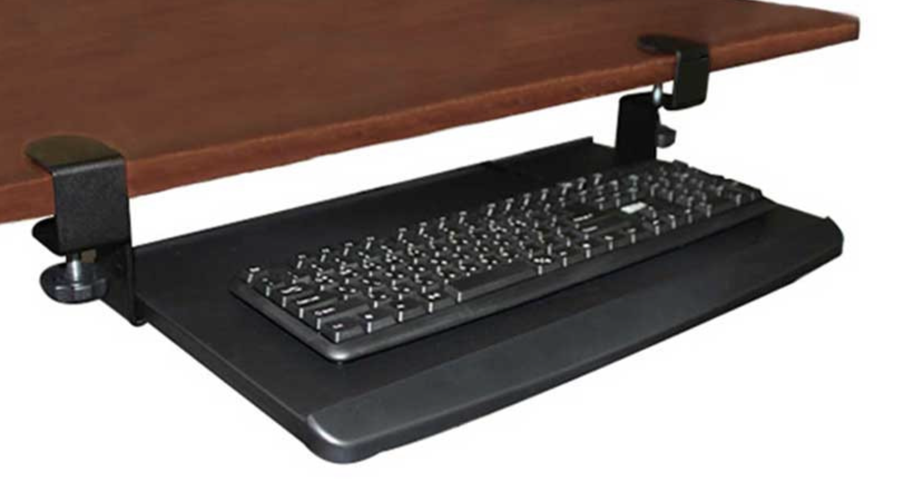
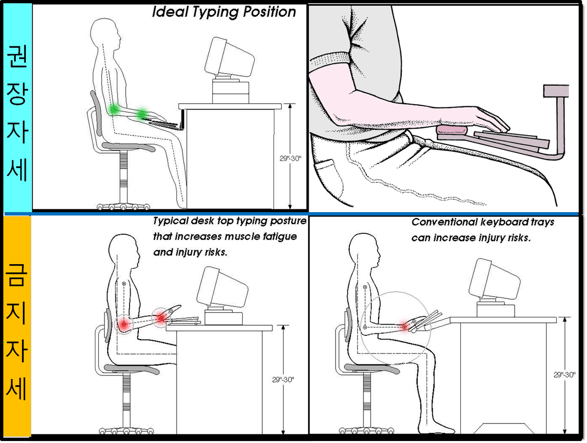
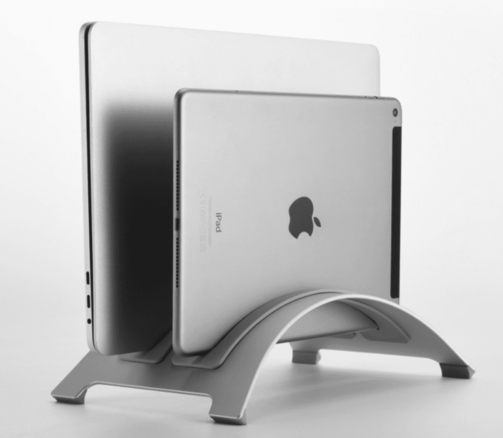

3년차 웹 프론트엔드 개발자의 흔한 데스크 셋업

:::note TMI

- 코로나 시절 집에서 공부하며 소소하게 데스크 셋업을 하게되었습니다.
- 지금은 주 5일 사무실 출근 중입니다.
  :::

<!--truncate-->

## 장비 목록

### 모니터 - LG 34인치 360 모니터 34WN780 WQHD

34인치 울트라 와이드 모니터. 가격은 약 65만원.

원래 `듀얼 모니터 + 모니터 받침대` 조합으로 사용중이었는데 책상 공간을 너무 많이 차지하는 단점이 있었습니다. 모니터를 하나로 줄이고, 모니터 암으로 책상 공간을 확보한 덕분에 책상을 넓게 쓸 수 있게되었는데 이 점이 제일 만족스럽습니다. 내장 스피커가 있어 스피커를 따로 구매하지 않아도 되고, HDMI도 2개 연결할 수 있어서 맥북과 데스크탑 화면을 전환하며 사용중입니다.

### 키보드 - 키크론 K6

키크론 K6 블루투스 키보드. 가격은 약 10만원.

맥북 키보드와 윈도우 키보드를 모두 지원하고, 무선으로 사용할 수 있어서 선택했습니다. 숫자키를 쓸 일이 많이 없어서 아주 미니멀한 스타일로 골랐는데 아직까지 큰 불편함은 없습니다. 휴대성이 좋지만 외출할 땐 잘 안들고 나가는 편이에요.

### 키보드 트레이

책상에 설치할 수 있는 키보드 트레이. 가격은 약 4만원.

손목을 보호하기 위해 책상 아래에 키보드 트레이를 설치했습니다.

팔꿈치를 직각으로 두고, 손목은 꺾이지 않도록 해야 어깨나 손목에 무리가 덜 가는데 책상 위에 키보드를 놓으면 도저히 그 각도가 나오지 않아서 찾아보니 키보드 트레이라는 것이 있더라구요. 덕분에 책상 위 공간을 더 넓게 사용할 수 있게 되어 좋습니다. 키보드 트레이를 구입하니 손목을 받칠 수 있는 팜레스트도 같이 사은품으로 챙겨줘서 더 좋았습니다 :-)

### 마우스 - 애플 트랙패드

트랙패드 1세대. 중고로 구입.

맥북을 좀 사용하다보면 일반 마우스를 쓰는게 불편해집니다. 1세대는 충전식이 아니라 건전지를 사용하는데 매번 충전하는 게 귀찮을 것 같아서 일부러 1세대로 구입했습니다.

### 맥북 아이패드 듀얼 거치대

아이패드와 맥북을 동시에 사용할 수 있는 거치대. 가격은 약 4만원.

모니터 암을 사용하면서 확보한 책상 공간을 더 넓게 사용하기 위해 세로로 거치할 수 있는 모니터 거치대를 구입했습니다. 맥북을 거치해두고 클램쉘 모드로 사용 중인데, 무선 블루투스 키보드와 트랙패드의 조합으로 책상 공간을 넓게 유지하며 깔끔한 생활이 가능해집니다.

### 의자 - 일룸

당시 코로나 보조금으로 구입. 약 30만원.

오래 앉아있어야하므로 그래도 꽤 거금을 들였으나 조금 무겁고, 매쉬 재질이 아니라서 여름에 사용감이 썩 좋지 않습니다. 더워요...

 
 

## 셋업은 아직 끝나지 않았다...

재택이 가능한 데스크 셋업을 마련하는 데에만 100만원이 넘게 썼네요. 건강하고 즐겁게 일하기 위해 투자하는 것이라고 생각하고 있습니다. 애석하게도 아직 꿈의 데스크 셋업은 완성되지 않았습니다.

1. 서서 일할 수 있는 모션 데스크
2. 통풍이 잘되는 허먼밀러 의자
3. 공간을 많이 차지하지 않으면서 음질이 좋은 사운드바
