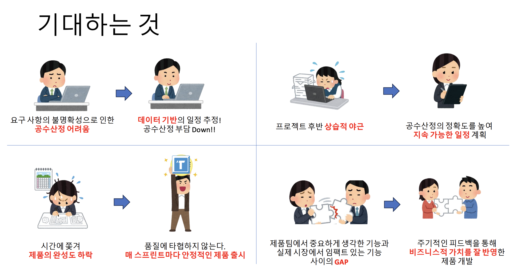

import ImageLayout from '../../src/components/ImageLayout';
import asis from './asis.png';
import storyExample from './storyExample.png';
import workshop from './workshop.png';
import post from './postit.JPG';
import book from './book.JPG';

이전 글 [어느 날, 회사에서 서비스 개발을 멈추기로 했다.](../2024-02-03-post/index.mdx)에서는 회사에서 2개월 간 서비스 개발을 멈추고, 개발 프로세스 개선하는 TF에 참여하면서 느낀 점을 정리했습니다. 
TF가 마무리 되고, 회사에서 서비스 개발에 애자일 프로세스를 적용한 지 6개월이 지났습니다
6개월의 시간 동안, 1번의 마이너 업데이트와 2번의 핫픽스를 진행는데요. 
이번 글에서는 제가 생각한 애자일한 조직의 모습, 조직에서 애자일 프로세스를 적용한 방법, 겪었던 시행착오 등을 기록 해보려고 합니다. 

## 애자일 하다는 착각 

<ImageLayout src={asis} description="뉴로클의 개발 문화" />

회사 채용페이지의 개발 문화에 대한 내용은 제가 작성했는데요. 
작성할 때만해도 저는 저희 조직이 애자일하게 개발하고 있다고 생각했습니다. 

### 착각 요소

1. 스프린트를 진행한다.
2. Jira를 사용한다.
3. 프로젝트가 끝나면 회고한다.

생각해보면 이 두 가지 요소 때문에 애자일하다고 착각하고 있었던 것 같습니다.
'워터폴이 아니니까 애자일인거 아니야...?'라고 대충 생각했던 것 같아요. 

우리 조직은 애자일하게 하고 있는데 기획을 수정하는 게 왜 이렇게 힘든 걸까요? 
왜 개발자들이 릴리즈 날에 밤새면서 버그를 고치는 걸까요?
애자일이란 과연 무엇일까요?

<!--truncate-->

 

## 어떤 부분이 문제 였을까?

약 2개월 동안 팀원들과 애자일을 공부하고, 치열하게 토론하며 저희 프로세스의 문제점을 찾아내고 새로운 프로세스를 만들었습니다.
진짜 애자일한 조직이 되기 위해 크게 2가지를 바꾸었는데요.

1. **스프린트 기간을 2주로 줄임**
2. **스토리 포인트 도입**

 

결과적으로 이런 사이클을 계속 반복하게 되었어요!
업무 프로세스를 변경한다고 했을 때, 너무 복잡해져서 적응하지 못하는 것 아닌지에 대한 걱정이 많았는데 사실 핵심은 이 2가지였고, 나머지는 저희가 늘 해왔던 일들이라 실제로 수행하는 데 어려움은 적었습니다.

 

|               | AS-IS | TO-BE |
| ------------- | ----- | ----- |
| 스프린트 기간 | 1개월 | 2주   |
| 스토리 포인트 | X     | O     |

### 1. 스프린트 기간을 2주로 줄임

> 1개월 단위로 진행했던 **스프린트 기간을 2주로 줄이고, 스프린트 전후로 킥오프와 회고를 진행**했습니다. 

예를 들어 메이저 업데이트를 6개월 간 개발한다고 가정해 보겠습니다. 
기존에는 스프린트 1개의 기간을 1개월로 잡아서 총 6개의 스프린트를 진행하던 것을 2주로 줄여 12개의 스프린트를 진행하였습니다.

스프린트가 끝날 때마다 스프린트 회고를 진행하는데 짧은 간격으로 일정을 점검하게 되면서 문제점을 비교적 초기에 발견하고, 대처할 수 있었습니다. 
더불어 스프린트 기간이 짧아지면서 개발의 속도감도 높아지는 장점도 있었습니다. 

### 2. 스토리 포인트 도입

> 모든 업무를 스토리로 만들고, **각 스토리마다 스토리 포인트를 부여하여 피쳐의 크기를 수치화** 했습니다.

스토리란 `유저가 제품에서 사용해 볼 수 있는 변경사항`으로 정의했습니다.
기능을 유저관점에서 설명한 것으로 예를 들면 `유저가 OO버튼을 누르면 OO화면으로 이동하는 기능`이 될 수 있습니다.
이전에는 이런 기능을 `OO 기능 개발`이라고 크게 잡아서 진행했는데, 이를 스토리 범위로 작게 쪼개고 기능 하나의 크기를 상대적으로 비교할 수 있도록 스토리포인트를 계산하여 전체적인 피쳐의 크기를 수치화 했습니다. 

`스프린트 계획`단계 에서 스프린트에서 진행할 스토리를 산정하고, `스프린트 회고`에서는 완료된 스토리 포인트를 계산해 평균 속도를 측정했는데요. 
**팀의 개발 속도를 PM의 감성적 의견이 아닌 정량적인 수치로 파악할 수 있었어요.**
남은 기간동안 우리가 목표했던 것들을 전부 개발할 수 있는지 없는지, 개발할 수 없다면 얼만큼의 시간이 더 필요한지에 대한 판단 근거가 되어주었습니다.

<ImageLayout src={post} description="포스트잇으로 시각화하면 훨씬 와닿더라구요!" />

 

## 그래서 좋아졌나요?

저는 이 프로세스를 도입하고나서 크게 3가지 효과를 느꼈습니다.

1. 피쳐의 크기를 파악할 수 있다.
2. QA를 더 꼼꼼히 볼 수 있다.
3. 큰 피쳐에서도 각 기능마다 우선순위를 고려할 수 있다. 

### 1. 피쳐의 크기를 파악할 수 있다.

초반 1~2개월은 버전에 들어갈 메인 피쳐를 선정하는 데 소비합니다.
우선순위와 대략적인 마감 날짜를 정하기 위해 피쳐 목록들을 쭉 보면서 기획이 없는 항목에 대해서도 주 단위로 공수를 산정해야 했습니다. 
기획자도 모르는 피쳐에 대한 공수를 산정하는 것이 너무 어렵기도하고, 각 팀이 생각하는 기능이 동상이몽입니다.
초반에 대충 계산한 공수가 기획이 구체화 되면서 불어나는 경우가 많이 있었고, 이로 인해 릴리즈 날짜가 미뤄지는 경우가 종종 있었어요.

스토리가 없었을 때에는 한 스프린트를 끝내고 진행도를 체크할 때, 피쳐의 완성도를 수치화하기 어렵고 '_큰 피쳐들을 열심히 개발중_'이라고 밖에 말할 수 없었습니다.

스토리 포인트가 도입 된 후에는 `전체 100 스토리 포인트 중 n 스토리 포인트 완료`처럼 완성도 파악이 쉬워졌고, 각 기능 개발에 걸리는 시간을 상대적으로 비교할 수 있게 되었어요!

<ImageLayout src={storyExample} description="하나의 피쳐에 대해 각 팀이 상의하여 합리적인 스토리 포인트를 산정합니다." />

### 2. QA를 더 꼼꼼히 볼 수 있다.

이전에는 스프린트가 끝날 때마다 어떤 기능이 완성되었는지 확인하는 것이 어려웠습니다. 
크기가 큰 피쳐같은 경우에는 2~3개월에 걸쳐 개발이 진행되는 경우가 많아서 스프린트가 끝날 때마다 QA를 진행하기가 불가능했어요.
릴리즈 직전 3주동안 QA 스프린트를 진행하면서 QA의 부담이 커지고, 제품의 안정성도 떨어지는 상황이었습니다. 

스토리로 피쳐를 작게 쪼개고, 스토리를 완료하면 2주마다 해당 스토리에 대한 QA를 진행하게 되면서 릴리즈 직전의 QA 부담을 많이 줄일 수 있게 되었어요.
유저의 입장을 기준으로 정리된 스토리로 QA 포인트도 좀 더 정확하게 잡아낼 수 있었습니다. 
`OO 기능에 대한 QA` 보다는 `OO 버튼을 누르면 OO 화면으로 이동하는 기능에 대한 QA` 가 훨씬 구체적이고, 놓치기 어렵거든요. 

### 3. 큰 피쳐에서도 각 기능마다 우선순위를 고려할 수 있다. 

스토리를 구체적으로 뽑아낼 수 없는 기획은 더 잘게 쪼개게 되면서 MVP를 더 빨리 도출할 수 있었습니다. 
중요한 기능을 먼저 개발하고, 나머지는 시간이 남을 때 개발하는 방식으로 진행할 수도 있었어요.
시장에 임팩트가 있을 기능이 무엇인지 더 자주 고민하게 되고, 야근을 하더라도 의미있는 야근을 했다고 느껴져서 정신적으로도 덜 힘들었습니다. 

 

### PM의 후기

프로젝트 관리의 주체였던 PM분께 애자일 프로세스 도입 후기에 대해 여쭤봤는데요.
이전에는 스프린트 2~3개에 걸쳐서 '진행중'이던 피쳐가 스토리로 작게 쪼개진 덕분에 관리 리소스가 크게 줄었고, 명확해졌다고 말씀해주셨습니다. 
그럼에도 불구하고 스토리를 만드는 것은 각 팀마다 이해도 차이가 있어서 아직은 조금 더 연습이 필요한 것 같다고 하셨어요.
아직 개선할 점들이 있지만 충분히 만족스러운 애자일 첫걸음 이었다고 생각해요🎉

 

## 혼자서는 바꿀 수 없는 것

애자일 프로세스를 도입하면서 가장 크게 느낀 점은 '혼자서는 바꿀 수 없다'는 것이었습니다. 
나만 스토리를 잘 뽑고, 나만 스토리 포인트를 잘 산정하고, 나만 스프린트 목표를 이룬다고 해서 조직이 애자일해지는 것은 아닙니다.
팀원 모두의 이해도를 올리는 것이 중요했고, 이를 위해서 많은 노력이 필요했습니다.

<ImageLayout src={workshop} description="태어나서 처음으로 업무 워크샵을 기획하고 진행해보았습니다" />

애자일 워크샵을 진행해서 스토리를 어떻게 만들어야 하는지, 스토리 포인트는 어떻게 산정해야 하는지에 대해 설명하고 실습을 통해 익히는 시간을 가졌습니다.
그 과정에서 각자의 이해 수준을 맞추고, 각 팀이 느끼는 어려운 점을 함께 공유할 수 있었어요.

이 워크샵을 진행하기 위한 자료를 2개월 동안 정말 치열하게 연구하고, 토론해서 만들어 냈는데 이 과정이 팀을 더 단단하게 만들어 주기도 했습니다. 

가장 중요한 건 팀원 모두가 이 모든 프로세스를 그저 생각없이 따르거나, 최대한 덜 일하려고 이용하는 것이 아니라 **더 나은 제품을 만들기 위한 과정, 완성도를 높이기 위한 시간을 확보하는 수단으로 생각해야** 한다는 것입니다.
그렇지 않다면 큰 의미가 없고, 워터폴 방식으로 하는 것이 나쁜 방식이 아니라고 생각하거든요. 

 

## 애자일이 만병통치약은 아니에요!

조직에 애자일 프로세스를 적용한다고 해서 모든 문제가 해결되는 것은 아닙니다.
각 팀의 성격, 규모, 상황마다 적절한 프로세스가 있는 것 같아요. 
때로는 워터폴 방식이 훨씬 더 효율적일 수 있어요.

사실, 처음 이 프로세스를 도입한 마이너 버전 릴리즈 날도 새벽에 퇴근 했습니다. 
노력했지만 한 번에 모든 문제를 해결할 수는 없더라고요. 

<ImageLayout src={book} description="<애자일 개발이 처음인 내가 출근했더니 스크럼 마스터가 된 건에 관하여> 중에서..." />

책의 한 페이지가 너무 와닿아서 찍어두었습니다. (책에 실제로 겪을 법한 상황들이 많이 묘사되어있어서 재미있었어요. 추천!) 
애자일을 처음 도입한 팀의 이야기인데 이 팀도 결국 릴리즈 당일에는 새벽 2시까지 일하더군요...ㅎㅎ
애자일의 진정한 의미는 '카이젠(개선)'에 있으니까! 다음 릴리즈에는 더 나은 방향으로 개선 되기를 바라고 있습니다.

 

그리고 아직도 해결되지 않은 문제 중, 가장 큰 문제는 기획과 디자인이 완성되는 시점이 너무 늦는 것입니다.
책에서도 나오지 않는 문제인데요.  
가장 좋은 시나리오는 다음 버전의 기획이 미리 완료되어있고, 스토리와 스토리포인트까지 산정되어있는건데 현재 리소스로는 불가능에 가까운 일이네요. 
기획자, 디자이너가 많은 조직은 이런 문제가 없을까... 궁금한 점이 많습니다. 
일단 와이어프레임으로 MVP 개발과 검증을 진행하면서 완성도를 올리는 방식을 지향하고 있지만, 모든 피쳐의 성격이 MVP 기획이 가능한 형태는 아니라서 현실과 타협할 수밖에 없는 상황입니다.
책이나 컨퍼런스에 참가할 기회가 있다면 이런 문제들에 대한 해결책들을 찾아보고 싶어요.

 

### 중요한 것은 꺾이지 않는 마음

처음 개선된 프로세스를 소개할 때, 사내 발표에서 썼던 장표 중 하나입니다. 

이런 것들을 기대했는데 완벽하진 않지만 어느정도 변화를 이끌어 낸 것 같아서 굉장히 뿌듯하네요.
가장 긍정적으로 생각되는 건 **일하고 싶은 환경을 스스로 만들어 갈 수 있다는 희망**이 생겼다는 것입니다. 
이 글을 읽고 계신 분들은 애자일 하고 계시는지, 어떤 방식으로 일하고 싶은 환경을 가꾸고 계신지 궁금하네요! 

긴 글 읽어주셔서 감사합니다!🙏 

