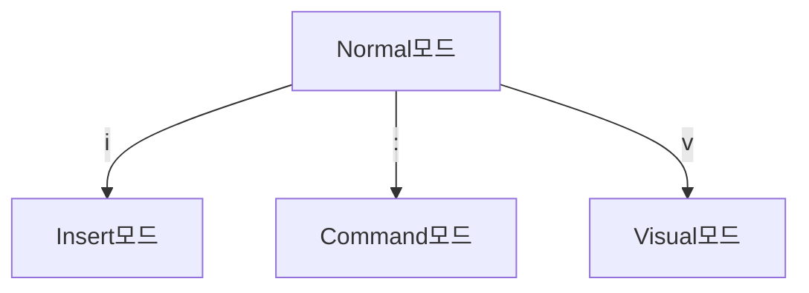

import ImageLayout from "../../src/components/ImageLayout";
import vim from "./vim.png";
import realProgrammer from "./realProgrammer.png";
import cheatsheet from "./cheatsheet.jpeg";
import efficient from "./10x.jpeg";
import vimtutorExample from "./vimtutorExample.png";
import feconf from "./feconf.JPG";

> Vim is a highly configurable text editor built to make creating and changing any kind of text very efficient. It is included as "vi" with most UNIX systems and with Apple OS X.[^1]

Vim은 "Vi IMproved"의 준말로, 원래 UNIX 시스템에서 사용되던 Vi 편집기를 개선한 텍스트 편집기 입니다. 1991년에 v1.14가 처음 공개되었습니다.[^2]

<ImageLayout src={vim} description="vim 실행 화면" />

터미널에 `vi`를 입력하면 Vim이 실행됩니다.

<br />

### vim을 배우고 싶었던 이유

<ImageLayout src={realProgrammer} description="출처 https://xkcd.com/378/" />

어디에선가 `vim에 익숙해지면 마우스 없이 모든 명령어를 처리할 수 있고, 생산성이 극대화된다`는 말을 들었습니다.
저는 리눅스 환경에 익숙하지 않아서 검은 터미널 화면에 빽빽하게 타이핑하며 개발하는 것에 대한 환상이 있었고, 한 번 배워보고 싶었어요.
그리고 뭔가 '진짜' 개발자처럼 보이잖아요...!

<!--truncate-->

## Vimtutor로 시작하기

터미널에서 `vimtutor`를 입력하면 Vim에 내장된 튜토리얼을 시작할 수 있습니다.

```bash
===============================================================================
=    빔 길잡이 (VIM Tutor) 에 오신 것을 환영합니다    -      Version 1.7      =
===============================================================================

     빔(Vim)은 이 길잡이에서 다 설명할 수 없을 만큼 많은 명령을 가진
     매우 강력한 편집기입니다. 이 길잡이는 빔을 쉽게 전천후 편집기로 사용할
     수 있도록 충분한 명령에 대해 설명하고 있습니다.

     이 길잡이를 떼는 데에는 실습하는 데에 얼마나 시간을 쓰는 가에 따라서
     25-30 분 정도가 걸립니다.

     이 연습에 포함된 명령은 내용을 고칩니다. 이 파일의 복사본을 만들어서
     연습하세요. (vimtutor 를 통해 시작했다면, 이미 복사본을 사용하는
     중입니다.)

     중요한 것은, 이 길잡이가 직접 써보면서 배우도록 고려되어 있다는 것입니다.
     명령을 제대로 익히려면, 직접 실행해보는 것이 필요합니다. 내용을 읽는
     것만으로는, 명령을 잊어버리게 될 것입니다.

     자 이제, Caps Lock(Shift-Lock) 키가 눌려있지 않은지 확인해보시고, j 키를
     충분히 눌러서 Lesson 1.1이 화면에 가득 차도록 움직여봅시다.
```

무려 한국어 튜토리얼이 있어 놀랐습니다!
약 7챕터의 레슨으로 구성되어있고, 한 챕터에는 실습 예시와 요약이 함께 있습니다.

<ImageLayout src={vimtutorExample} />

내용은 그렇게 어렵지 않았고 설명에 적혀있는대로 30분 정도면 충분히 학습할 정도의 분량이었어요.

<br />

### 특징

메모장이나 VSCode 같은 일반 텍스트 편집기와 비교했을 때, 가장 큰 차이점은 모드 기반의 편집입니다.
vim 관련 meme을 검색해봤을 때 흔하게 나오는 게 "How do I exit Vim?"이라는 질문인데요, Vim은 Noraml모드, Insert모드, Command모드, Visual모드 등 여러 모드를 가지고 있습니다.
종료하려면 일반모드에서 `:q`를 입력하면 되는데, GUI가 사람들에게는 시작부터 적응이 어렵습니다.



타이핑을 하기 위해서는 `i`를 눌러 Insert모드로 전환해야 하고, 타이핑한 것을 저장하려면 `esc`를 눌러 Normal모드로 전환한 후 다시 `:`를 눌러 Command모드로 전환한 뒤 `:wq`(저장 후 종료) 같은 명령어를 입력해야 합니다.
그리고 Visual 모드는 마치 마우스로 드래그하는 효과와 같은 기능을 하는데 v를 누르면 커서가 있는 위치부터 텍스트를 선택합니다.

다양한 명령어가 있는데 시험공부 하듯이 외우는 것보다 `vimtutor`를 통해 직접 사용해보면서 배우는 것이 더 효과적입니다.

<br />

## vim 사용으로 10x 개발자 되기...?!

<ImageLayout
  src={efficient}
  description="그래서 과연 생산성이 10배 빨라졌을까요...?"
/>

vim을 사용해보기로 결심한 후에 FEconf 라이트닝 톡에서 vim을 4년, Neovim을 1년 7개월 간 사용하신 프론트엔드 개발자분의 세션을 들었습니다.
그 분을 보니 vim 사용이 어떤 면에서 좋은지 느낌이 오더라고요.
`.vimrc` 파일을 개인에게 맞게 최적화 해서 테마, 플러그인, 단축키 등을 설정할 수 있는데 개인에게 어떻게 최적화 하는지에 따라서 생산성을 높일 수 있을 것 같았습니다.

<ImageLayout
  src={feconf}
  description="조성진님의 '저는 vim을 사용하는 프론트엔드 개발자 입니다.' 세션"
/>

배경화면 투명도를 줄여서 화면 전환 없이 코드 작성하며 결과물을 확인할 수 있도록 세팅하셨는데 신박하다고 생각했습니다.
그리고 vim은 VSCode와 비교했을 때, 매우 가볍고 컴퓨터 리소스를 적게 사용하기 때문에 vim 사용으로 절약한 리소스를 다른 작업에 사용할 수 있습니다.
세션에서는 vim 사용으로 절약한 리소스로 로컬 LLM을 돌리시더라고요.

이외에도 vim 사용에 익숙해지면 어느 OS 환경에서든 써먹을 수 있고, 손을 많이 움직일 필요없이 빠르게 작업할 수 있다는 장점이 있습니다.
여러모로 극한의 상황에서 개발을 할 때 유용할 것 같다는 생각이 들었습니다.

<br />

## Vim 정복에 실패한 개발자의 솔직한 고백

글의 제목에 `:q!`를 적어놓은 이유는... Vim에 입문하자마자 강제 종료 해버렸다는 것을 표현하고 싶었습니다😅
vimtutor를 통해 기본적인 명령어를 익히고, 블로그 포스팅 할 때 사용중인 zed 에디터를 vim 모드로 설정해서 사용하는 중인데요.
매일 사용하는 게 아니면 금방 잊어버려서 매번 명령어를 검색해야하는 번거로움을 겪고 있습니다.
그래서 이걸로 개발하려면 한동안은 생산성은 오히려 저하되겠더라구요.

<ImageLayout src={cheatsheet} />

<br />

엄청나게 많은 명령어들을 체화하고 익숙해질 자신이 없었습니다.
컴퓨터 리소스가 그렇게 아까운 환경도 아니고, 상당히 부지런한 성격이라 vim을 정복해서 부귀영화를 누리겠다는 그런 간절함도 별로 없었던 게 vim과 다시 데면데면해진 주된 원인인 것 같아요.

같이 일하던 동료분 중에 엑셀 초고수 동료분이 있었는데 군대에서 행정업무를 하던 시절 온갖 단축키를 외운 것이 비결이라고 하시더라구요.
제가 Vim에 적응하려면 입대정도는 해야... 되지 않을까? 하는 생각이 들었습니다.

<br />

<ImageLayout src={realProgrammer} description="그놈의 진짜 개발자" />

웃자고 넣은 이미지인데, 제 마음속 한 구석에는 '진짜' 개발자 처럼 보이고 싶은 욕망이 있었던 것 같습니다.
나에게 맞게 최적화하고, 극한의 효율을 추구하는 그런 능력을 조금 더 키워보고 싶었었나봐요.
몇 달동안 묵혀두었던 Vim에 대한 글을 쓰게 되었는데요.
글을 쓰면서 어떤 기술을 사용하지 않는다고 스스로를 진짜가 아니라고 생각할 필요는 없다고 느꼈습니다.
오늘을 기점으로 Vim에 적응하지 못했다는 것을 시원하게 인정하고, 제 마음속의 짐을 내려놓아보려구요!

---

[^1]: [Vim - the ubiquitous text editor](https://www.vim.org/)

[^2]: [Vim - Wikipedia](<https://en.wikipedia.org/wiki/Vim_(text_editor)>)
