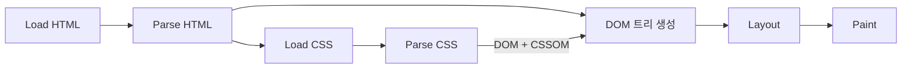
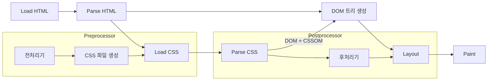
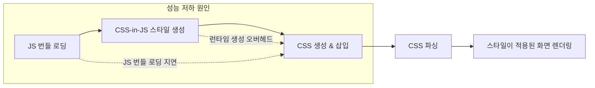
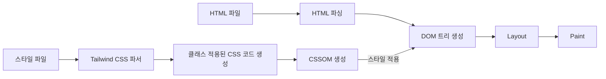

import ImageLayout from "../../src/components/ImageLayout";
import cssInJs from "./cssInJs.png";
import processor from "./processor.png";

CSS는 HTML 문서의 요소들을 꾸미는 역할을 합니다.
처음 CSS를 배우고 나서는 도전적인 과제가 주어지거나, 인터렉티브한 과제가 주어지지 않는 이상 초반에 배웠던 CSS를 그대로 사용하게 되는데요.
저도 취업 이후에는 따로 CSS를 공부하지 않았던 것 같습니다.
최근 zero-runtime CSS-in-JS 키워드를 접하게 되면서 어떤 스타일링 방식이 있는지 다시 한 번 정리해보고자 합니다.

## CSS의 작동방식

:::note
[CSS 작동방식](https://developer.mozilla.org/ko/docs/Learn/CSS/First_steps/How_CSS_works) MDN
:::



<!--truncate-->

CSS는 주로 inline, internal, external 세 가지 방식으로 작성할 수 있습니다.

### inline CSS

```html
<p style="color: blue; font-size: 16px;">이 문장은 파란색과 16px 크기입니다.</p>
```

태그의 style 속성에 직접 CSS를 작성하는 방식입니다.

#### 장점

- 간단한 적용
- 별도의 CSS 파일이 필요 없음: CSS 파일을 추가로 로드할 필요가 없어서, 네트워크 요청을 줄여 초기 로딩 시간을 약간 단축할 수도 있습니다.
- 특정 요소에 스타일 우선순위 제공: 인라인 스타일은 CSS 규칙 중에서 최우선으로 적용됩니다. 외부 스타일시트에서 스타일이 덮어씌워지는 문제를 방지할 수 있습니다.

#### 단점

- 재사용성이 떨어짐
- 유지보수가 어려움: 스타일을 한 곳에서 관리하기 어려워 일회성으로 사용되는 경우가 아니라면 권장하지 않습니다.

### internal CSS

```html
<head>
  <style>
    p {
      color: green;
      font-size: 18px;
    }
  </style>
</head>
<body>
  <p>이 문장은 녹색과 18px 크기입니다.</p>
</body>
```

HTML 문서 내부에 `<style>` 태그를 사용하여 CSS를 작성하는 방식입니다.

#### 장점

- 가독성: 컴포넌트와 스타일 로직이 분리되어 가독성이 높아집니다.

#### 단점

- 유지보수가 어려움: 여러 문서에 동일한 스타일을 적용하려면 모든 문서에 동일한 CSS를 작성해야 하므로 유지보수가 어렵습니다.

### external CSS(CSS-in-CSS)

```html
<!-- HTML 파일 -->
<head>
  <link rel="stylesheet" href="styles.css" />
</head>
<body>
  <p>이 문장은 외부 CSS 파일에서 스타일을 적용받습니다.</p>
</body>
```

```css
/* styles.css 파일 */
p {
  color: red;
  font-size: 20px;
}
```

별도의 css 파일을 작성하고, link 태그로 HTML 문서에 연결하는 방식입니다.

#### 장점

- 재사용성: 여러 문서에서 동일한 스타일을 적용할 때 유용합니다.
- 유지보수가 쉬움: 스타일을 한곳에서 관리할 수 있어 유지보수가 쉽습니다.
- 효율성: Sass나 Less와 같은 CSS 전처리기를 사용하면 CSS를 더 효율적으로 작성할 수 있습니다.

<br />

### CSS 전처리기와 후처리기

CSS-in-CSS 스타일에서 언급했던 Sass나 Less는 CSS 전처리기 입니다.
CSS 전처리기는 변수 선언, 중첩, Mixin, 함수 등의 고급 기능을 사용하여 반복을 줄이고, 가독성을 높여줍니다.

후처리기는 벤더 프리픽스를 추가해주어 크로스 브라우징 문제를 해결해주고, 폴리필을 추가해 구형 브라우저에서도 잘 동작할 수 있도록 해주는 역할을 해요.
PostCSS 등이 대표적인 후처리기이고, Autoprefixer와 cssnano 같은 플러그인을 설정하면 CSS 파일을 더 작은 크기로 최적화하고 브라우저 호환성을 높이며, 유지보수와 확장성 또한 강화할 수 있습니다.

<ImageLayout src={processor} description="https://2024.stateofcss.com" />

2024년에 가장 많이 사용된 전처리기/후처리기 순위인데요.
Sass와 PostCSS의 빈도가 높네요.

#### 전처리기와 후처리기는 언제, 어떻게 동작하는 걸까?



빌드 시점에 전처리기를 사용하여 Sass나 Less 파일을 CSS 파일로 변환하고, CSSOM이 생성된 이후에 후처리기가 동작합니다.

<br />

## CSS-in-JS

앞서 소개한 방식들 중 어떤 방식을 선택하더라도 CSS가 파싱되어 렌더트리가 생성되는데요.
CSS를 파싱하는 동안에는 JS의 실행이 차단되기 때문에 CSS 적용 방식이 렌더링 성능에 영향을 미칩니다.
CSS-in-JS는 이런 문제를 해결해주는데요.
CSS모델을 문서레벨이 아니라 컴포넌트 레벨로 추상화하고, 중복 및 의존성을 줄여 유지보수를 쉽게 합니다.
JS코드 내에서 CSS를 작성하고 관리하는 방식으로, Styled components, Emotion 등이 있습니다.

<ImageLayout src={cssInJs} description="https://2024.stateofcss.com" />

위 통계에 있는 CSS 모듈은 정확히 말하면 CSS-in-JS 방식은 아닙니다.
external CSS 방식과 비교하면, js에서 파일을 import 해서 사용하는 방식[^1]이기 때문에 통계에 들어간게 아닐까 싶네요.
css 모듈은 선택적으로 컴포넌트 className에 스타일 적용이 가능하지만, CSS-in-JS처럼 동적으로 스타일을 적용할 수 없습니다.
아래는 동적으로 스타일을 적용하는 예시입니다.

```js
import styled from "styled-components";

const Button = styled.button`
  background-color: ${(props) => (props.primary ? "blue" : "gray")};
  color: white;
  padding: 10px;
  border: none;
  border-radius: 5px;
`;
```

#### 장점

- gloabl namespace를 신경쓸 필요 없음: CSS로 컴파일할 때, 고유이름 생성되기 때문에 클래스 이름 충돌 문제가 없습니다.
- JS와 CSS 상태 공유
- CSS 로드 우선순위 이슈가 없음
- 동적 스타일링: css 문법을 거의 그대로 사용하면서도 스타일링을 동적으로 처리할 수 있습니다. 덕분에 테마 적용도 쉽습니다.
- SSR(서버사이드 렌더링) 최적화: 서버사이드 렌더링을 통해 초기 HTML에 필요한 스타일만 삽입해 사용자에게 빠르게 보여줄 수 있습니다.
  초기 로딩 속도를 향상하는 데 이점이 있습니다.

#### 단점



- 런타임 생성 오버헤드 발생: 런타임에 스타일을 계산하고 생성하는 과정에서 발생하는 오버헤드가 있습니다.
- 번들 크기가 커짐: js 번들의 크기가 커져서 초기 로딩 속도에 영향을 미칠 수 있습니다.
- 브라우저에 캐싱되지 않음: 스타일이 js에서 동적으로 생성되기 때문에 CSS가 캐시되지 않아 동일한 스타일이라도 매번 재생성되는 오버헤드가 발생합니다.

<br />

## Zero-runtime CSS-in-JS

제가 처음 Zero-runtime CSS-in-JS를 접한 계기는 Material UI 버전 업그레이드 공지[^2]였습니다.
진행중인 프로젝트의 성능을 최적화 할 수 있는 방법을 찾다가 Zero-runtime CSS-in-JS를 알게 되었어요.
Material UI v6에서는 Pigment CSS를 도입해 CSS를 런타임이 아닌 빌드 타임에 추출하는 방식으로 클라이언트 사이드의 재계산을 피하고, 번들 크기를 줄일 수 있다고 합니다.

```js
import { styled } from "@pigment-css/react";

const Heading = styled("div")({
  fontSize: "4rem",
  fontWeight: "bold",
  padding: "10px 0px",
});

function App() {
  return <Heading>Hello</Heading>;
}
```

#### 장점

- CSS 파싱 문제 해결: 런타임에 스타일을 생성하는 것이 아니라 빌드 시점에 스타일을 추출하여 정직 CSS파일처럼 사용할 수 있습니다.
  이를 통해 불필요한 JS 로딩으로 인한 성능 저하를 방지합니다.
- 낮은 러닝커브:사용법은 styled-components와 비슷합니다.
  DX적으로는 이점을 유지하면서 성능을 향상시킬 수 있습니다.

#### 단점

- 빌드 시간 증가
- 개발 환경에서의 어려움: 빌드 타임에 스타일을 생성하기 때문에 테스트를 작성해야한다거나 실험을 해야할 때 어려움이 있을 수 있습니다.

<br />

## Utility-first CSS

Utility-first CSS는 HTML 요소에 직접 스타일을 적용하는 방식입니다.
미리 정의된 유틸리티 클래스 `text-center`, `p-2` 등을 사용하여 스타일을 적용하고, 대표적인 프레임워크로 tailwindCSS가 있습니다.

```html
<button class="bg-blue-500 text-white px-4 py-2 rounded">Click me</button>
```

CSS-in-JS와 달리 정적 CSS 클래스 기반으로 스타일을 적용하기 때문에 런타임 오버헤드가 없습니다.



#### 장점

- 높은 재사용성
- 개발 속도 향상: CSS를 따로 작성할 필요가 없기에 개발속도가 빠릅니다.
- 런타임 오버헤드 없음
- 브라우저 캐싱: 정적 CSS 파일이 브라우저에 캐싱되어 성능이 최적화됩니다.

#### 단점

- 코드 가독성 저하: 클래스 순서를 일관되게 지키지 않으면 가독성이 떨어질 수 있습니다.
- 러닝커브: 초기 클래스 명명 규칙을 익히는데 시간이 걸릴 수 있습니다.

<br />

## 결론

전통적 스타일링 방식부터 Utility-first CSS까지 다양한 스타일링 방법을 살펴보았습니다.
겉핥기식이었지만 각 방식의 장단점을 정리할 수 있었습니다.
CSS 라이브러리에 대해서는 그냥 유행인 것들을 따라서 써보는 식으로 찍먹해왔는데, 이제는 성능적인 측면을 고려해야겠다는 생각이 들었습니다.

<br />

---

<br />

[^1]: [CSS Modules - github](https://github.com/css-modules/css-modules)

[^2]: [MUI v6](https://mui.com/material-ui/migration/upgrade-to-v6/#why-you-should-upgrade-to-material-ui-v6)
