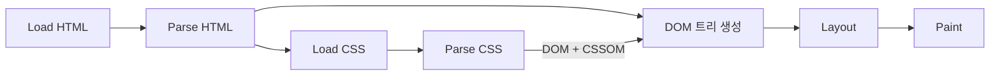
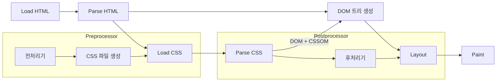

import ImageLayout from "../../src/components/ImageLayout";
import cssInJs from "./cssInJs.png";

CSS는 HTML 문서의 요소들을 꾸미는 역할을 합니다.
처음 CSS를 배우고 나서는 도전적인 과제가 주어지거나, 인터렉티브한 과제가 주어지지 않는 이상 초반에 배웠던 CSS를 그대로 사용하게 되는데요.
저도 취업 이후에는 따로 CSS를 공부하지 않았던 것 같습니다.
최근 zero-runtime CSS-in-JS 키워드를 접하게 되면서 어떤 스타일링 방식이 있는지 다시 한 번 정리해보고자 합니다.

## CSS의 작동방식

:::note
[CSS 작동방식](https://developer.mozilla.org/ko/docs/Learn/CSS/First_steps/How_CSS_works) MDN
:::



<!--truncate-->

CSS는 주로 inline, internal, external 세 가지 방식으로 작성할 수 있습니다.

### inline CSS

```html
<p style="color: blue; font-size: 16px;">이 문장은 파란색과 16px 크기입니다.</p>
```

태그의 style 속성에 직접 CSS를 작성하는 방식입니다.
재사용성이 떨어지고, 스타일을 한 곳에서 관리하기 어려워 유지보수가 어렵기 때문에 일회성으로 사용되는 경우가 아니라면 권장하지 않습니다.

### internal CSS

```html
<head>
  <style>
    p {
      color: green;
      font-size: 18px;
    }
  </style>
</head>
<body>
  <p>이 문장은 녹색과 18px 크기입니다.</p>
</body>
```

HTML 문서 내부에 `<style>` 태그를 사용하여 CSS를 작성하는 방식입니다.
컴포넌트와 스타일 로직이 분리되어 가독성이 높아집니다.
하지만 여러 문서에 동일한 스타일을 적용하려면 모든 문서에 동일한 CSS를 작성해야 하므로 유지보수가 어렵습니다.

### external CSS(CSS-in-CSS)

```html
<!-- HTML 파일 -->
<head>
  <link rel="stylesheet" href="styles.css" />
</head>
<body>
  <p>이 문장은 외부 CSS 파일에서 스타일을 적용받습니다.</p>
</body>
```

```css
/* styles.css 파일 */
p {
  color: red;
  font-size: 20px;
}
```

별도의 css 파일을 작성하고, link 태그로 HTML 문서에 연결하는 방식입니다.
여러 문서에서 동일한 스타일을 적용할 때 유용하고, 스타일을 한곳에서 관리할 수 있어 유지보수가 쉽습니다.

Sass나 Less와 같은 CSS 전처리기를 사용하면 CSS를 더 효율적으로 작성할 수 있습니다.
변수 선언, 중첩, Mixin, 함수 등의 고급 기능을 사용하여 반복을 줄이고, 가독성을 높입니다.



빌드 시점에 전처리기를 사용하여 Sass나 Less 파일을 CSS 파일로 변환하고, CSSOM이 생성된 이후에 후처리기가 동작합니다.
후처리기는 벤더 프리픽스를 추가해주어 크로스 브라우징 문제를 해결해주고, 폴리필을 추가해 구형 브라우저에서도 잘 동작할 수 있도록 해주는 역할을 해요.

<br />

이 세가지 방식 중 어떤 방식을 선택하더라도 CSS가 파싱되어 렌더트리를 생성해야 합니다.
CSS를 파싱하는 동안에는 JS의 실행이 차단되기 때문에 CSS를 어떻게 관리하느냐도 렌더링 성능에 영향을 미칩니다.

## CSS-in-JS

약 2015년부터 본격적으로 CSS-in-JS가 주목받기 시작했습니다.
JS코드 내에서 CSS를 작성하고, 관리하는 방식으로 Styled components, Emotion, tailwindCSS 등이 있습니다.

```js
import styled from "styled-components";

const Button = styled.button`
  background-color: ${(props) => (props.primary ? "blue" : "gray")};
  color: white;
  padding: 10px;
  border: none;
  border-radius: 5px;
`;
```

css 문법을 거의 그대로 사용하면서도 스타일링을 동적으로 처리할 수 있게 한다거나, 테마를 쉽게 적용할 수 있게 해준다거나 하는 장점이 있고, 서버사이드 렌더링을 지원하여서 성능향상에 기여하는 부분도 있습니다.
제가 취업을 준비하던 시기에는 styled component가 대세였는데, 그 이후에는 tailwindCSS가 인기를 끌었습니다.

<ImageLayout src={cssInJs} description="출처 https://2023.stateofcss.com" />

스타일링을 동적으로 처리하는 것은 inline 스타일에서도 가능하지만 성능적, 유지보수적 관점에서는 좋지 않습니다.
스타일이 변경될 때마다 브라우저가 재계산해야해서 렌더링 성능이 저하될 수 있고, inline 스타일은 캐싱이 되지 않기때문에 매번 스타일을 새로 처리해야하는 오버헤드가 발생합니다.
CSS-in-JS는 이러한 문제를 해결해주는 장점이 있지만, 런타임에 스타일을 생성하기 때문에 렌더링 속도가 느려질 수 있습니다.
또, js 번들의 크기가 커져서 초기 로딩 속도에 영향을 미칠 수 있습니다.

## Zero-runtime CSS-in-JS

> Material UI v6 introduces Pigment CSS, a zero-runtime CSS-in-JS styling engine to replace Emotion and styled-components as a more future-proof solution for writing styles in React 19 and beyond. With Pigment CSS, styles are extracted at build time rather than runtime, avoiding client-side recalculations and unlocking React Server Component (RSC) compatibility. This also leads to significant reductions in bundle sizes for Material UI apps.[^1]

제가 처음 Zero-runtime CSS-in-JS를 접한 계기는 Material UI 버전 업그레이드 공지였습니다.
진행중인 프로젝트의 성능을 최적화 할 수 있는 방법을 찾다가 Zero-runtime CSS-in-JS를 알게 되었어요.
Material UI v6에서 Pigment CSS를 도입해 CSS를 런타임이 아닌 빌드 타임에 추출하는 방식으로 클라이언트 사이드의 재계산을 피하고, 번들 크기를 줄일 수 있다고 합니다.

```js
import { styled } from "@pigment-css/react";

const Heading = styled("div")({
  fontSize: "4rem",
  fontWeight: "bold",
  padding: "10px 0px",
});

function App() {
  return <Heading>Hello</Heading>;
}
```

사용법은 styled-components와 비슷하지만, 런타임에 스타일을 생성하는 것이 아니라 빌드 타임에 스타일을 추출하기 때문에 DX적으로는 이점을 유지하면서 성능을 향상시키는 방식입니다.

## 결론

전통적 스타일링 방식부터 Zero-runtime CSS-in-JS까지 다양한 스타일링 방법을 살펴보았습니다.
겉핥기식이었지만 각 방식의 장단점을 알수 있었어요.
CSS 라이브러리에 대해서는 그냥 유행인 것들을 따라서 써보는 식으로 찍먹해왔는데, 이제는 성능적인 측면을 고려해야겠다는 생각이 들었습니다.

<br />

---

<br />

[^1]: [MUI v6](https://mui.com/material-ui/migration/upgrade-to-v6/#why-you-should-upgrade-to-material-ui-v6)
