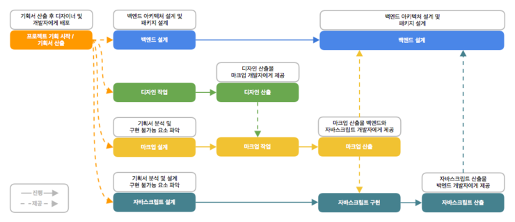
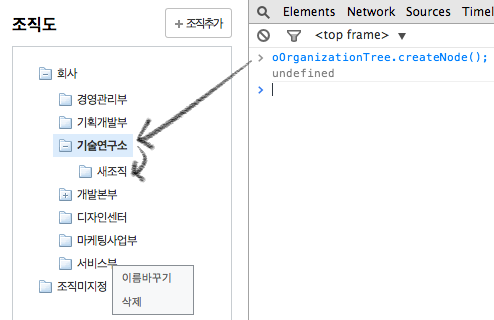

# 네이버는 이렇게 한다! 프런트엔드 개발 시작하기

2014년 9월에 초판 발행된 책이다. 8년이 지났지만 그 당시 네이버의 워크플로우나 기술에 대해 알 수 있어서 재미있게 읽었다. 1부에서는 전체적인 프론트엔드 개발도구에 대해 설명하고, 2부에서는 예제 하나를 잡아서 마크업부터 자바스크립트 개발까지 설명한다.

2014년은 React 개발 초기여서 그런지 예제는 jQuery를 사용한 예제였고, js를 OOP로 코딩하는 방식이 흥미로웠다. (내가 객체지향 개념을 잘 모르기 때문에...) 린트나 테스트 작성처럼 코드 품질 관리에 대해서도 설명되어있어서 좋았다. 8년전에도 리팩토링과 테스트 코드 작성

## 1부 - 프런트엔드 개발과 도구 소개

### 프런트엔드 개발이란

- 마크업
- UI 인터랙션 개발 : css로 표현하지 못한 동적인 효과를 js로 구현
- UI 컴포넌트 개발 : js를 모듈처럼 사용할 수 있게하는 컴포넌트 개발
- AJAX UI 개발 : AJAX 통신을 이용한 동적인 웹 페이지 구현
- UX 프로토 타입 개발

:::info 2022년의 프론트엔드 개발

2022년의 프론트엔드 개발 범위는 웹을 넘어서 앱까지 범위가 확장된 것 같다. 특히 모바일 서비스의 비중이 높아졌는데 모바일에서도 웹 프론트엔드 개발 수요가 증가되었고, js만 다루면 서버에서부터 앱 개발까지 가능하기 때문에 범위가 많이 확장되었다고 느껴진다.

특히나 'AJAX UI 개발'과 같은 표현은 조금 생소한데 서버에서 받아오는 데이터를 잘 뿌려주고, SPA 앱에서 성능 최적화를 하는 것까지 의미가 확장된 것 같다. 그리고 데이터를 받아오는 것 뿐만 아니라 서버에 데이터를 전달하면서 통신하는 부분에 있어서 신경쓸 것이 과거에 비해 더 많아진 것 같다. 

- [프론트엔드 역사와 미래, 업무 분야... 그리고 잘하는 프론트엔드 개발자란?](https://velog.io/@teo/frontend)

:::

네이버에서 정의하는 프론트엔드 개발의 범위는 HTML, CSS, 자바스크립트를 주 언어로 해서, 마크업, UI 개발 및 프로토타입을 개발하는 것까지로 볼 수 있다.

### 프런트엔드 개발 현황

- 웹 표준과 웹 접근성, 브라우저 렌더링 원리를 고려한 마크업, 크로스 브라우징, js 안티 패턴, js 성능 최적화, HTTP 통신 원리를 고려한 코드 작성 등 프론트에서 신경써야할 것들이 많고, 서버 개발자가 이를 다 커버하는 것이 쉽지 않기에 프런트와 백엔드를 분리해 개발하고 있다.
- 프런트 개발은 백엔드 개발에 의존적일 수 밖에 없다.

네이버에서는 다음과 같은 흐름으로 개발을 진행했고, 백엔드 개발의 의존성을 줄이기 위해 WebAPI문서를 통해 인터페이스를 공유하는 방식을 도입해 독립적인 개발이 가능하도록 했다.

:::info 2022년의 프론트엔드 개발

HTTP API를 인터페이스로 프론트와 백엔드가 병렬적으로 개발이 진행되도록 하는 방식은 요즘 기본적으로 진행되는 방식이라고 생각한다. 회사에서는 Redoc, 사이드 프로젝트를 할 때에는 Swagger를 사용해서 백엔드 개발자와 작업을 진행했다. 

:::

### 기술 스택

- IDE: 웹스톰 
- 버전관리 시스템: 서브버전과 깃
- 코드 품질관리: JSLint
- 테스트: QUnit 
- 디버깅: 크롬 개발자 도구 
- 마크업 개발: Less(CSS 전처리), Emmet
- 패키지 관리: Bower
- 문서화: JSDoc3
- 디렉터리 스캐폴딩(템플릿 같은 것): Grunt-init

:::info 2022년의 프론트엔드 개발

Less, Bower, Grunt 같은 도구들은 지금까지 한번도 안써봤고, 주변에서도 거의 안쓰는 것 같다. Grunt는 가장 최신 버전이 2021년 4월 버전으로 업데이트도 뜨문뜨문한 느낌이다.

JSDoc같은 경우에는 들어본 적은 있으나 실제로 써보지는 않았다. 프론트에서 인터페이스 문서화를 할 필요가 있을까?

:::

### 리팩터링 기법

책에서는 웹스톰과 함께 쓸 수 있는 리팩터링 기법을 위주로 소개했다.

- Rename
- Move files
- Safe Delete
- Inline: 메서드 몸체가 명확할 때 메서드를 삭제하고 풀어서 쓰는 방법
- Extract: Inline의 반대

리팩터링에 대해서는 지금 읽고있는 마틴 파울러의 리팩토링을 더 읽어보는 것이 좋겠다...

### 디버깅

## 2부 - 프런트엔드 개발 시작

- Example - 조직토 트리 개발

좌측의 조직도 트리를 명세 확인부터 자바스크립트 모듈 개발까지 순서대로 자세히 소개한다.

## 부록

