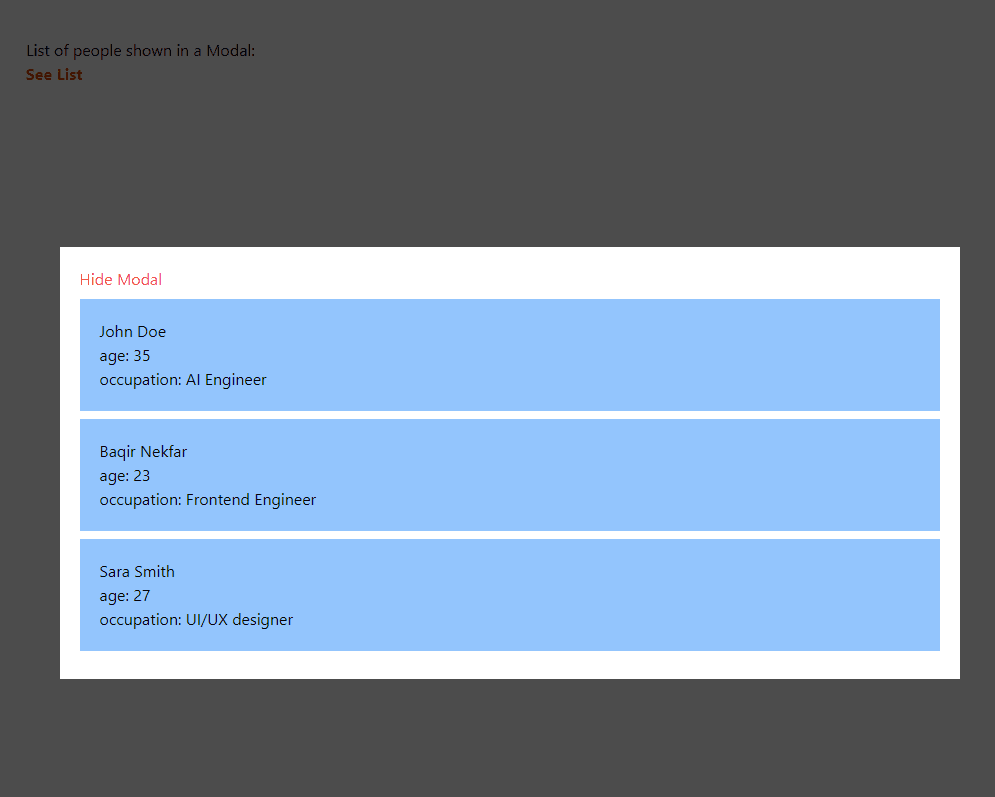

# 흔한 리액트 디자인 패턴들

:::info

Baqir Nekfar의 아티클 [The Most Common React Design Patterns](https://www.linkedin.com/pulse/most-common-react-design-patterns-baqir-nekfar/)을 번역한 글 입니다.

:::


## 레이아웃 컴포넌트

얼마 전, 링크드인에 디자인 패턴과 디자인 패턴이 무엇인지에 대해 포스팅한 적이 있습니다. 오늘은 리액트의 디자인 패턴, 특히 레이아웃 컴포넌트라는 디자인 패턴에 대해 이야기하고자 합니다.

:::note ✨ 디자인 패턴
 간단히 말해서 기존 문제에 대한 최선의 해결책이라고 할 수 있으며, 특정 상황을 처리하는 모범 사례라고 할 수 있습니다.
:::

리액트는 멋진 UI를 만들기 위한 라이브러리라는 것을 모두 아시겠지만, 멋진 UI를 만드는 좋은 방법이 하나만 있는 것은 아닙니다.

하지만 몇 가지 모범 사례를 따르면 깔끔하고 고성능의 구조화된 코드를 작성하는 데 도움이 될 것입니다. 이제 첫 번째 리액트 디자인 패턴에 대해 이야기해 보겠습니다.

✨레이아웃 컴포넌트: 레이아웃 컴포넌트는 주로 페이지에서 다른 리액트 컴포넌트를 렌더링하고 배열하는 데 사용되며, 자식 컴포넌트가 어디에 어떻게 위치해야 하는지를 지정합니다. 리액트 개발자로서 매일 다루는 가장 일반적인 컴포넌트 중 하나입니다. 레이아웃 컴포넌트의 몇 가지 예로는 분할 화면, 목록, 모달 등이 있습니다.


### 분할 화면

화면을 작은 조각으로 분할하고 원하는 다른 컴포넌트를 특정 영역에 배치하는 컴포넌트입니다. 페이지를 두 섹션(왼쪽과 오른쪽)으로 나누는 분할 화면 구성 요소의 예와 효율적인 사용 방법을 살펴보겠습니다.

```tsx
import { Children, ReactNode } from "react";

export const SplitScreen = ({
  leftWidth,
  rightWidth,
  className,
  children,
}: {
  className?: string;
  leftWidth?: number;
  rightWidth?: number;
  children: ReactNode;
}) => {
  const [left, right] = Children.toArray(children);
  return (
    <div className={`flex w-full ${className}`}>
      <div style={{ flex: `${leftWidth}` }}>{left}</div>
      <div style={{ flex: `${rightWidth}` }}>{right}</div>
    </div>
  );
};

SplitScreen.defaultProps = {
  className: "",
  leftWidth: 6,
  rightWidth: 6,
};
```

app.tsx 파일에서 이 레이아웃을 사용하는 방법은 다음과 같습니다.

```tsx
import { SplitScreen } from "./LayoutComponents/SplitScreen";

const LeftScreen = () => (
  <div className="bg-blue-700 text-white h-full">Left Screen</div>
);
const RightScreen = () => (
  <div className="bg-orange-500 text-white h-full">Right Screen</div>
);

export default function App() {
  return (
    <div className="w-full h-full">
      <SplitScreen className="min-h-[600px]" leftWidth={8} rightWidth={4}>
        <LeftScreen />
        <RightScreen />
      </SplitScreen>
    </div>
  );
}
```

app.tsx 파일을 살펴보면 분할 화면 컴포넌트를 어떤 방식으로든 어떤 자식과도 완전히 재사용할 수 있도록 하는 몇 가지 Props가 있음을 알 수 있습니다. 

브라우저에서 위의 코드를 실행한 결과를 살펴봅시다.


### 목록 (List)

목록은 리액트 개발자가 매일 마주하는 가장 흔한 시나리오 중 하나입니다. 페이지에서 목록 항목을 정렬하기 때문에 레이아웃 컴포넌트에 속합니다. 따라서 성능과 재사용성 관점에서 올바르고 효율적인 방법으로 목록을 작성하는 법을 살펴보겠습니다.

```tsx
import { FC } from "react";

interface ListRendererPropsType {
  items: unknown[];
  resourceName: "product" | "person";
  ItemComponent: any;
}

export const ListRenderer: FC<ListRendererPropsType> = ({
  items,
  resourceName,
  ItemComponent,
}) => {
  return (
    <ul>
      {items.map((item, i) => (
        <ItemComponent key={i} {...{ [resourceName]: item }} />
      ))}
    </ul>
  );
};
```

위의 컴포넌트는 모든 종류의 목록 항목을 자체적으로 렌더링하는 재사용 가능한 목록 렌더러 컴포넌트입니다. 이 데모에서는 `product`와 `person`만 사용했지만 필요하다면 다른 사용 사례도 추가할 수 있습니다. 

이 컴포넌트를 사용하는 방법은 다음과 같습니다.
```tsx
import { ListRenderer } from "./LayoutComponents/ListRenderer";

type PersonItemPropsType = {
  person: {
    fullName: string;
    age: number;
    occupation: string;
  };
};
type ProductItemPropsType = {
  product: {
    name: string;
    price: number;
    quantity: number;
  };
};

const ProductItem = ({ product }: ProductItemPropsType) => (
  <li className="w-full p-5 bg-orange-200 my-2">
    <h1>{product.name}</h1>
    <div>Price: ${product?.price}</div>
    <div> Quantity: {product?.quantity}</div>
  </li>
);

const PersonItem = ({ person }: PersonItemPropsType) => (
  <li className="w-full p-5 bg-blue-300 my-2">
    <h1>{person.fullName}</h1>
    <div>age: {person?.age}</div>
    <div> occupation: {person?.occupation}</div>
  </li>
);

const people = [
  {
    fullName: "John Doe",
    age: 35,
    occupation: "AI Engineer",
  },
  {
    fullName: "Baqir Nekfar",
    age: 23,
    occupation: "Frontend Engineer",
  },
  {
    fullName: "Sara Smith",
    age: 27,
    occupation: "UI/UX designer",
  },
];
const products = [
  {
    name: "Dinning Table",
    price: 100,
    quantity: 10,
  },
  {
    name: "Programming Chair",
    price: 200,
    quantity: 20,
  },
  {
    name: "Sofa",
    price: 1000,
    quantity: 100,
  },
];

export default function App() {
  return (
    <div className="w-full h-full p-10">
      <h1>List of people:</h1>
      <ListRenderer
        ItemComponent={PersonItem}
        resourceName="person"
        items={people}
      />
      <h1>List of products:</h1>
      <ListRenderer
        ItemComponent={ProductItem}
        resourceName="product"
        items={products}
      />
    </div>
  );
}
```

:::note

단순화를 위해 people, products, 그리고 ProductItem 컴포넌트와 ProductItem 컴포넌트를 한 페이지에 넣었지만, 실제 시나리오에서 외부 API에서 데이터를 가져올 것이고 이를 호출하는 커스텀 hook(다음 글에서 설명할 예정입니다)과 함께 다른 파일로 나눠질 것입니다.

:::

이제 코드 실행 결과를 살펴보겠습니다.


### 모달

또 다른 일반적인 레이아웃 컴포넌트는 모달입니다. 모달은 모든 콘텐츠를 감싸서 화면 위쪽의 다른 레이어에 표시합니다. 구현은 간단하기 때문에 재사용 가능하고 효율적인 모달 컴포넌트를 만들기 위해 서드파티 패키지를 사용할 필요가 없습니다.

```tsx
import { FC, ReactNode } from "react";

interface ModalPropsType {
  children: ReactNode;
  visible: boolean;
  requestToClose: () => void;
}

export const Modal: FC<ModalPropsType> = ({
  children,
  visible,
  requestToClose,
}) => {
  if (!visible) return null;
  return (
    <div
      className="fixed inset-0  bg-black/70 flex justify-center items-center"
      onClick={requestToClose}
    >
      <div
        className="relative min-w-[900px] p-5 min-h-[400px] bg-white"
        onClick={(e) => e.stopPropagation()}
      >
        <button onClick={requestToClose} className="text-red-500">Hide Modal</button>
        {children}
      </div>
    </div>
  );
};
```

모달 내부에 사람 목록을 렌더링하는 방법은 다음과 같습니다.

```tsx
import { useState } from "react";
import { ListRenderer } from "./LayoutComponents/ListRenderer";
import { Modal } from "./LayoutComponents/Modal";

type PersonItemPropsType = {
  person: {
    fullName: string;
    age: number;
    occupation: string;
  };
};

const PersonItem = ({ person }: PersonItemPropsType) => (
  <li className="w-full p-5 bg-blue-300 my-2">
    <h1>{person.fullName}</h1>
    <div>age: {person?.age}</div>
    <div> occupation: {person?.occupation}</div>
  </li>
);

const people = [
  {
    fullName: "John Doe",
    age: 35,
    occupation: "AI Engineer",
  },
  {
    fullName: "Baqir Nekfar",
    age: 23,
    occupation: "Frontend Engineer",
  },
  {
    fullName: "Sara Smith",
    age: 27,
    occupation: "UI/UX designer",
  },
];

export default function App() {
  const [modalVisible, setModalVisible] = useState<boolean>(false);

  return (
    <div className="w-full h-full p-10">
      <h1>List of people shown in a Modal:</h1>
      <button
        className="text-orange-500 font-bold"
        onClick={() => setModalVisible(true)}
      >
        See List
      </button>
      <Modal
        visible={modalVisible}
        requestToClose={() => setModalVisible(false)}
      >
        <ListRenderer
          ItemComponent={PersonItem}
          resourceName="person"
          items={people}
        />
      </Modal>
    </div>
  );
}
```

실행 결과를 살펴보겠습니다.




이번 글에서는 레이아웃 컴포넌트라는 리액트 디자인 패턴에 대해 배웠습니다. 분할 화면, 목록, 모달과 같은 리액트 레이아웃 컴포넌트의 예시와 올바른 사용법에 대해 이야기했습니다.
