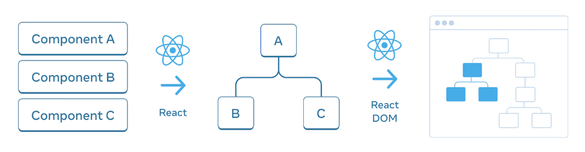

# 가상DOM

가상 DOM을 이해하려면 우선 DOM이 무엇인지 알아야 한다.

## 1. DOM(Document Object Model)

트리 구조로 문서의 계층 구조를 표현한 것을 DOM이라고 한다. DOM 트리 라고도 한다. Javascript에서 활용한 `findElementById` 같은 메서드는 언어가 제공하는 API라기보다 브라우저와 상호작용하기 위한 웹 API라고 볼 수 있다. Javascript는 웹 API를 이용해 DOM을 조작한다.

UI를 모델링하기 위해 우리가 사용하는 DOM 들은 다음과 같다.

1. DOM - HTML 트리
2. CSSOM - CSS 트리
3. Accessibility Tree
4. React DOM 

React DOM 같은 경우는 위의 이미지와 같이 React가 JSX를 트리로 변환한 것을 말한다. 

## 2. 가상 DOM

가상 DOM은 브라우저에 존재하는 DOM을 흉내 낸 데이터 구조이다. 어플리케이션 코드와 실제 브라우저 DOM 사이에 중간 계층을 담당하여 데이터 변경을 탐지하거나 브라우저와 코드 사이의 이벤트 통신, 최적화 등을 한다.

### 왜 가상 DOM을 이용할까?

직접 DOM을 조작하기 어려운 경우가 있는데 가상 DOM이 DOM 조작과 관련된 복잡한 작업을 추상화 해준다. 데이터의 변경사항을 탐지해서 UI를 갱신하는 과정이 그렇다.

1. DOM 트리 조회
2. repaint, reflow를 위한 계산
3. DOM 트리 갱신

이 일련의 과정에서 빠르고 효율적인 작업이 가능해진다. 메모리에 생성된 가상 DOM의 변경사항 중 실제 DOM에 반영해야할 부분만 갱신하는데 가상 DOM에서 변경을 감자히는 부분도 계산이 들어가기는 하지만 실제 DOM을 갱신하는 것이 무거운 작업이기 때문에 가상 DOM의 빠른 변경 탐지 알고리즘을 사용하는 것이 훨씬 **효율적**이다 **상태 추적이 간편해지는 것**도 장점.

DOM의 직접 조작이 가상 DOM을 사용하는 것보다 항상 느리다고 볼 수 없지만 현대 애플리케이션은 대부분 동적인 경우가 많기 때문에 많은 애플리케이션 개발에서 React를 사용한다.

### 어떻게 DOM이 변경될까?

가상 DOM이 변경된다고 해서 DOM이 변경되는 것은 아니고, [Diffing 알고리즘](https://legacy.reactjs.org/docs/reconciliation.html)으로 이전 가상 DOM과 새 가상 DOM을 비교하여 변경된 부분만 실제 DOM에 반영한다.
