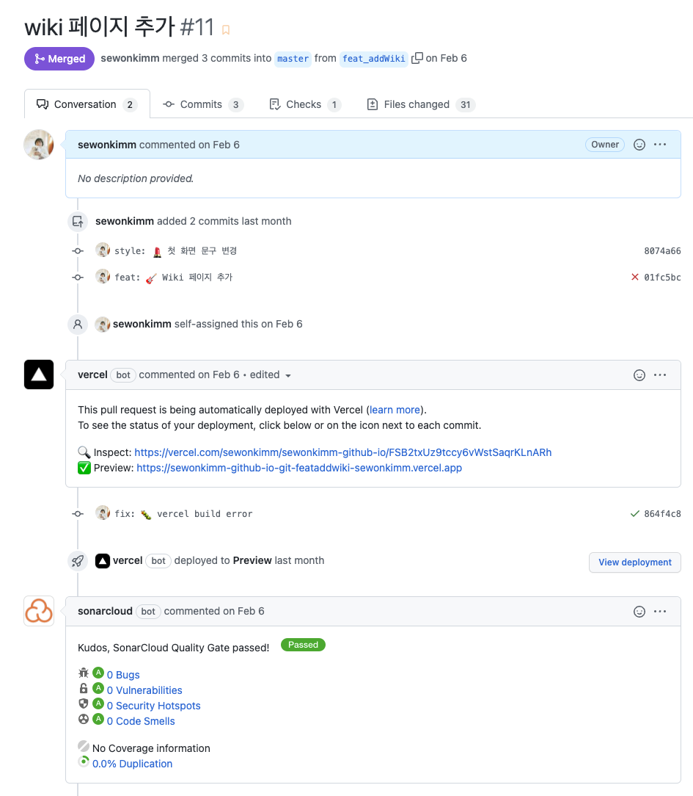

제가 처음 기술 블로그를 시작한 때는 바야흐로 2019년 여름이었습니다. 본격적으로 취업준비를 시작했을 때, 큰 생각없이 [Github로 취업하기](https://sujinlee.me/professional-github/) 포스팅을 보고 Github을 관리하기 시작하면서 블로그도 시작하게 되었습니다. 그 후 2년간 꾸준히 알고리즘을 비롯한 CS 지식, Web 개발 관련 지식, SSAFY 관련 내용, TIL등을 작성했고, 2021년 8월 취업에 성공했습니다. 블로그가 결정적인 영향을 주었다고 생각하지는 않지만 취업에 있어서 긍정적인 영향은 주었다고 생각합니다. 그리고 2년간 500여 개의 글을 작성하면서 기록을 좋아하는 제 성향을 알게되었습니다.

<!--truncate-->

## 블로그 개편, WHY?

기록과 정리를 굉장히 좋아하는 성향을 깨닫고난 뒤, 다른 개발자들의 블로그에도 많은 관심이 생겼습니다. 2021년에는 오픈소스컨트리뷰톤에 참가하면서 캡틴판교님과 다른 개발자분과 기술적인 내용을 문서화하는 것도 경험해보면서([Cracking vue.js](https://joshua1988.github.io/vue-camp/) 프로젝트에 참여했습니다) '**지금의 블로그로 괜찮은가..? 양질의 글을 쓰고 싶다...**'라는 생각을 하게 되었습니다. '글'이라기 보다는 '기록'에 가까운 미완의 문장들을 업그레이드 시키기 위해서 블로그 개편을 마음먹었습니다.

## 블로그 개편, HOW?

### 1. 플랫폼; github pages

네이버 블로그, 티스토리, velog, medium 등 다양한 플랫폼이 있습니다. 그리고 저도 플랫폼을 옮겨야할지 고민해봤지만 **어디에 글을 쓰느냐보다 어떤 글을 쓰는지가 중요합니다.** (먼저, 글을 써야합니다...!!!) 그래서 기존에 사용하던 플랫폼을 유지하게되었습니다.

지금 생애 첫 블로그 개설을 고민하고 계신데 아직 git에 익숙하지 않은 분들이라면 **github으로 시작해 보시는 것을 강력 추천**합니다! 처음에는 아마 jekyll이나 gatsby와 같은 정적사이트 생성도구를 사용하실텐데 초반 구축과정이 조금 어렵게 느껴질 수 있지만 git과 markdown에 익숙해 질 수 있는 좋은 기회입니다. 처음엔 텍스트에디터로 글을 쓰는 것도, commit과 push를 해야만 배포되는 것도 다른 플랫폼에 비해서 불편하지만 불편한만큼 개발적으로 얻어갈 수 있는게 많습니다. 개인적으로는 github pages를 선택한 것이 개발 인생에 있어서 큰 도움이 되었습니다.

### 2. Docusaurus 🦖

현재 사이트는 Docusaurus를 기반으로 만들어졌습니다.

[ReactNative](https://reactnative.dev/), [Jest](https://jestjs.io/) 공식문서를 보다가 포맷이 비슷해서 찾아보니 Docusaurus라는 것이 있었고, `React 기반`, `손 쉬운 버전 관리`, `다국어 지원`, `다크모드`, `다양한 플러그인` 등 매력적인 기능이 많았습니다. 일반적인 포스팅도 하고 싶고, [기계인간 이종립님의 기술 블로그](https://johngrib.github.io/)처럼 wiki형태로 공부한 내용을 기록하고 싶기도 해서 고민하고 있었는데 Docusaurus는 포스팅의 형태가 나누어져 있어서 결정적으로 선택하게 되었습니다.

### 3. 배포; Vercel

부끄럽지만 배포에 대해서는 아는 것이 없습니다... 당시 주변 분들이 많이 언급하셔서 한 번 사용해보려고 썼습니다. Vercel에서 git repository를 연결하기만하면 손 쉽게 배포되기 때문에 어려운 것은 없었습니다.

간편하고 Pull request 작성하면 preview도 만들어주는 점이 좋습니다. 연결한 김에 Sonar cloud로 정적 분석도구도 달아줬습니다.

## 블로그 3.0, 그 이후

큰 맘 먹고 블로그를 싹 갈아엎으니 속이 시원합니다.(다행히도 이전 포스팅들은 github에 있습니다) 앞으로 어떤 글을 써나갈지가 제일 중요하겠죠?

### 앞으로 어떤 글을 쓸 것인가

- 누군가가 내 글을 읽는다고 가정하고, 영양가 있는 글을 쓸 것입니다.
- 공부를 기록하는 용도의 글은 wiki에, 전하고 싶은 메세지가 있는 글은 Blog로 카테고리 구분 할 예정입니다.
- TIL 같은 단순 메모용 글은 쓰지 않을 예정입니다. 프로젝트 개발 후기, 활동 경험 공유, 개발 지식, 튜토리얼, 문서 번역, 회고 등 작성할 것들이 산더미입니다.

사실 블로그 개편을 마음먹고 첫 글을 작성하기까지 이런저런 핑계로 굉장히 오랜 시간이 걸렸는데 이 글을 시작으로 바지런히 블로그를 잘 꾸며나가 보겠습니다. 저에게도 도움이 되지만 다른 분들에게도 도움이 되는 블로그로 자라나기를!

:::tip 재미있게 봤던 기술 블로그에 관한 포스트들

- [4년간의 개인 기술 블로그 운영 회고하기](https://www.holaxprogramming.com/2016/11/17/blahblah-writing-as-programmer/)
- [내가 개발 블로그 플랫폼으로 Github과 Jekyll을 선택한 이유](https://wormwlrm.github.io/2018/07/07/Why-I-select-Github-and-Jekyll-for-my-development-blog.html)
- [개발하기 바쁜데 글까지 쓰라고?](https://taetaetae.github.io/2019/10/27/a-reason-for-writing/)
- [nextJS 뭘로 배포할까?](https://taeny.dev/javascript/nextjs-with-deployment-platform/)

:::
