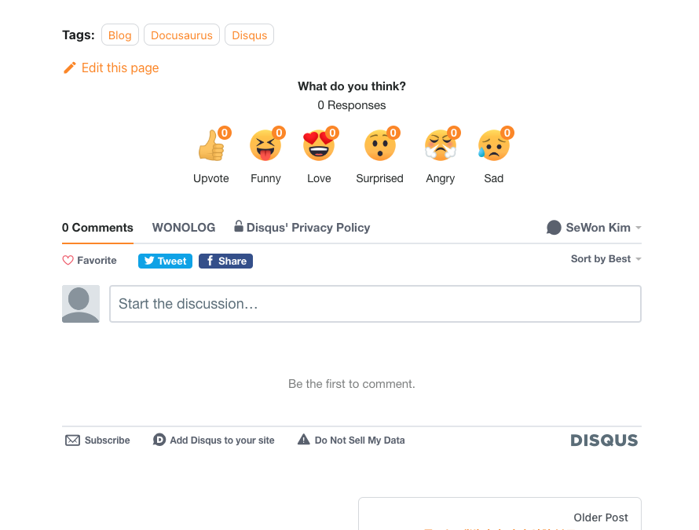

블로그는 기록의 용도도 있지만 더 많은 개발자 분들과 소통할 수 있는 창구라고 생각합니다. 이전 jekyll 블로그에서도 Disqus로 댓글 기능을 연동해서 사용 중이었는데요. Docusaurus로 만든 이번 블로그에서도 댓글을 달아보았습니다. 

<!--truncate-->

:::note 

- 개발환경 : docusaurus @2.0.
- Docusaurus theme : theme-classic  

:::

## 1. Disqus에 블로그 등록하기

:::tip 참고한 블로그

- [Register Your Weblog with Disqus](https://madrus4u.com/blog/register-disqus)
:::

링크 따라서 만들면 되고, 특별히 신경써야할 것은 딱히 없습니다. 

## 2. disqus-react 설치


:::tip 참고한 블로그

- [Add Disqus Comments to Docusaurus Blog Posts](https://madrus4u.com/blog/blog-comments)
:::


:::warning

- Docusaurus v2에서 제대로 동작합니다.
- `theme-classic`을 사용해야합니다.

:::

다음 명령어로 disqus를 설치합니다. 
```shell
yarn add disqus-react
```

## 3. 블로그 포스트 frontmatter 설정

블로그 포스트 맨 위에 포스트 정보를 적는 frontmatter에 `comment` 항목을 true로 설정해줍니다.

```md
---
slug: /your-blog-post-slug
...
draft: true
comments: true 
---
```

아직 블로그 포스트가 미완성이라면 draft 항목을 true로 설정해주세요. 해당 항목이 true인 글은 dev 버전에서만 보이고, deploy 버전에서는 보이지 않습니다.

## 4.컴포넌트 swizzle

다음 swizzle CLI로 블로그 포스트 wrapping을 진행합니다.

```shell
yarn swizzle @docusaurus/theme-classic BlogPostItem -- --wrap
```

Docusaurus의 swizzle 기능은 사용자 정의 레이아웃을 쉽게 만들 수 있도록 하는 기능입니다. [Swizzling api 문서](https://docusaurus.io/ko/docs/cli#docusaurus-swizzle)를 확인해보시면 blog post에 댓글을 추가하는 것 외에도 다양한 레이아웃을 손쉽게 추가해 줄 수 있습니다. 

swizzle을 진행하고 `src/theme/BlogPostItem/index.js` 파일에서 블로그 포스트의 레이아웃에 댓글 컴포넌트를 추가합니다.  

```jsx
import React from "react";
import BlogPostItem from "@theme-original/BlogPostItem";
import { DiscussionEmbed } from "disqus-react";
import { useBlogPost } from "@docusaurus/theme-common/internal";

export default function BlogPostItemWrapper(props) {
  const { metadata } = useBlogPost();
  const { frontMatter, slug, title } = metadata;
  const { comments = true } = frontMatter;

  return (
    <>
      <BlogPostItem {...props} />
      {comments && (
        <DiscussionEmbed
        // highlight-next-line
          shortname="your-disqus-shortname"
          config={{
            url: slug,
            identifier: slug,
            title,
            language: "ko_KR",
          }}
        />
      )}
    </>
  );
}

```

shortname은 Disqus 관리 페이지의 settings에서 확인할 수 있습니다.


## 5. 마무리



프로젝트를 컴파일 해보면 다음과 같이 댓글이 잘 연결됨을 확인할 수 있습니다. 로컬에서 테스트 한 댓글은 deploy 버전에서는 보이지 않는다고 하네요. 또 배포 후에 url 을 지정하는 `slug` 항목을 변경하면 댓글이 모두 사라질 수 있다고 하니 주의하세요.


생각보다 쉽게 댓글을 연결했습니다. 이 포스트를 보고 계신 분들도 블로그에 성공적으로 Disqus 연결하셨기를 바랍니다! 여기까지 보셨다면...


(좋댓구알 plz~)
