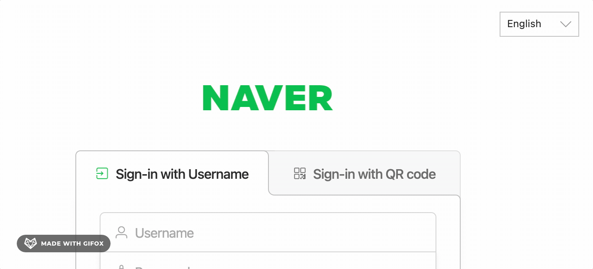
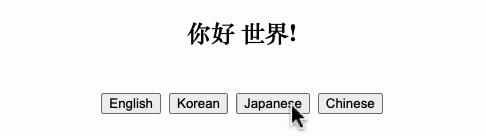

제가 회사에서 만들고 있는 제품은 한국뿐 아니라 일본, 싱가폴, 대만, 유럽 등 다양한 국가에 고객사가 있습니다. 지금은 영어, 일본어, 한국어를 지원하고 있는데요. 취준생 시절 포트폴리오를 만들기 위한 웹서비스 개발을 할 때에는 다국어 지원 경험이 많지 않아서 처음엔 조금 생소한 주제였습니다. 그래서 이번 기회에 다국어 지원을 위한 구현 방법을 정리해보려고 합니다.


## 먼저, 생각해 볼까요?



위와 같이 다양한 언어를 지원하는 서비스를 만들려면 어떻게 해야할까요? 간단히 구현방법을 생각해보면 다음과 같습니다.

1. 컴포넌트 내 모든 문구를 하드코딩하지 않고, 언어에 맞는 문구를 반환하는 메서드를 사용한다.
2. 언어별로 문구를 관리하는 파일을 마련한다.
3. 언어 선택 버튼을 만들어서, 언어를 선택하면 해당 언어로 문구를 반환할 수 있도록 한다.

생각보다 복잡하지는 않습니다. 직접 구현해 보는 것도 좋은 경험이지만 위에 나열한 것들을 쉽게 구현할 수 있도록 도와주는 라이브러리가 이미 존재합니다!

<!--truncate-->

## i18n

i18n 라이브러리를 사용하는 이유가 단순히 'key - value' 형태로 문구를 쉽게 관리할 수 있기 때문만은 아니고, interpolation(보간)이나 pluralization(복수형) 등 다양한 기능을 제공하기 때문입니다. 그 외에도 플러그인이 많아서 필요한 기능을 직접 구현하는 시간과 비용을 아낄 수 있습니다.

:::info 깨알 상식

i18n은 internationalization(국제화)의 약자로, i와 n 사이에 있는 글자 수가 18개라서 i18n이라고 한다고 해요.

:::

그리고 i18n라이브러리를 사용하면 [Locize](https://locize.com/)라는 유료 서비스를 활용하는 것도 쉬워지는데요. 제품의 크기가 커지면 관리해야할 문자열이 굉장히 많아지고, 언어가 추가되기 시작하면 그 양은 배로 늘어납니다. 단순히 언어를 추가하는 것뿐만 아니라 어순이나 복수형 표기 등에 대해서도 고민해야하는데요. 이런 디테일들은 다국어 시스템을 구축하기 전에 미리 생각하지 못하는 경우가 많습니다. 우리가 보기엔 그냥 중국어인데 중국 대륙의 중국어와 대만의 중국어, 홍콩의 중국어가 각각 다르기 때문에 그런 것들도 놓치기 쉬운 부분 중 하나입니다. 한마디로 개발자가 혼자 해결할 수 있는 영역이 아니며 협업이 불가피합니다.

이런 상황에서의 번역 작업은 생각보다 가성비가 떨어지는 일입니다. 번역 작업을 하면서 밤을 새다보면 현타가 오는데요. 기획자, 디자이너, 번역자가 효율적으로 협업할 수 있도록 도와주는 Locize와 같은 서비스가 있다는 것은 굉장히 좋은 일입니다. 사용할 수 있다면 최대한 활용하는 편을 추천드려요!

저는 2022년부터 Locize를 사용해 제품의 언어 관리를 효율적으로 할 수 있는 시스템을 구축하는 작업을 진행했고, 덕분에 한국어 지원을 부담없이 진행할 수 있었는데요. **다국어 서비스를 효율적으로 관리하는 방법**에 대해서는 또 다른 글에서 다루도록 하겠습니다.

:::tip

더 많은 정보는 [i18n 공식문서](https://www.i18next.com/)를 참고하세요.
javascript말고도 제공하는 언어가 많아서 한 번 익혀놓으면 다른 언어에서도 쉽게 사용할 수 있습니다.

:::


우선 프로젝트에 i18n 라이브러리를 사용해 다국어 서비스를 세팅하는 방법에 대해서 알아보겠습니다.


## 실전! 다국어 서비스 개발하기

:::note



선택한 언어에 따라서 문구가 바뀌는 예제입니다.
프로젝트 소스코드는 [여기](https://github.com/sewonkimm/react-i18n-practice)에서 확인할 수 있습니다.
:::

구현 순서는 다음과 같습니다.

### 1. 프로젝트 준비하기

먼저 리액트 프로젝트 생성하고 문구와 언어를 선택할 수 있는 UI를 구현합니다.

```jsx
import React from "react";

export default function MainPage() {

  const changeLanguage = (lng) => {
    // 언어를 변경하는 기능
  };

  return (
    <div className="root">
      <h2>
        // 번역을 적용할 문구
      </h2>

      <div className="buttonContainer">
        <button type="button" onClick={() => changeLanguage("en")}>
          English
        </button>
        <button type="button" onClick={() => changeLanguage("ko")}>
          Korean
        </button>
        <button type="button" onClick={() => changeLanguage("ja")}>
          Japanese
        </button>
        <button type="button" onClick={() => changeLanguage("zh")}>
          Chinese
        </button>
      </div>
    </div>
  );
```

### 2. react-i18next 라이브러리 설치하기

:::note

[react-i18next 라이브러리 공식문서](https://react.i18next.com/getting-started)를 참고하여 설정하였습니다.

:::


```bash
npm install react-i18next i18next --save
```

명령어를 이용해 라이브러리를 설치해주시고, 루트 폴더에 `i18n.js` 파일을 생성합니다.


### 3. i18n config 설정하기

`i18n.js` 파일에 다음과 같이 설정합니다.

```js
// src/i18n.js
import i18n from "i18next";
import { initReactI18next } from "react-i18next";

import LanguageDetector from "i18next-browser-languagedetector";

i18n
  .use(LanguageDetector)
  .use(initReactI18next)
  .init({
    fallbackLng: "en",
    debug: true,

    interpolation: {
      escapeValue: false, // not needed for react as it escapes by default
    },
  });

export default i18n;
```

#### 플러그인

위 파일에서 Backend와 LanguageDetector는 필수적으로 적용할 사항은 아니고, 필요에 따라서 적용하면 되는 플러그인 입니다.

제가 적용한 [i18next-browser-languagedetector](https://github.com/i18next/i18next-browser-languageDetector)는 [window.navigator.language](https://developer.mozilla.org/en-US/docs/Web/API/Navigator/language)로 알아낼 수 있는 브라우저의 언어를 감지합니다. 사용자가 선택한 언어 정보를 쿠키나 로컬스토리지 등에 저장해두면 그 정보를 감지하고 설정해주는 것도 가능합니다.

이 외에도 다양한 플러그인이 많은데요. 사용가능한 플러그인 항목은 [공식문서](https://www.i18next.com/overview/plugins-and-utils)를 참고하세요.


### 4. 문구 관리 JSON 파일 생성 및 연결하기

`public/locales/<language_code>/translation.json` 로 각 언어별 문구를 관리합니다.

```json
// en/translation.json
{
  "helloWorld": "Hello world!"
}

// ko/translation.json
{
  "helloWorld": "헬로 월드!"
}

// cn/translation.json
{
  "helloWorld": "你好 世界!"
}
```

각 파일에 다음과 같이 key-value문구를 넣고, 실제로 문구를 사용할 때에는 컴포넌트에서 `useTranslation` hook을 사용합니다.

```jsx
import React from "react";
import { useTranslation } from "react-i18next";

export default function MainPage() {
  const { t } = useTranslation();

  return (
    <div className="root">
      <h2>{t("helloWorld")}</h2>
    </div>
  );
```

UI 코드에서 t메소드에 json파일에서 관리하는 key값을 넣어주면 해당 언어에 맞는 문구를 반환해줍니다.

<!-- 문구를 추가하다보면 json 파일을 분리해야할 때가 오는데요. 이 때 사용할 수 있는 방법은 다른 글에서 다루도록 하겠습니다. -->
<!-- 언젠간 글 쓰기... 😅 -->

### 5. 언어 변경 기능 추가하기

```jsx
const { t, i18n } = useTranslation();

const changeLanguage = (lng) => {
    i18n.changeLanguage(lng);
};
```
i18n 객체의 changeLanguage 메소드를 사용하면 언어 변경하는 기능을 구현할 수 있습니다. i18n 객체에는 다양한 메소드가 있으니 [공식문서](https://www.i18next.com/overview/api)를 참고하세요. 생각보다 활용할 수 있는 것이 많은데 예를 들어 언어별로 폰트를 다르게 가져가야한다거나 할 때에도 유용하게 사용할 수 있습니다. `i18n.language`의 반환값을 useEffect의 dependency에 걸어서 언어가 변경될 때마다 다른 폰트를 가져오도록 한다던가 하는 방식으로 구현하는 것처럼 말이지요.


## 완성~


간단하죠? 다국어 서비스를 구현하는 기초 코드를 같이 살펴보았습니다!
이 글이 다국어 서비스를 구현하는 데에 도움이 되었으면 좋겠습니다. 감사합니다. 🙏
