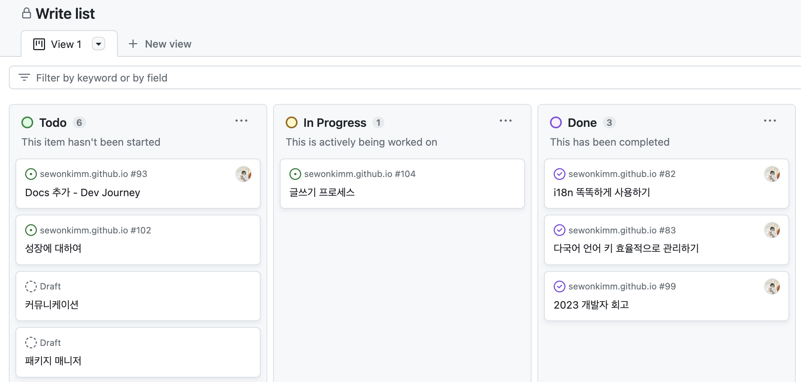
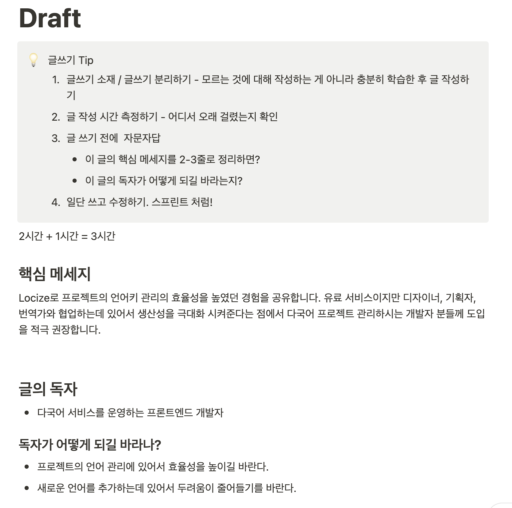

[블로그 3.0을 시작](../2022-03-12-post/index.md)하며 양질의 글을 쓰기로 마음먹은지 벌써 2년이 지났습니다. 하지만 메세지가 있는 글, 내 마음에 드는 글을 쓰기란 생각보다 쉽지 않았고 2년간 9개 밖에 작성하지 못했습니다. 올해 글쓰기를 조금 더 잘하고 싶어서 글또 9기 활동을 시작했고, 글또에서 \<실용주의 글쓰기> 세미나를 듣고 제 작문 활동을 되돌아 봅니다.

<!--truncate-->

<br />

## 글을 쓰는 이유

저는 왜 글또에 참여하면서까지 글을 쓰고 싶었을까요? 블로그 첫 글을 다시 돌아보았습니다.

1. 기록을 좋아한다. 그냥 그렇게 태어났다.
2. 글쓰기를 통해 성장하고 싶다.

크게 두 가지 이유가 있었습니다. 2년이 지난 지금도 그 마음에는 크게 변함이 없습니다. 취업 이후, 전처럼 프론트엔드 분야를 열심히 공부하지 않는 것 같은 느낌이 들어 블로그에 글을 쓰면서 공부하고 싶었던 마음이 컸던 것 같습니다. 그렇다면 저는 지금껏 어떤 방식으로 글을 써왔을까요?

<br />

## 나의 글쓰기 프로세스

```mermaid
graph LR;
    A[글감 저장]--> |산책하며 Develop| B[착석];
    B--> |무수히 많은 방해| C[글 작성];
    C-->D[업로드];
    D-->E[퇴고];
    E-->C;
```


### 1. 글감 저장

저는 산책을 하며 아이디어를 많이 얻습니다. 머릿속에서 어느정도 구상이 된 주제들을 github project에 만들어 관리합니다. 플랫폼에 종속되지 않고, 정적 사이트로 블로그를 만들었기 때문에 github을 이용하기가 편리하더라구요.



아이디어는 많지만 실행까지 굉장히 오래 걸려서 대충 키워드만 써놓은 것들은 나중에 '내가 뭘 쓰려고 했더라?'는 생각에 지워버리기도 합니다. 기록이라도 해 놓는 것이 중요하지만, 한 단계 더 나아간다면 **구체적으로 전달하려고 했던 메세지라도 간략하게 남겨놓는 게** 좋은 것 같아요. (두 단계 더 나아간다면 빨리 빨리 글을 쓰는 게 좋겠죠...? 😅)


### 2. 착석

저의 글쓰기 과정을 시각화해보고 느낀 점이 있습니다. 전반적인 글쓰기 프로세스는 다른 사람과 크게 다르지 않지만, **글을 쓰기 전까지의 시간이 매우 오래 걸립니다.** 이것도 다른 사람과 크게 다르지 않을지도 모르겠습니다.


흔한 직장인이 되어버린 저는 퇴근 후엔 너무 피곤해서 글 쓰는 것을 미루고, 주말에는 글을 쓰려고 노트북을 켜면 금새 다른 것에 집중력을 빼앗겨 결국 글 쓰는 것을 또 평일로 미룹니다. 그 사이에 반짝였던 아이디어들은 빛을 잃어버리고, 글쓰기 의욕도 함께 작아져버립니다.글 쓰기를 좋아하지만 좋은 글을 쓰는 건 어려운 일이기 때문에 저도 모르게 글 쓰기를 미뤄온 것 같습니다.

### 3. 글 작성

일단 자리에 앉아서 컴퓨터를 켜고, IDE를 여는데까지 성공하면 그 다음은 쉬운 편입니다. 일단 술술 써 내려가는 것 같아요.

다만, 글또를 시작하고 나서는 글 작성 전에 **'예상 독자, 전하고 싶은 메세지'를 미리 생각**하고 글을 쓰려고 노력하고 있습니다.예상 독자와 전달하고 싶은 메세지를 미리 생각했을 때, 글이 좀 더 명확해지고 작성하기도 쉬워져서 노션에 초안을 미리 작성해보고, 시간을 측정해보는 습관을 들여보려고 합니다.


(노션에 작성한 초안)

어느정도 내용이 구체화되면 제목을 정하는데 글 쓰는 과정 중에서 제목 정하기가 제일 어려운 것 같습니다. 멋진 제목이 먼저 생각나면 오히려 글이 금방 쓰이는 것 같아요.

### 4. 업로드

다른 블로그처럼 버튼 하나로 바로 배포하지 않고, PR을 작성하고 머지하는 과정을 거쳐야 글이 최종적으로 배포됩니다. 그 과정에서 자연스럽게 글을 한 번 더 읽어보게 됩니다(1차 퇴고). 이 때 종종 오타도 수정하고, 문장도 다듬게 됩니다.

### 5. 퇴고

저는 제 글을 읽는 것을 좋아합니다. 공들여 작성해 업로드 한 글은 심심하면 한 번씩 읽어봅니다. 컴퓨터로도 읽어보고, 휴대폰으로도 읽어봅니다. 그러다 오타도 발견하고, 내용도 보완하구요. '퇴고를 해야겠다'고 특별히 마음먹어 본 적은 없고, 그냥 제 글이 재미있어서 여러번 읽다보니 자연스럽게 퇴고를 하게 됩니다. 그래서 글을 더 잘 쓰고 싶어요. **제 글을 제일 많이 보는 사람은 저 스스로이기 때문에 여러번 읽어도 부끄럽지 않은 글을 쓰고 싶습니다.**

<br />

## 저항이 큰 사람


이렇게 돌아보니 저는 글쓰기 '저항(무언가를 하려고 마음 먹었을 때, 실천을 방해하는 때 알 수 없는 힘)'이 큰 사람인 것 같습니다. 사실 그 저항은 이번주 글또 마감일에도 크게 작용했어요. 글쓰기를 통해 성장하고 싶지만 성장하는 것은 힘드니까 자연스럽게 저항이 생기는 것 같습니다.

<br />

## 작게 시작하기, 빠르게 실패하기

실제로 전기 저항을 줄이는 방법은 전선을 **짧고, 굵게** 만드는 것입니다. 저도 글쓰기 저항을 줄이기 위해 매일 짧게나마 글을 써보려고 합니다. 아직까지 습관이 들지 않았지만 글또 \<실용주의 글쓰기> 세미나에서 정말 실용적인 팁들을 많이 얻었거든요.

- 글쓰기 템플릿 만들어 놓기
- 배터리 방전될 때까지만 글쓰기
- 글 쓰는 동안 휴대폰을 냉장고(?)에 넣어두기
- 지하철 사물함에 노트북 넣어두기(침대를 벗어나게 만드는 장치)

그리고 제 글쓰기 과정을 돌아보며 깨달은 것도 있습니다.

- 글쓰기 전에 공부하기

**글은 공부의 결과물**입니다. 공부할 겸 글을 작성하다보면 양질의 글이 나올 수 없고, 시간도 오래 걸린다는 것을 배웠습니다. 그래서 지금까지 테크니컬한 글 보다는 회고나 외부 활동 후기 등을 주로 써온 것 같습니다. 기술적인 글들은 1년 넘게 미루고 미루다가 글또를 시작한 뒤에야 쓸 수 있었습니다.

<br />

아직 6번의 글또 마감이 남았으니 세미나에서 배운 팁들을 직접 실천해보며 글쓰기 근육을 단련해보려고 합니다.

```
## 글 쓰기 전 생각해볼 것

---

1. 예상 독자는 누구인가요?
2. 독자가 이 글을 읽고 어떻게 변하길 바라나요?
3. 글 전체적으로 전하고 싶은 핵심 메세지는 무엇인가요?

## 목차

---

- 서론
- 본론
- 결론
```

저항을 조금이라도 줄이기 위해 세미나 끝나자마자 글쓰기 템플릿도 빠르게 만들어보았습니다. (벌써 저항을 줄였습니다!)

<br />
<br />

이 글을 읽으시는 분들도 본인의 글쓰기 과정을 되돌아보고, 저항을 줄여내길 바라며... 💪 저강도 고반복 글쓰기 시작합니다!
