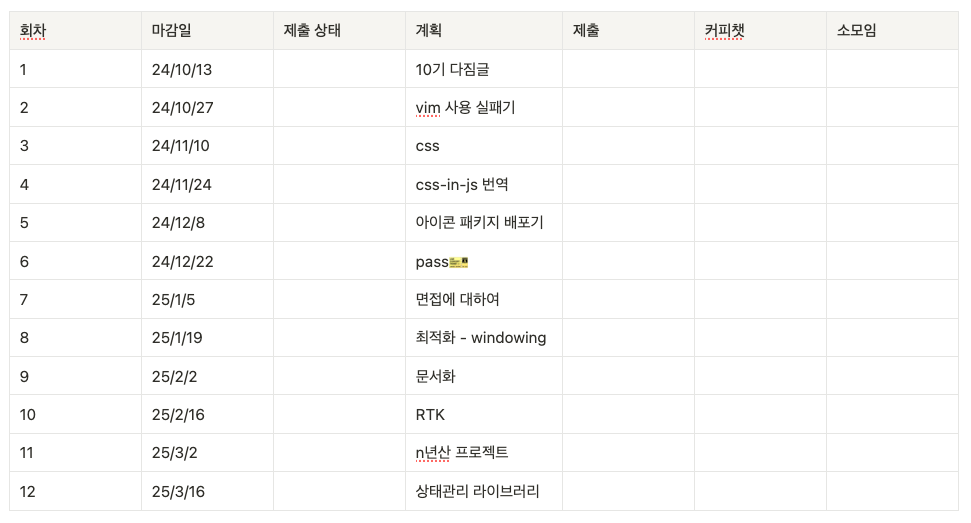

> 어느 날 아침 문득, 정말이지 맹세코 아무런 계시나 암시도 없었는데 불현듯, 잠에서 깨어나는 순간 나는 이렇게 부르짖었다.
> "그래, 이렇게 살아서는 안 돼! 내 인생에 나의 온 생애를 다 걸어야 해. 꼭 그래야만 해!"
>
> 모순, 양귀자

요 근래에 정말 재미있게 읽었던 소설의 첫 문장입니다. 글또 10기 OT가 끝나고 문득, 정말이지 맹세코 아무런 계시나 암시도 없었는데 불현듯, '그래, 이렇게 살아서는 안 돼! 내 인생에 나의 온 생애를 다 걸어야 해. 꼭 그래야만 해!'라고 생각했어요. (부르짖지는 않았음...)

처음 개발자를 꿈꾼지 5년이 지났고, 프런트엔드 개발자로 봉급을 받은지 3년이라는 시간이 지났습니다. 사랑의 유효기간은 900일[^1]이라고 하죠? 요즘은 어쩐지 프로그래머로서의 열정도 사라지고, 커리어 권태기가 온 것 같아요. 그래서 '글또 10기 시작'이라는 핑계로 제 프로그래밍 인생에 저의 온 생애를 다 걸어보자는 비장한 다짐을 해보려고 합니다. 
글또는 어쩌면 프로그래머로서 열심히 살아보기 위한 수단일지도 모르겠네요😁

<!--truncate-->

 

## 글또 10기에 이루고 싶은 것

1. 글을 매개로 한 공부 - 글을 쓰기 위해서라도 열심히 공부하고, 성장하는 제가 되고 싶어요
2. 기술적 취향 및 관심사 찾기 - 제가 어떤 글을 쓰는지 살펴보다보면 제 기술적 취향과 관심사를 찾을 수 있을 것 같아요
3. 다양한 사람들을 만나보면서 고정관념, 편견 부수기 혹은 강화하기

저는 사실 제가 어떤 걸 좋아하는 개발자인지, 어떤 걸 잘할 수 있는 사람인지 잘 모르겠어요. 
9기 활동하면서 다국어 시스템이나 조직문화 개선에 대한 글을 쓸 때 참 재미있었는데 10기에는 기술적인 글들을 좀 더 써보면서 내가 어떤 부분을 좋아하고, 잘할 수 있는지 찾아보고 싶습니다.

 

## 액션 아이템 - 활동 로그

> 지금부터라도 나는 내 생을 유심히 관찰하면서 살아갈 것이다. 
> 되어 가는 대로 놓아두지 않고 적절한 순간, 내 삶의 방향키를 과감하게 돌릴 것이다.
> 인생은 그냥 받아들이는 것이 아니라 전 생애를 걸고라도 탐구하면서 살아가야 하는 무엇이다.
> 그것이 인생이다.......
>
> 모순, 양귀자

소설 속 주인공은 '삶을 유심히 관찰하며 탐구하듯 살아야한다. 그것이 인생이다.' 라고 말하는데 저도 말뿐인 다짐이 아니라 실천하기 위해서 탐구적인 자세를 좀 더 가져가 볼까 합니다. 
그래서 엉성하지만 앞으로 6개월간의 대략적인 계획을 미리 해볼 수 있는 템플릿을 만들어보았어요. 

소재가 없어서 패스를 쓰는 것만은 피하고 싶어서 '언젠간 쓰겠지...'하고 쌓아두었던 글 소재들을 일단 넣어놨어요.
계획대로 되지 않는 것이 인생이기 때문에 '꼭 해내고야 말겠다!'는 생각은 없고, 중간중간 열심히 살고 있는지 스스로를 독려해주기만 해도 큰 역할을 할 것 같습니다. 

 

## 액션 

목표와 액션 아이템까지 생각했습니다. 이제 할 일은 액션!

> 인생은 탐구하면서 살아가는 것이 아니라, 살아가면서 탐구하는 것이다.
> 실수는 되풀이된다.
> 그것이 인생이다.......
>
> 모순, 양귀자

이 소설을 읽은 분들이라면 아시겠지만 소설의 결말이 여느 K-드라마처럼 행복하고, 이상적으로 마무리되지 않아서 이런 다짐글에 인용하는 것이 맞나 싶은 생각이 듭니다. 
하지만 뻔한 성공 스토리가 아니라서 더 마음에 깊이 와닿았어요.
저도 비장하고, 거창하게 다짐했지만 6개월 후에는 후회가 가득한 회고글을 작성하고 있을지도 모르지요.
설령 정해진 미래가 그렇다 하더라도, 실수를 되풀이 하는것... 그것이 인생이니까... 

일단 고! 🚀🚀🚀

 

---

[^1]: [과학이 말하는 사랑이란](https://www.kpanews.co.kr/column/show_youth.asp?idx=849)
