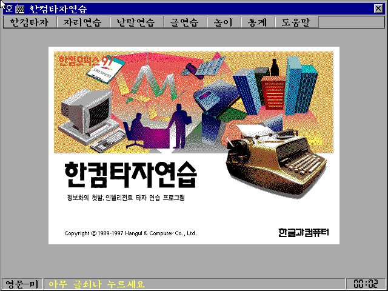
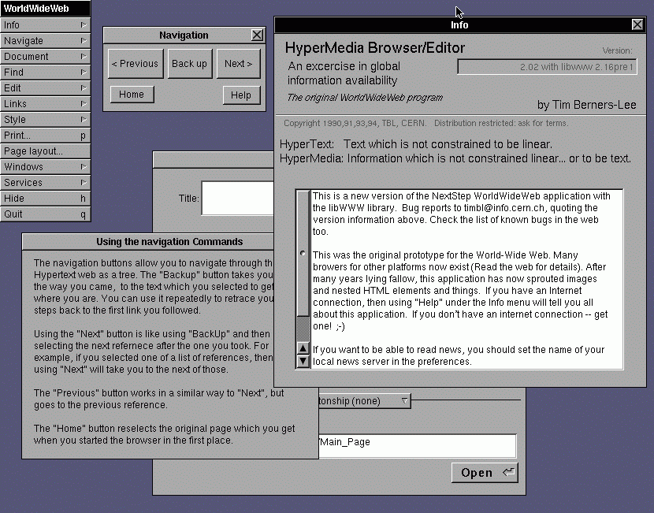

# 거의 모든 IT의 역사

## 역사를 잊은 개발자에게 미래는 없다

약 480여쪽에 이르는 이 책을 읽고 나면 _역사를 잊은 개발자에게 미래는 없다._ 라는 말이 있을 법도 하다고 느껴집니다. 1955년 스티브 잡스와 빌 게이츠의 탄생으로 IT의 역사는 시작되는데요. 애플과 마이크로소프트를 중심으로 현재의 IT 산업이 어떻게 발전해왔는지, 그리고 부록으로 한중일의 IT 역사도 함께 살펴볼 수 있습니다. 

## 나의 ~~작고 소중한~~ IT 역사

제가 컴퓨터를 다뤘던 첫 기억은 windows97 한컴타자연습 이었습니다. 8살 쯤 다음 아이디를 처음 만들어 가족들과 이메일을 주고받던 시절을 지나 windows10, 스마트폰을 사용하는 시기에 이르기까지 컴퓨터를 숨쉬듯이 사용하던 삶에 비해 역사에는 정말 관심이 없었던 것 같습니다. IT 업계에 뛰어들고 나서도 2년동안은 그저 눈 앞의 기술을 익히는 것에만 급급했던 것 같아요. 이제 단순 기술 트렌드를 쫓아가기보다는 어떤 기술이 어떤 맥락에서 탄생했고, 어떤 문제를 해결하는지에 대한 통찰력을 기르고 싶었는데 이 책을 읽으면서 그런 부분을 많이 채워나갈 수 있었습니다.

세계 최초의 웹 브라우저와 웹 서버가 스티브잡스가 설립한 넥스트라는 회사라는 것에 놀랐는데요. 어떻게 보면 제가 지금 먹고 살 수 있게 된 것이 스티브 잡스 덕분이라고도 볼 수 있는데 그런 사실을 까맣게 모르고 있었다니 조금 충격적이었습니다. 시간이 나면 웹 브라우저의 역사에 대해서도 한 번 살펴보고 싶었습니다.

이 외에도 오픈소스의 탄생과 발전에 관한 부분도 재미있었습니다. 대학생 때, 과제로 오픈소스 관련 레포트를 몇 장 제출했을 때에도 오픈소스 정신에 대해서, 이게 레포트를 써야할 만큼 중요한 정신인지 이해하지 못했었는데 이제야 마음으로 이해하게 되었어요! IT에 대한 맥락이 부족해서 이해하지 못했던 것 같은데 흐름을 안다는 것이 얼마나 중요한 지 이제야 알게 되었습니다. 웹 개발, 앱 개발을 막론하고 IT 업계에 종사하고 있다면 흥미롭게 읽을 수 있을 것 같고, 이제는 일상에서 인터넷과 컴퓨터를 떼 놓을 수 없으니 종사자가 아니더라도 재미있게 읽을 수 있을 것 같습니다.

## 짧은 감상

- 1970년대부터 우리가 보통 데스크탑이라고 생각하는 컴퓨터의 형태가 나오는데 생각보다 정말 최근의 일이라는 게 신기합니다. 회사의 흥망성쇠가 사무자동화와 많이 연관되어있는 부분도 재미있었어요. 읽으면서 AI업계에서 우리 회사의 소프트웨어가 가져가야 할 포지션이나 전략도 비슷하다고 생각되었습니다. 
- 스티브 잡스가 히피 행색을 해도, 삭발을 해도, 밤에 일해도 적극 지원해준 '아타리'는 정말 신기한 기업인 것 같아요. 심지어 1970년 대에 말이에요...! 기록으로만 보면 잡스는 엄청 제멋대로인 사람 같다고 느껴지는데 천운을 타고난 사람이 아닌가 싶습니다.
- 벽돌깨기 콘테스트에서 구현은 워즈니악에게 맡기고, 1등 상금에 보너스까지 챙긴 잡스 이야기는 정말 경악을 금치 못했습니다. 시간 제한을 줄인 것도 그렇고, 5,000 달러나 받았는데 사흘밤을 샌 워즈니악에게 겨우 350달러만 준 것도 그렇고 제가 워즈니악이었다면 같이 창업 안했을 것 같은데 그 후로도 오랜시간을 잡스와 함께 한 워즈니악은 정말 신기했어요... 비즈니스의 세계란 이런 것일까요...? 
- 스티브 잡스와 빌 게이츠 말고도 MITS의 에드 로버츠, 게리 킬달 등 처음 들어본 인물들의 이야기도 재미있었습니다. 취미가 로켓 제작이거나 자가용 비행기가 있거나 하나같이 정말 특이한 사람들이라고 생각했어요. 미국의 1970년대에는 도대체 무슨 일이...
- 2000년대 이후부터는 발전 속도가 빠르고(언급되는 회사가 많아짐😵‍💫), 스마트폰이 본격적으로 사용되기 시작한 2010년대부터는 하드웨어도 소프트웨어도 정말 다 기억하기 어려울 만큼 다양한 내용이 언급됩니다. 이 책으로 시험을 안봐서 다행이라고 생각했어요.

## 기억하고 싶은 문장들

- 소프트웨어의 흥망성쇠를 살펴보면 지배적인 위치에 있는 운영체제 개발업체와 어떤 관계를 맺는지가 상당히 중요하다는 걸 알 수 있다. 새로운 아이디어도 지배적인 위치에서 대규모 자본과 지배력으로 밀어붙이면 버틸 수 없다는 씁쓸한 이치를 깨닫는 듯해 착잡하다. 지배적인 시장구조가 아니라 아이디어로 살아남을 수 있는 세상이 이때까지는 도래하지 않았던 것이다. (1980년대)
- 내부에서 문제를 해결할 수 없을 때는 외부의 힘을 빌려야 한다. (스티브 잡스의 애플 복귀)
- 엔지니어들이 지나치게 우대받으며 자신들이 하고 싶은 프로젝트를 무작정 밀고나가는 관행이 만연하면서 실제로 실현될 수 없는 이상적인 프로젝트들이 너무 많았다. (애플의 위기)
- 애플의 디자인팀뿐만 아니라 개발, 마케팅, 영업팀까지도 동일한 문제를 놓고 목표를 달성하기 위해 머리를 맞대고 노력하는 문화
- 컴퓨터나 전자제품을 파는 것은 맞지만, 결국 고객은 사람이고 훌륭한 고객서비스가 이어지지 않는다면 물건을 팔 수 없다는 매우 기본적인 원칙에 충실했던 것이다. 론 존슨은 첨단기술 세계에 하이터치가 존재하고, 이러한 하이터치를 최대한 이용해 성공사례를 만들어냈다는 데 무한한 자부심을 느꼈다. 애플의 성공은 한두 명의 천재에 의한 것만이 아님을 다시 보여주었다. (애플 스토어)
