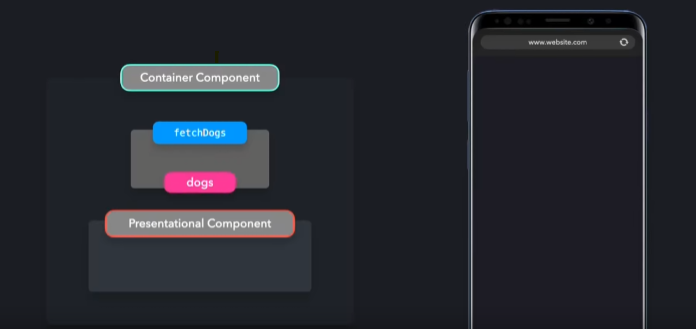
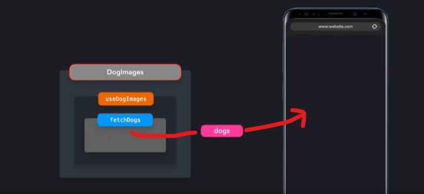

# Container/Presentational Pattern


뷰와 어플리케이션 로직을 분리하는 패턴.



- Container 컴포넌트 : **무슨** 데이터를 유저에게 보여줄지 신경쓰는 컴포넌트 (ex. 데이터 fetching)
- Presentation 컴포넌트 : 데이터를 **어떻게** 보여줄지 신경쓰는 컴포넌트


### 장점

하나의 컴포넌트에 뷰와 로직을 같이 구현하면 재사용이 어렵고 의존도가 높아지는데 그런 문제를 해결할 수 있다.

### 단점; Hooks로 대체되다.

Container 컴포넌트에서 fetchDogs라는 메소드를 실행해 Dogs 데이터를 Presentation 컴포넌트에 전달하고, Presentation 컴포넌트는 Props로 받아온 데이터를 출력한다. 최근에는 hooks이 도입되면서 많은 패턴들이 hooks로 대체되었다. 



```javascript
// hooks
export default function useDogImages() {
  const [dogs, setDogs] = useState([]);
 
  useEffect(() => {
    fetch("https://dog.ceo/api/breed/labrador/images/random/6")
      .then((res) => res.json())
      .then(({ message }) => setDogs(message));
  }, []);
 
  return dogs;
}

// component
import useDogImages from "./useDogImages";

export default function DogImages() {
  const dogs = useDogImages();

  return dogs.map((dog, i) => );
}
```

:::note References

https://www.patterns.dev/posts/presentational-container-pattern

:::
