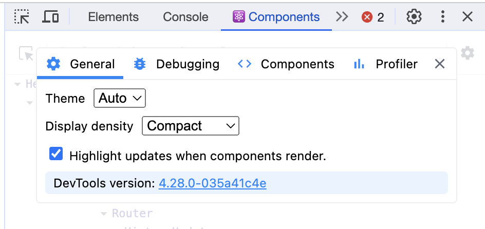
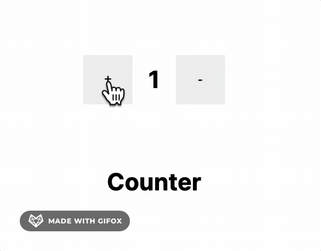
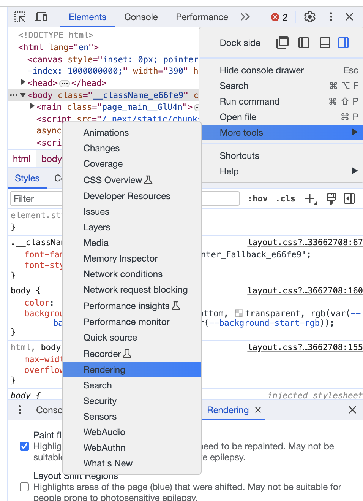
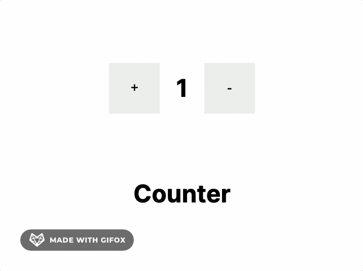

# Rendering

React에서 렌더링이 의미하는 것
- 클래스형 컴포넌트에서 render 메서드가 호출되는 것
- 함수형 컴포넌트에서 함수 전체가 실행되는 것
  

## React는 언제 리렌더링 될까?

기본적으로 LifeCycle에 따라 자동적으로 리렌더링이 된다.

1. state가 변경되었을 때
2. props가 변경되었을 때
3. 부모 컴포넌트가 리렌더링 되었을 때

### 가상 DOM과 실제 DOM의 리렌더링 차이 이해하기

**렌더링이 항상 UI 업데이트를 의미하는 것은 아니다.** 렌더링이 일어나더라도 UI가 변경되지 않을 수도 있다. [가상 DOM](./virtualDom)에서 리렌더링이 일어나면 React에서 계산하여 실제 DOM 업데이트를 최적화하기 때문이다.
## 리렌더링을 실제로 확인하는 방법

### React DevTools로 가상 렌더링 확인하기

`React DevTools > View settings` 경로로 접근해서 `Highlight updates when components render` 항목을 체크하면 repaint 가 되는 부분을 확인할 수 있다.

### Chrome DevTools로 실제 렌더링 확인하기

`Chrome DevTools > More tools > Rendering > Paint flashing` 경로로 접근해서 `Paint flashing` 항목을 체크하면 repaint 가 되는 부분을 확인할 수 있다.

두 방법으로 리렌더링을 체크해보면 react의 리렌더링과 실제 DOM의 리렌더링이 다르다는 것을 알 수 있다.
