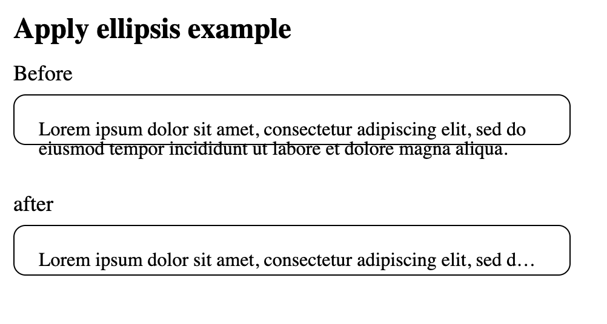

# 말줄임표(...)로 문자열 나타내는 법

width가 fixed 된 컴포넌트에서 문자열이 overflow 되었을 때, 자동으로 `...`으로 나타내도록 하는 방법이 있다.

:::tip 참고

- [text-overflow MDN](https://developer.mozilla.org/en-US/docs/Web/CSS/text-overflow)

:::
 
MDN에 적힌 것처럼 처리를 해주면 간단히 해결된다. 

```css
overflow: hidden;
text-overflow: ellipsis;
white-space: nowrap;
```

text-overflow 속성은 overflow를 자동으로 설정해주지 않기 때문에 overflow, white-space 속성을 지정해줘야 ellipsis가 적용된다.


(적용 예시)

border가 적용된 부분은 width가 따로 없는 상태인데 최상위 div의 width가 500px로 고정되어 있는 상태이기 때문에 알아서 부모의 width를 잡아서 overflow가 적용된다. 만약 text-overflow 설정이 잘 들어먹지 않는 경우 UI의 width나 parents의 width가 잘 잡혀있는지 확인해야한다.
