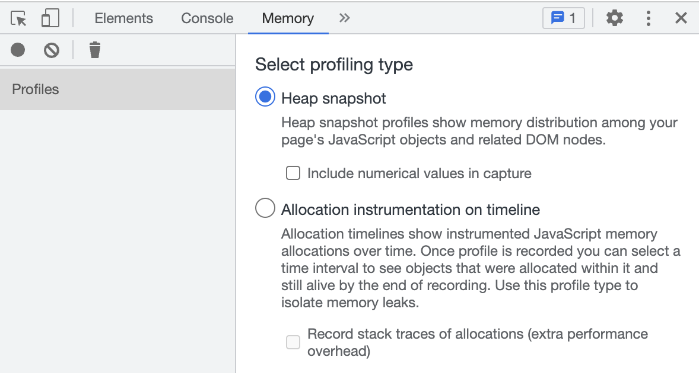

# 메모리 누수

## 메모리 누수란?

어떠한 이유로 더 사용되지 않는 메모리를 해제하지 못하는 현상

## JS에서의 메모리 누수

- 자바스크립트와 같은 고수준 언어들은 "가비지 콜렉션(GC)"이라는 자동 메모리 관리 방법을 사용. C와 같은 저수준 언어는 메모리가 필요없어질 때를 개발자가 직접 결정하고 해제하는 방식을 사용
- "더 이상 필요없는 오브젝트"를 "**어떤 다른 오브젝트도 참조하지 않는 오브젝트**"라고 정의하여 메모리를 해제해준다.
- JS는 수동 메모리 해제가 불가능하다.

## 대표적인 메모리 누수 원인

### console.log

- 출력하고자 하는 객체의 정보를 저장하고 있어야 하기 때문에, GC가 데이터를 수거하지 못하여 누수가 발생할 수 있다.
- deploy할 때 console.log를 제거하는 이유가 단순히 내용이 유출되지 않게하기위함인줄 알았는데 메모리 누수와 연관이 있었다.

## 메모리 누수 확인 방법

개발자 도구 👉 memory

:::info 참고할 만한 페이지

- [자바스크립트의 메모리 관리 MDN](https://developer.mozilla.org/ko/docs/Web/JavaScript/Memory_Management#%EA%B0%80%EB%B9%84%EC%A7%80_%EC%BD%9C%EB%A0%89%EC%85%98)
- [5가지 누수 원인](https://ui.toast.com/posts/ko_20210611)
  :::
