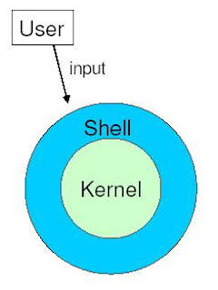

# CLI

## CLI; Command Line Interface

- 마우스가 아닌 텍스트로 명령을 입력하는 것
- 초기 MS-DOS, Linux는 GUI가 없고, CLI만 있었다.
- 맥OS에서는 리눅스와 비슷한 CLI환경을 사용할 수 있다.


---

## 텍스트로 명령을 내리면 어떻게 컴퓨터가 알아들을까?

> **TLDR; 유저 👉 터미널 👉 쉘 👉 커널 👉 하드웨어**

일단 이것을 이해하려면 컴퓨터가 어떻게 생겨먹었는지 알아야한다. 


간단하게 하드웨어와 소프트웨어로 구분된다. 여기에서 주목해야하는 것은 소프트웨어. OS는 컴퓨터에 설치된 소프트웨어로 OS를 통해 하드웨어를 조작한다. 우리가 사용하는 모든 프로그램(크롬, VSC, 곰플레이어 등...)은 다 OS 위에서 돌아간다.


### Kernal 

OS는 Kernal과 User space로 구분할 수 있다.


커널은 physical device들과 직접 상호작용하고, 컴퓨터 자원을 프로그램에 적절히 할당하는 역할을 한다. OS의 핵심 부분.


### Shell

쉘이란 커널과 상호작용하도록 해주는 user space의 프로그램이다. 



커널을 감싸고 있기때문에 shell(껍데기)이라 불린다. 

사용자가 쉘에 명령을 입력하면 쉘이 그것을 해석하여 커널로 전달해준다.

### Terminal

쉘에 직접 접근하지 않고, 터미널을 통해서 쉘에 명령을 내린다. 터미널은 쉘을 실행하는 곳이라고 할 수 있다. 비유하자면 터미널은 TV고, 쉘은 TV를 켜야 볼 수 있는 방송프로그램인 것이다.


고대에는 하나의 컴퓨터에 여러명이 케이블로 접속했는데 이때 터미널을 통해 접속했다고 한다. 현대에 PC가 보급된 이후에는 터미널을 많이 사용하지는 않지만 원격접속이나 컴퓨터 직접 제어를 위해 터미널을 사용한다. 터미널을 콘솔이라고 부르기도 하는데 모든 컴퓨터에는 콘솔이 내장되어있다. 


## 결론

터미널(혹은 콘솔)을 통해 텍스트로 컴퓨터에 명령을 내리면 해당 명령을 쉘이 받아서 커널에 전해주고, 커널은 컴퓨터를 조작하는 방식으로 동작한다.

---

## 궁금증 해결! zsh는 shell이었어!

쉘은 여러 종류가 있는데 맥 구매하면 가장 처음 설정하는 zsh는 결국 쉘의 일종인 것이다. bash, sh, csh 등 다양한 쉘이 있다.

```shell
echo $SHELL
```
명령어로 현재 사용중인 셸을 확인할 수 있다.


나는 zsh를 사용중이다. 그냥 맥북 사면 일단 설치하라길래 블로그 보고 따라했었는데 sh의 확장버전이고 다양한 플러그인과 테마가 지원되는 장점이 있다고 한다. oh my zsh는 zsh에서 사용되는 플러그인 프레임워크다.


```shell
cat /etc/shells
```

명령어로 컴퓨터에 설치된 쉘을 확인할 수 있으며 기본 쉘을 변경하는 것도 가능하다.


<br />
<br />
<br />


:::tip 참고

[Effective shell : what is a shell?](https://effective-shell.com/part-2-core-skills/what-is-a-shell/)

:::
