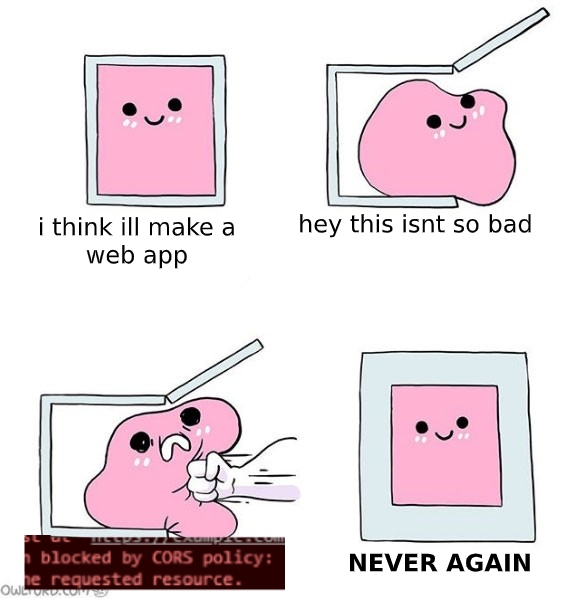

# 웹에서의 Client-Server 통신

프론트엔드 개발을 시작하다가 처음 어려움을 느꼈던 순간은 api를 연결할 때였다. 서버에서 넘겨준 api 스펙대로 데이터를 보냈는데 CORS 에러나 400대 에러가 뜨면 땀이 나기 시작한다. 단순 string이나 number 값을 전송하는 게 어느정도 익숙해다는 생각이 들었을 때 파일을 다루기 시작하면 또 다시 멀어지고... 

뿐만 아니라 서버 통신에 실패했을 때의 에러 핸들링 등 여러 장벽들이 있고, 아직도 어렵게 느껴질 때가 많다🥲 (지금도 이틀째 File을 놓고 삽질 중...) 그래도 몇 번 부딫혀보면서 감을 잡아가고 있는 중이고, 이번 기회에 한 번 정리해서 삽질하는 시간을 줄여보고자 한다.

## 목록

1. [Request](./request.md)
2. [Https](./https.md)
3. [CORS](./cors.md)
4. File upload
5. Error handling
